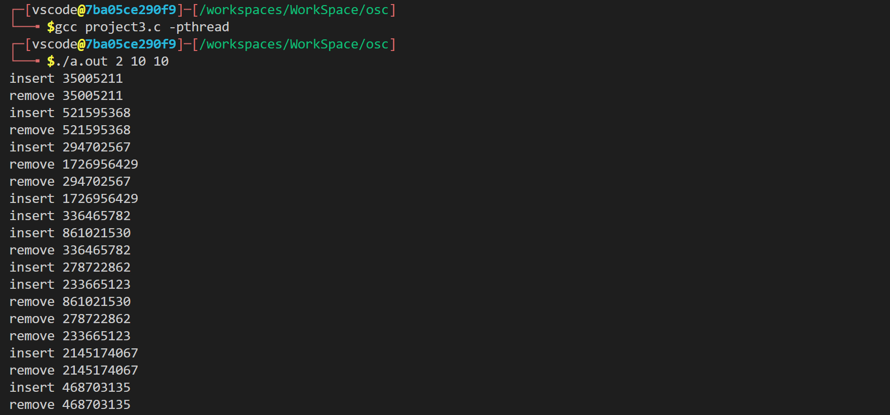

# 操作系统实验报告

[TOC]

## 独木桥问题

因为桥上最多只能通过一l辆车，因此，我们可以用一个二值信号量来实现锁，从而保证互斥性。

```c
brige = 1; // 初始化为 1
car {
	P(brige); // 得到 brige 资源
    pass();   // 通过 brige
    V(brige); // 释放 brige 资源
}
```

## 独木桥问题-拓展1

可以通过同向的车辆，那么我们参考读者写者锁的思路。用 left 表示往左的车辆数，right 表示往右的车辆数。如果来了一台往左的车辆，它先原子的增加 left，如果增加后为 1 ，那么说明它是第一辆，还需要得到 brige 资源；如果不为 1 ，说明桥上还有往左的车辆，无需特殊操作，直接通过即可。下桥时，也是先原子的减少 left ，如果减少后为 0 说明桥上没有往左的车了，需要释放 brige 资源，否则无需特殊操作。往右的车辆同理。

```c
left = 0, right = 0
// 桥上往左的车辆和往右的车辆的数量
leftlock = 1, rightlock = 1, brigelock = 1 
// 实现互斥读取 left、right 和 brige
acquire_left() {
	p(leftlock); // 得到 left 资源
    left++;
    if (left == 1) // 如果是第一台 left 的车
        p(brigelock) // 还需要得到 brige 资源
    v(leftlock); // 释放 left 资源
}
release_left() {
    p(leftlock); // 得到 left 资源
    left--;
    if (left == 0) // 如果是最后一台 left 的车
        v(brigelock) // 还需要释放 brige 资源
    v(leftlock); // 释放 left 资源
}
leftcar() {
    acquire_left(); // 获取往左通过的锁
    pass();
    release_left(); // 释放往左通过的锁
}
rightcar {
	acquire_right(); // 同 left
    pass();
    release_right(); // 同 left
}
```

## 独木桥问题-拓展2

基本上和上面差不多，但是多了一个桥上只有 N 辆车，那么我们只需要添加两个信号量，分别表示往左还能上的车辆数和往右还能能上的车辆数，初始化为 `N` 。每次上桥消耗资源，即 `P(semleft)` ，每次下桥释放资源，即 `v(semleft)`。添加了如下三行伪代码。

```c
left = 0, right = 0
// 桥上往左的车辆和往右的车辆的数量
leftlock = 1, rightlock = 1, brigelock = 1 
// 实现互斥读取 left、right 和 brige
semleft = N, semright = N  // <================= new line 1
// 往左和往右的车辆信号量
acquire_left() {
	p(leftlock); // 得到 left 资源
    left++;
    if (left == 1) // 如果是第一台 left 的车
        p(brigelock) // 还需要得到 brige 资源
    P(semleft); // <====================== new line 2
    v(leftlock); // 释放 left 资源
}
release_left() {
    p(leftlock); // 得到 left 资源
    left--;
    if (left == 0) // 如果是最后一台 left 的车
        v(brigelock) // 还需要释放 brige 资源
    v(semleft); // <======================= new line 3
    v(leftlock); // 释放 left 资源
}
leftcar() {
    acquire_left(); // 获取往左通过的锁
    pass();
    release_left(); // 释放往左通过的锁
}
rightcar {
	acquire_right(); // 同 left
    pass();
    release_right(); // 同 left
}
```

## 红黑客问题

我们使用一个二值信号量来实现对当前船上的红客人数和黑客人数实现互斥访问。（如果用两个的话，会导致死锁，因此使用一个粗粒度的大锁会好一些）。

```c
People = 1;
redNum = 0, blackNum = 0
red() {
    P(people);
    if (blackNum == 3) { // 当黑客人数为 3 的时候，红客不能上船
        V(people)
    } else {
        redNum++;
        if (redNum + BlackNum == 4) { // 坐满四个人了开船，然后清零
            sail();
            redNum = 0;
            Black = 0;
        } 
        V(people);
    }
}
black() {
    P(people);
    if (redNum == 3) { // 当红客人数为 3 的时候，黑客不能上船
        V(people)
    } else {
        blackNum++;
        if (redNum + BlackNum == 4) { // 坐满四个人了开船，然后清零
            sail();
            redNum = 0;
            Black = 0;
        } 
        V(people);
    }
}
```

## 公园游玩问题

有车有人就能游玩，没有车那么人就要等，没有人那么车就要等。

```c
car = N, tourist = M;
CAR() {
	P(car); // 获得 car 资源
    P(tourist); // 获得 tourist 资源
    travel(); 
    V(tourist); // 释放游客资源
    V(car); // 释放车资源
}
TOURIST() {
	P(tourist); // 获得 tourist 资源
    P(car); // 获得 car 资源
    travel();
    V(car); // 释放车资源
    P(tourist); // 释放游客资源
}
```

## 生产者和消费者问题

参照书后面的课后习题，首先我们的 main 函数从命令行中接受 3 个参数，参数 1 为最后 sleep 的时间，参数 2 为生产者数量，参数 3 为消费者数量。生产者数量应该大于等于消费者数量，否则消费者就是死锁。

我们使用两个信号量，分别表示缓存区的空闲空间和使用空间。生产者减少空闲空间，增加使用空间；消费者增加空闲空间，减少使用空间。同时，为了避免多个线程同时操作缓冲区，我们为缓冲区添加一个互斥锁，保证每次只用一个生产者或者消费者修改缓冲区。

锁需要写在信号量的里面，

```c
#include <pthread.h>
#include <stdio.h>
#include <stdlib.h>
#include <semaphore.h>
#include <assert.h>
#include <unistd.h>
#define MAX 4

int buffer[MAX];
int fast = 0; // 写入的位置
int slow = 0; // 读取的位置

// 向缓冲区写入数据
int insert_item(int value)
{
    buffer[fast] = value;
    fast = (fast + 1) % MAX;
    return 0;
}

// 从缓冲区读取数据
int remove_item(int* item)
{
    *item = buffer[slow];
    slow = (slow + 1) % MAX;
    return 0;
}

sem_t empty;
sem_t full;
pthread_mutex_t mutex;

// 生产者，首先等待缓冲区有空闲空间，然后获得缓冲区的锁
// 这里锁需要写在条件变量的里面
void* producer(void* arg)
{
    int time = rand() % 10;
    sleep(time);
    int item = rand();
    sem_wait(&empty);
    pthread_mutex_lock(&mutex);
    insert_item(item);
    pthread_mutex_unlock(&mutex);
    sem_post(&full);
    printf("insert %d\n", item);
}

// 消费者，同上
void* consumer(void* arg)
{
    int time = rand() % 10;
    sleep(time);
    int item;
    sem_wait(&full);
    pthread_mutex_lock(&mutex);
    remove_item(&item);
    pthread_mutex_unlock(&mutex);
    sem_post(&empty);
    printf("remove %d\n", item);
}

int main(int argc, char* argv[])
{
    assert(argc == 4);
    int sleepTime = atoi(argv[1]);
    int producerNum = atoi(argv[2]);
    int consumerNum = atoi(argv[3]);
    // assert(producerNum >= consumerNum);
    sem_init(&empty, 0, MAX); // 初始化 empty 为 MAX ，表明可以向缓冲区写入 MAX 个数字
    sem_init(&full, 0, 0); // 初始化 full 为 0，表明可以从缓冲区读取 0 个数字
    // sem_init(&mutex, 0, 1); 二值信号量，实现锁
    pthread_mutex_init(&mutex, NULL);
    pthread_t p[producerNum + consumerNum];
    for (int i = 0; i < producerNum; i++)
        pthread_create(&p[i], NULL, producer, NULL);
    for (int i = producerNum; i < producerNum + consumerNum; i++)
        pthread_create(&p[i], NULL, consumer, NULL);
    // for (int i = 0; i < producerNum + consumerNum; i++)
    //     pthread_join(p[i], NULL);
    // 根据题意，我们不需要等线程结束，只需要等 sleepTime 后主线程结束
    sleep(sleepTime);
    return 0;
}
```

运行结果展示：



