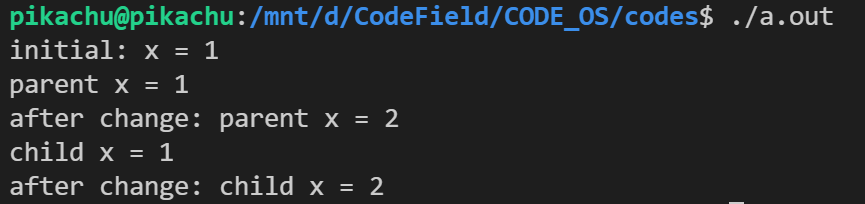
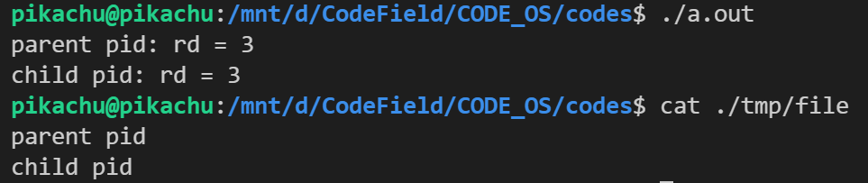
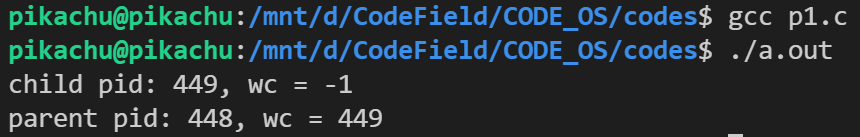
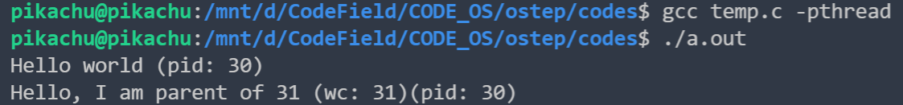

#### fork() 系统调用

```c
#include <stdio.h>
#include <stdlib.h>
#include <unistd.h>
#include <assert.h>

int main(int argc, char *argv[])
{
    printf("Hello world(pid: %d)\n", (int)getpid());
    int rc = fork();
    assert(rc >= 0);
    if (rc == 0)
    {
        printf("Hello, I am child(pid: %d)\n", (int)getpid());
    }
    else
    {
        printf("Hello, I am parent of %d (pid: %d)\n", rc, (int)getpid());
    }
    return 0;
}
```

fork()系统调用，这是操作系统提供的创建新进程的方法。新创建的进程几乎与调用进程完全一样，对操作系统来说，这谁看起来有两个完全一样的程序在运行，并都从 fork()系统调用中返回。新创建的进程称为子进程（child）， 原来的进程称为父进程（parent）。子进程不会从 main()函数开始执行（因此 hello world 信息只输出了一次），而是直接从 fork()系统调用返回，就好像是它自己调用了 fork()。父进程 fork 的返回值是子进程的 PID ，子进程的返回值是 0 。

CPU 的调度决定了哪个进程先执行。

#### wait()系统调用

```c
#include <stdio.h>
#include <stdlib.h>
#include <unistd.h>
#include <assert.h>
#include <sys/wait.h>

int main(int argc, char *argv[])
{
    printf("Hello world(pid: %d)\n", (int)getpid());
    int rc = fork();
    assert(rc >= 0);
    if (rc == 0)
    {
        printf("Hello, I am child(pid: %d)\n", (int)getpid());
    }
    else
    {
        int wc = wait(NULL);
        printf("Hello, I am parent of %d (wc: %d)(pid: %d)\n", rc, wc, (int)getpid());
    }
    return 0;
}
```

父进程调用 wait()，延迟自己的执行，直到子进程执行完毕。当子进程结束时，wait()才返回父进程。

```c
#include <stdio.h>
#include <stdlib.h>
#include <unistd.h>
#include <assert.h>
#include <sys/wait.h>

int main(int argc, char *argv[])
{
    printf("I am %d\n", fork());
    printf("I am %d\n", fork());
    printf("I am %d\n", fork());
    return 0;
}
```

运行看看这个神奇的程序，添加 wait 分析运行顺序。

### exec()系统调用

这个系统调用可以让子进程执行与父进程不同的程序。

```c
#include <unistd.h>
int execl(const char *pathname, const char *arg0, ... /* (char *)0 */ );

int execv(const char *pathname, char *const argv[]); 

int execle(const char *pathname, const char *arg0, .../* (char *)0, char *const envp[] */ );

int execve(const char *pathname, char *const argv[], char*const envp[]);

int execlp(const char *filename, const char *arg0, ... /*(char *)0 */ );

int execvp(const char *filename, char *const argv[]);
 
int fexecve(int fd, char *const argv[], char *const envp[]);
```

看下面这个代码：

```c
#include <stdio.h>
#include <stdlib.h>
#include <unistd.h>
#include <assert.h>
#include <string.h>
#include <sys/wait.h>

int main(int argc, char *argv[])
{
    printf("Hello world (pid: %d)\n", (int)getpid());
    int rc = fork();
    assert(rc >= 0);
    if (rc == 0)
    {
        printf("Hello, I am child (pid: %d)\n", (int)getpid());
        char *myargs[3];
        // strdup 会 malloc 一个相同的字符，然后返回指针（从栈区到堆区）
        myargs[0] = strdup("wc");
        myargs[1] = strdup("temp.c");
        myargs[2] = NULL;
        execvp(myargs[0], myargs);
        // 这句话永远不会执行，因为会去执行 exec 指向的程序，执行完了就完了
        printf("This shouldn't print out");
    }
    else
    {
        int wc = wait(NULL);
        printf("Hello, I am parent of %d (wc: %d)(pid: %d)\n", rc, wc, (int)getpid());
    }
    return 0;
}
```

exec()会从可执行程序中加载代码和静态数据，并用它覆写自己的代码段（以及静态数据），堆、栈及其他内存空间也会被重新初始化。然后操作系统就执行该程序，将参数通过 argv 传递给该进程。因此，它并没有创建新进程，而是直接将当前运行的程序（以前的 p3）替换为不同的运行程序（wc）。子进程执行 exec()之后，几乎就像 p3.c 从未运行过一样。对 exec()的成功调用永远不会返回。

#### 为什么这样设计 API

shell 也是一个用户程序，它首先显示一个提示符（prompt），然后等待用户输入。你 可以向它输入一个命令（一个可执行程序的名称及需要的参数），大多数情况下，shell 可以在文件系统中找到这个可执行程序，调用 fork()创建新进程，并调用 exec()的某个变体来执行这个可执行程序，调用 wait()等待该命令完成。子进程执行结束后，shell 从 wait()返回并再次输出一个提示符，等待用户输入下一条命令。

```c
#include <stdio.h>
#include <stdlib.h>
#include <unistd.h>
#include <assert.h>
#include <string.h>
#include <fcntl.h>
#include <sys/wait.h>

int main(int argc, char *argv[])
{
    printf("Hello world (pid: %d)\n", (int)getpid());
    int rc = fork();
    assert(rc >= 0);
    if (rc == 0)
    {
        printf("Hello, I am child (pid: %d)\n", (int)getpid());
        close(STDOUT_FILENO);
        open("./p4.output", O_CREAT | O_WRONLY | O_TRUNC, S_IRWXU);
        char *myargs[3];
        myargs[0] = strdup("wc");
        myargs[1] = strdup("temp.c");
        myargs[2] = NULL;
        execvp(myargs[0], myargs);
        printf("This shouldn't print out");
    }
    else
    {
        int wc = wait(NULL);
        printf("Hello, I am parent of %d (wc: %d)(pid: %d)\n", rc, wc, (int)getpid());
    }
    return 0;
}
```

这个程序将本该在终端上输出的内容重定向到了 p4.output 这个文件了。

#### 其他 API

比如可以通过 kill()系统调用向进程发送信号（signal），包括要求进程睡眠、终止或其他有用的指令，比如通过 ps 命令来查看当前在运行的进程，top 展示当前系统中进程消耗 CPU 或其他资源的情况。

#### 作业

1. 编写一个调用 fork()的程序。在调用 fork()之前，让主进程访问一个变量（例如 x） 并将其值设置为某个值（例如 100）。子进程中的变量有什么值？当子进程和父进程都改变 x 的值，变量会发生什么？

```c
#include <stdio.h>
#include <stdlib.h>
#include <unistd.h>

int main(int argc, char *argv[])
{
    int x = 1;
    printf("initial: x = %d\n", x);
    int rc = fork();
    if (rc < 0)
    {
        fprintf(stderr, "fork failed\n");
        exit(1);
    }
    else if (rc == 0)
    {
        printf("child x = %d\n", x);
        x++;
        printf("after change: child x = %d\n", x);
    }
    else
    {
        printf("parent x = %d\n", x);
        x++;
        printf("after change: parent x = %d\n", x);
    }
    return 0;
}
```

运行结果（子进程相当于复制了一份，两个进程之间没有影响）



2．编写一个打开文件的程序（使用 open()系统调用），然后调用 fork()创建一个新进程。 子进程和父进程都可以访问 open()返回的文件描述符吗？当它们并发（即同时）写入文件时， 会发生什么？

```c
#include <stdio.h>
#include <stdlib.h>
#include <unistd.h>
#include <fcntl.h>
#include <assert.h>
#include <sys/wait.h>

int main(int argc, char *argv[])
{
    int fd = open("./tmp/file", O_WRONLY | O_CREAT | O_TRUNC);
    assert(fd > -1);
    int rc = fork();
    if (rc < 0)
    {
        fprintf(stderr, "fork failed\n");
        exit(1);
    }
    else if (rc == 0)
    {
        printf("child pid: rd = %d\n", fd);
        int rw = write(fd, "child pid\n", 11);
    }
    else
    {
        printf("parent pid: rd = %d\n", fd);
        int rw = write(fd, "parent pid\n", 12);
        wait(NULL);
    }
    return 0;
}
```

运行结果（并发也会是独立的写入，也就是要么都写，要么都没写，不会 parent 和 child 混成一个奇怪的词）：



3．使用 fork()编写另一个程序。子进程应打印“hello”，父进程应打印“goodbye”。你应该尝试确保子进程始终先打印。你能否不在父进程调用 wait()而做到这一点呢？

```c
/* 题目要求 fork ，因此我们可以让主进程睡上一会 */
#include<stdio.h>
#include<stdlib.h>
#include<unistd.h>
 
int main()
{
	int rc = vfork();
	if (rc < 0) {
		fprintf(stderr, "fork failed");
		exit(1);
	} else if (rc == 0) {
		printf("hello\n");
		exit(1);
	} else {
		printf("goodbye\n");
	}
	return 0;
}
```

> 1.  fork  （）：子进程拷贝父进程的数据段，代码段
>     vfork （）：子进程与父进程共享数据段
> 2.  fork （）父子进程的执行次序不确定
>     vfork( ) 保证子进程先运行，在调用exec 或exit 之前与父进程数据是共享的,在它调用exec
>      或exit 之后父进程才可能被调度运行。
> 3.  vfork （）保证子进程先运行，在它调用exec 或exit 之后父进程才可能被调度运行。如果在
>    调用这两个函数之前子进程依赖于父进程的进一步动作，则会导致死锁。

4．编写一个调用 fork()的程序，然后调用某种形式的 exec()来运行程序/bin/ls。看看是 否可以尝试 exec()的所有变体，包括 execl()、execle()、execlp()、execv()、execvp()和 execvP()。为什么同样的基本调用会有这谁多变种？

```c
#include<stdio.h>
#include<unistd.h>
#include<stdlib.h>
 
int flag = 0;
const int MAX = 6;
int main()
{
	char * s = "/bin/ls";
	char * ss = "ls";
	char * s2 = ".";
	char * sv[] = { ss, s2, NULL };
	for(flag = 0;flag < MAX; ++flag) {
		int rc = fork();
		if (rc < 0) {
			fprintf(stderr, "fork failed");
			exit(1);
		} else if (rc == 0) {
			switch(flag) {
			case 0:
				execl(s, ss, s2, NULL);
				break;
			case 1:
				execle(s, ss, s2, NULL);
				break;
			case 2:
				execlp(s, s, s2, NULL);
				break;
			case 3:
				execv(s, sv);
				break;
			case 4:
				execvp(ss, sv);
				break;
			case 5:
				execvpe(ss, sv);
				break;
			default: break;
			}
		} else {
			wait(NULL);
		}
	}
	return 0;
}
```

5．现在编写一个程序，在父进程中使用 wait()，等待子进程完成。wait()返回什么？如 果你在子进程中使用 wait()会发生什么？

```c
#include <stdio.h>
#include <stdlib.h>
#include <unistd.h>
#include <sys/wait.h>

int main()
{
    int rc = fork();
    if (rc < 0)
    {
        fprintf(stderr, "fork failed");
        exit(1);
    }
    else if (rc == 0)
    {
        int wc = wait(NULL);
        printf("child pid: %d, wc = %d\n", (int)getpid(), wc);
    }
    else
    {
        int wc = wait(NULL);
        printf("parent pid: %d, wc = %d\n", (int)getpid(), wc);
    }
    return 0;
}
```

运行结果：



6．对前一个程序稍作修改，这次使用 waitpid()而不是 wait()，什么时候 waitpid()会有用？

> ```
> pid_t waitpid(pid_t pid,int *status,int options)
> ```
>
> 1. pid>0时，只**等待进程ID等于pid的子进程**，不管其它已经有多少子进程运行结束退出了，只要指定的子进程还没有结束，waitpid就会一直等下去。
> 2. **pid=-1时，等待任何一个子进程退出，没有任何限制，此时waitpid和wait的作用一模一样。**
> 3. pid=0时，等待同一个进程组中的任何子进程，如果子进程已经加入了别的进程组，waitpid不会对它做任何理睬。
> 4. **pid<-1时，等待一个指定进程组中的任何子进程，这个进程组的ID等于pid的绝对值。**

```c
#include<stdio.h>
#include<unistd.h>
#include<sys/wait.h>
#include<stdlib.h>
 
int main()
{
	int rc = fork();
	int wc = waitpid(rc, NULL, 0);
	if(rc < 0) {
		fprintf(stderr, "fork failed");
		exit(1);
	} else if (rc == 0) {
		printf("child");
	} else {
		printf("parent");
	}
	printf("pid:%d wc:%d rc:%d\n", (int)getpid(), wc, rc);
	return 0;
}
```

7．编写一个创建子进程的程序，然后在子进程中关闭标准输出（`STDOUT_FILENO`）。 如果子进程在关闭描述符后调用 printf()打印输出，会发生什么？

```c
#include <stdio.h>
#include <stdlib.h>
#include <unistd.h>
#include <assert.h>
#include <string.h>
#include <fcntl.h>
#include <sys/wait.h>

int main(int argc, char *argv[])
{
    printf("Hello world (pid: %d)\n", (int)getpid());
    int rc = fork();
    assert(rc >= 0);
    if (rc == 0)
    {
        close(STDOUT_FILENO);
        printf("Hello, I am child (pid: %d)\n", (int)getpid());
        // open("./p4.output", O_CREAT | O_WRONLY | O_TRUNC, S_IRWXU);
        printf("This shouldn't print out");
    }
    else
    {
        int wc = wait(NULL);
        printf("Hello, I am parent of %d (wc: %d)(pid: %d)\n", rc, wc, (int)getpid());
    }
    return 0;
}
```

什么也不会发生，子进程无法打印，但是不影响主进程，如果重定向了那么就会输入到文件中。



8．编写一个程序，创建两个子进程，并使用 pipe()系统调用，将一个子进程的标准输出连接到另一个子进程的标准输入。

```c
// #include<unistd.h>
// int pipe(int filedes[2]);
// 返回值：成功，返回0，否则返回-1。参数数组包含pipe使用的两个文件的描述符。fd[0]:读管道，fd[1]:写管道。

#include <stdio.h>
#include <unistd.h>
#include <stdlib.h>
#include <assert.h>
#include <stdlib.h>
#include <sys/wait.h>

int main()
{
    // pi[0]读管道，pi[1]写管道
    int pi[2];
    int p = pipe(pi);
    assert(p >= 0);
    int rc[2];
    for (int i = 0; i < 2; ++i)
    {
        rc[i] = fork();
        assert(rc[i] >= 0);
        if (rc[i] == 0)
        {
            switch (i)
            {
            // 第一次创建的子进程
            case 0:
                close(pi[0]);
                write(pi[1], "hello world\n", 12);
                break;
            // 第二次创建的子进程
            case 1:
                close(pi[1]);
                char *line = (char *)malloc(sizeof(char) * 12);
                int n = read(pi[0], line, 12);
                printf("%s", line);
                // write(STDOUT_FILENO, line, n);
                return 2;
            }
            break;
        }
    }
    waitpid(rc[0], NULL, 0);
    waitpid(rc[1], NULL, 0);
    return 0;
}
```

