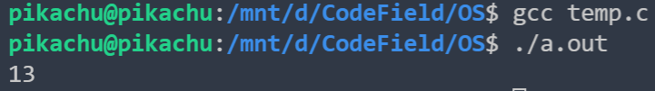
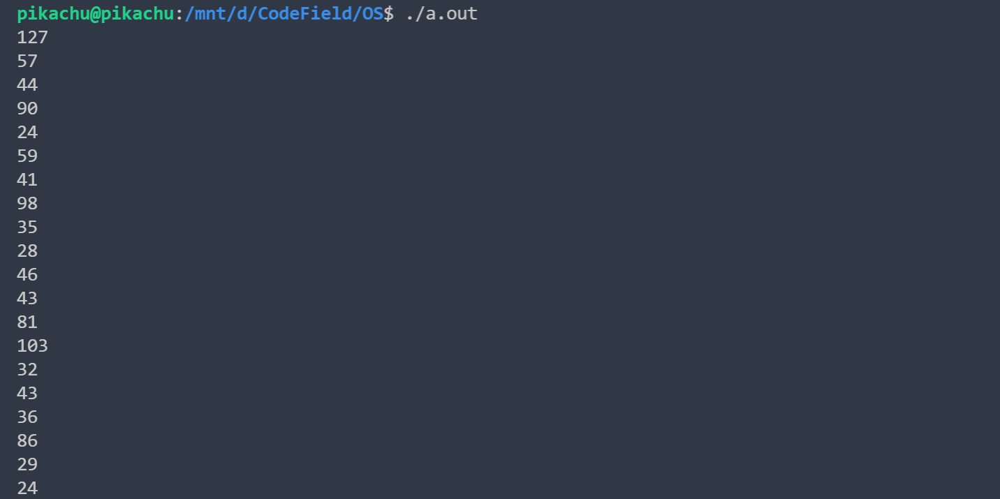

虚拟化 CPU 的基本思想：运行一个进程一段时间，然后运行另一个进程，如此轮换。通过以这种方式时分共享（time sharing）CPU，就实现了虚拟化。

我们需要保证性能和操作系统的控制权。

#### 基本技巧：受限直接执行

直接执行：只需要直接在 CPU 上运行程序即可。当 OS 希望启动程序运行时，它会在进程列表中为其创建一个进程条目，为其分配一些内存，将程序代码（从磁盘）加载到内存中，找到入口点（main()函数或类似的），跳转到那里，并开始运行用户的代码。

问题一：怎么确保程序不做任何我们不希望它做的事情

问题二：操作系统怎么停止当前进程并切换到另一个进程

#### 问题一：受限制的操作

我们引入用户模式和内核模式两种处理器模式，在用户模式运行的代码会受到限制，比如，不能执行 I/O 操作。

为了执行系统提供的调用，程序必须执行特殊的陷阱（trap）指令，该指令同时跳入内核并且将特权级别提升到内核模式。完成后，操作系统调用一个特殊的从陷阱返回的执行，将程序回退到用户模式。（这些调用都是严格写好的）

陷阱如何知道在 OS 内运行哪些代码？显然，发起调用的 过程不能指定要跳转到的地址，不然就会被恶意利用。

内核通过在启动时设置陷阱表（trap table）来实现。当机器启动时，它在特权（内核）模式下执行，因此可以根据需要自由配置机器硬件。操作系统做的第一件事，就是告诉硬件在发生某些异常事件时要运行哪些代码。

能够执行指令来告诉硬件陷阱表的位置是一个非常强大的功能。因此，你可能已经猜到，这也是一项特权（privileged）操作。

一言以蔽之，我们的程序要执行更高级的功能时，需要执行特殊的陷阱指令，调用系统提供的调用（执行的东西被确定了）；跳入内核了也不是就可以无所欲为了，执行的指令只能时陷阱表确定好的（比如你调用 read 陷入了内核模式，能执行的指令也是确定的，而不是你可以乱搞的）。

#### 问题二：在进程之间切换

当一个进程在 CPU 上运行，意味着操作系统没有运行。

##### 协作方式：等待系统调用

操作系统相信系统的进程会合理运行。运行时间过长的进程被假定会定期放弃 CPU，以便操作系统可以决定运行其他任务。

这种是不太可靠的，万一人家一直不调用系统调用之类的，一直 while(true); ，这是信不过的。

##### 非协作方式：操作系统进行控制

事实证明，没有硬件的额外帮助，如果进程拒绝进行系统调用（也不出错），从而将控制权交还给操作系统，那么操作系统无法做任何事情。

时钟中断，时钟中断到了，进程必须中断，然后 CPU 的控制权交给 CPU 。

##### 保存和恢复上下文

既然操作系统已经重新获得了控制权，无论是通过系统调用协作，还是通过时钟中断更强制执行，都必须决定：是继续运行当前正在运行的进程，还是切换到另一个进程。这 个决定是由调度程序（scheduler）做出的。

如果决定切换，OS 就会执行一些底层代码，即上下文切换。将当前进程状态存入内核栈，将下一个要执行的进程状态从内核栈恢复。

#### 担心并发吗

在中断或陷阱成立过程中发生另一个中断，怎么办？锁。

#### 小结

受限直接执行：就让你想运行的程序在 CPU 上运行，但首先确保设置好硬件，以便在没有操作系统帮助的情况下限制进程可以执行的操作。

#### 作业

系统调用的时长：

```c

#include <stdio.h>
#include <sys/time.h>
#include <unistd.h>
#include <fcntl.h>
#include <stdlib.h>
#include <assert.h>

int main()
{
    int fd = open("./README.md", O_RDONLY);
    assert(fd != -1);
    char ans[10];
    struct timeval start, end;
    gettimeofday(&start, NULL);
    for (int i = 0; i < 10; ++i)
    {
        read(fd, ans, 0);
    }
    gettimeofday(&end, NULL);
    printf("%d\n", end.tv_usec - start.tv_usec);
    close(fd);
    return 0;
}
```



上下文切换：

```c
#include <assert.h>
#include <stdio.h>
#include <sys/time.h>
#include <unistd.h>
#include <stdlib.h>

int main()
{
    int pi1[2];
    int pi2[2];
    char buf1[30], buf2[30];
    int p1 = pipe(pi1);
    int p2 = pipe(pi2);
    long temptime;
    struct timeval start, end;
    assert(p1 >= 0);
    assert(p2 >= 0);
    int rc = fork();
    for (int i = 0; i < 10; ++i)
    {
        assert(rc >= 0);
        if (rc == 0)
        {
            read(pi1[0], buf1, 25);
            gettimeofday(&end, NULL);
            printf("%d\n", end.tv_usec - atol(buf1));
            gettimeofday(&start, NULL);
            sprintf(buf2, "%ld", start.tv_usec);
            write(pi2[1], buf2, 25);
        }
        else
        {
            gettimeofday(&start, NULL);
            sprintf(buf1, "%ld", start.tv_usec);
            write(pi1[1], buf1, 25);
            read(pi2[0], buf2, 25);
            gettimeofday(&end, NULL);
            printf("%d\n", end.tv_usec - atol(buf2));
        }
    }
    return 0;
}
```



