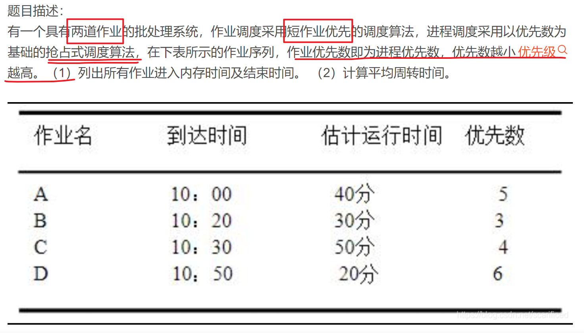
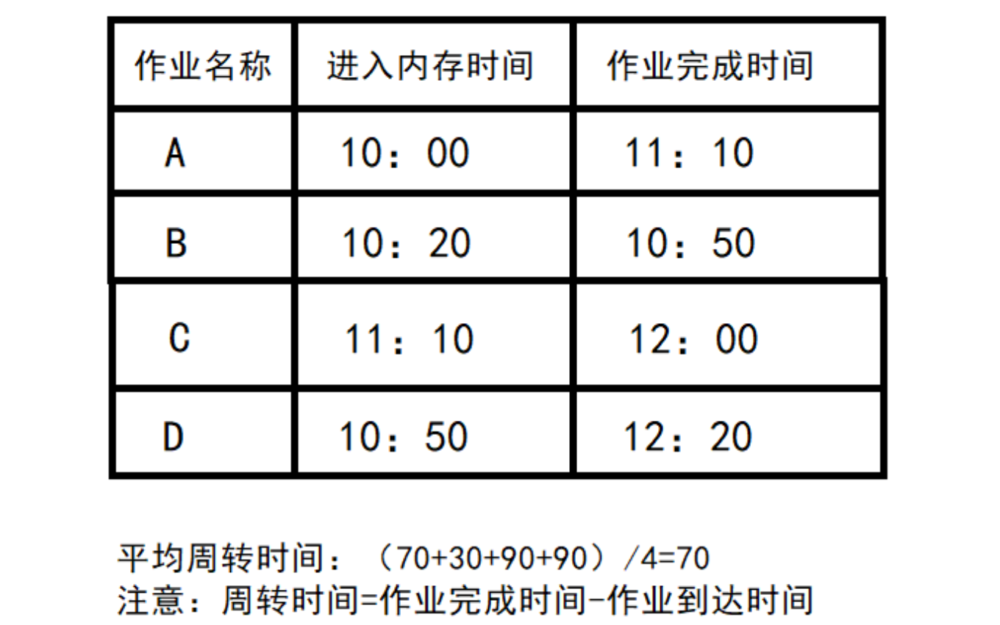

这一章，我们介绍一些操作系统调度程序采用的上层策略。

#### 工作负载假设

我们假设：

1. 每一个工作运行相同时间。
2. 一旦开始，每个工作保持运行直到完成。
3. 所有的工作同时到达。
4. 所有的工作只是用 CPU （不执行 I/O 操作等）
5. 每个工作的运行时间是已知的。

#### 调度指标

评价我们的调度策略的指标是：周转时间 = 完成时间 - 到达时间 。

周转时间是一个性能指标，但是我们还得综合公平性。并不能做到完美。

#### 先进先出（FIFO）

先到达的工作先执行，但是前面工作的时间过长会拖慢总体的周转时间。

#### 最短任务优先（SJF）

如果所有工作同时到达，那么 shortest job first 是一个很好的策略，但是如果工作到达时间不同呢？比如时间只需要 10s 的工作 B 和 C 在工作 A 执行后到达，那么就还得等。（非抢占式调度，那么 A 开始了就不会被抢占。）

#### 最短完成时间优先（STCF）

比如工作 A 运行了 10s 还剩 20s ，这个时候工作 B 到达，只需要运行 10s ，那么 B 就会抢占 CPU ，A 的执行暂停。

#### 新度量指标：响应时间

响应时间 = 首次运行 - 到达时间 。我们在电脑面前下达一个指令，当然希望响应时间越快越好，不希望等 10s 后再看到结果。

#### 轮转

为了解决响应时间的问题，我们介绍一种新的调度方法，称为轮转（Round-Robin， 即 RR）。RR 在一个时间片内运行一个工作，然后切换到运行队列中的下一个任务。RR 有时被称为时间切片，长度必须是时钟中断的倍数。时钟中断是底层提供的，操作系统决定是否进行上下文切换，轮转是操作系统的高级策略，决定什么时候上下文切换。

我们把时间切片设为为 1s ，那么 3 个工作的响应时间会是 0、1、2 ，平均响应时间是 1s 。时间切片越短，响应时间越短，但是上下文切换的成本会大大增加。

而且 RR 优化了响应时间，但是却影响了周转时间。

我们开发了两种调度程序。第一种类型（SJF、STCF）优化周转时间，但对响应时间不利。第二种类型（RR）优化响应时间，但对周转时间不利。

#### 结合 I/O

当一个工作调用 I/O 操作时， CPU 可以被另一个工作使用，当这个工作 I/O 操作执行完成之后，操作系统再按照某种策略（如 STCF ）来选择执行的工作。

#### 无法预知

我们看最后一条假设，很遗憾，我们根本无法预知每个进程的执行时间。

#### 补充作业

一个具有两道作业的批处理系统，这句话是什么意思呢？在引入了多道程序设计计数后，内存可以同时存放多个用户作业，并使它们交替运行，轮流使用 cpu 和 I/O 设备，使系统资源利用率提高。题目告诉我们是两道作业的批处理系统，意思就是内存里最多只能同时存在两道作业，在内存里有两道作业时，此时在到达的作业只能在后备队列里储存。

进入内存，即进程调度是按短作业优先的，而且是抢占式的。都进入了内存，谁先执行看的是优先级。

