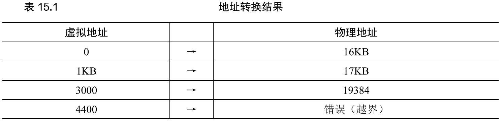

关键：如何高效、灵活的虚拟化内存。

基于硬件的地址转换，利用地址转换，硬件对每次内存访问进行处理，将指令中的虚拟（virtual）地址转换为数据实际存储的物理（physical）地址。因此， 在每次内存引用时，硬件都会进行地址转换，将应用程序的内存引用重定位到内存中实际的位置。

当然，仅仅依靠硬件不足以实现虚拟内存，因为它只是提供了底层机制来提高效率。 操作系统必须在关键的位置介入，设置好硬件，以便完成正确的地址转换。因此它必须管理内存（manage memory），记录被占用和空闲的内存位置，并明智而谨慎地介入，保持对内存使用的控制。

#### 假设

我们先假设用户的地址空间必须连续地放在物理内存中。同时，为了简单， 我们假设地址空间不是很大，具体来说，小于物理内存的大小。最后，假设每个地址空间的大小完全一样。

#### 一个例子

在虚拟内存中， 硬件可以介入到每次内存访问中，将进程提供的虚拟地址转换为数据实际存储的物理地址。

一个程序，或许需要 16kb 的内存，在它的世界里就是 0 到 16kb 而已，但是实际上，它可能存放在物理内存的 32kb 到 48kb 的位置上。由操作系统实现这种重定向（映射）。

#### 动态（基于硬件）重定位

动态重定向，也成为基址加界限机制。

我们有两个硬件寄存器（基址寄存器和界限寄存器），我们可以把地址空间放在物理内存的任何位置，同时又能确保进程只能访问自己的地址空间。

将虚拟地址转换为物理地址，这正是所谓的地址转换（address translation）技术。也就 是说，硬件取得进程认为它要访问的地址，将它转换成数据实际位于的物理地址。由于这种重定位是在运行时发生的，而且我们甚至可以在进程开始运行后改变其地址空间，这种 技术一般被称为动态重定位（dynamic relocation）。

基于软件的重定向就是在处理汇编代码的时候就完成地址转换。

比如上面那个例子，我们可以把基址寄存器设置为 32kb ，界限寄存器设置为 16kb （判断我们的访问是否越界）界限寄存器还有一种方式，就是保存实际的界限，在我们上个例子中是 48kb 。

##### 转换示例

空闲列表可以记录那些空闲内存没有使用，以便能够为进程分配内存。

#### 硬件支持：总结

首先，我们需要两种 CPU 模式，特权（内核）模式，可以访问整个机器的资源和用户模式，只能做有限的操作。

其次，硬件提供基址和界限寄存器，用来进行地址转换。

硬件还应该提供一些特殊指令，用于在内核模式下修改基址和界限寄存器。

最后，在用户程序尝试非法访问内存时，CPU 必须能够产生异常。

#### 操作系统的问题

第一，在进程创建时，操作系统必须采取行动，为进程的地址空间找到内存空间。

第二，在进程终止时（正常退出，或因行为不端被强制终止），操作系统也必须做一些 工作，回收它的所有内存，给其他进程或者操作系统使用。

第三，在上下文切换时，操作系统也必须执行一些额外的操作（保存和恢复基址和界限寄存器）。具体来说，当操作系统决定中止当前的运行进程时，它必须将当前基址和界限寄存器中的内容保存在内存中，放在某种每个进程都有的结构中，如进程结构（process structure）或进程控制块（Process Control Block，PCB）中。类似地，当操作系统恢复执行某个进程时（或第一次执行），也必须给基址和界限寄存器设置正确的值。

第四，操作系统必须提供异常处理程序（exception handler），或要一些调用的函数，像 上面提到的那样。操作系统在启动时加载这些处理程序（通过特权命令）。

#### 小结

本章通过虚拟内存使用的一种特殊机制，即地址转换（address translation），扩展了受限 直接访问的概念。利用地址转换，操作系统可以控制进程的所有内存访问，确保访问在地 址空间的界限内。有点受限直接访问内味了。

缺点：栈区和堆区大量没有使用的空间被浪费了。