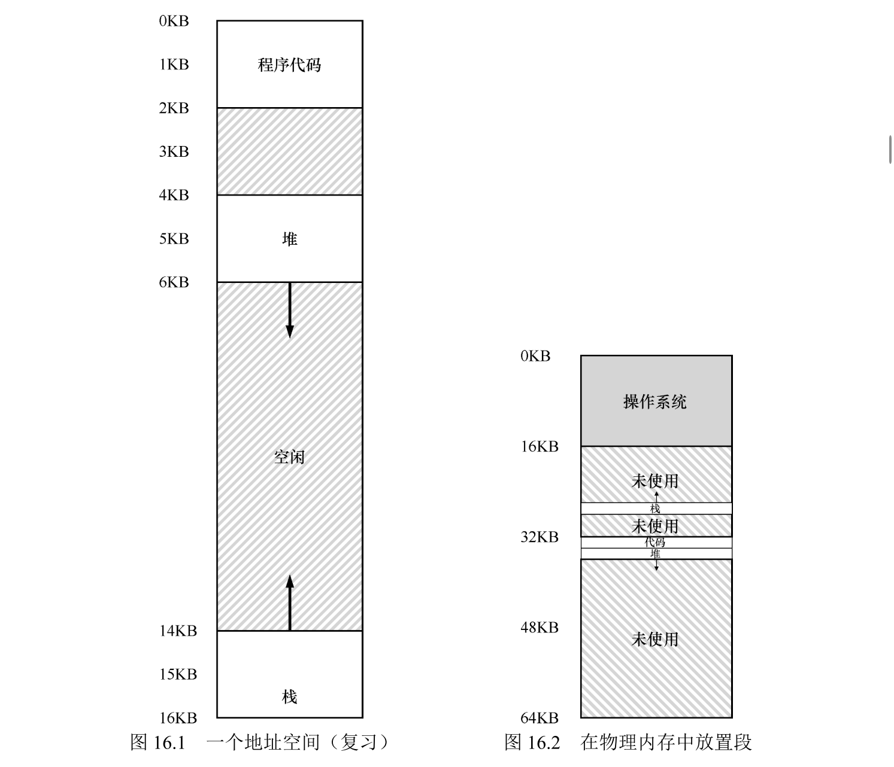
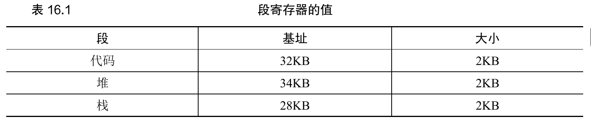

栈和堆之间，有一大块“空闲”空间。因此，简单通过基址寄存器和界限寄存器实现的虚拟内存很浪费。另外，如果物理内存无法提供连续区域来放置完整的地址空间，进程便无法运行。但设想一个 32 位（4GB）的地址空间，通常的程序只会使用几兆的内存， 但需要整个地址空间都放在内存中。

#### 分段：泛化的基址/界限

在MMU中引入不止一个基址和界限寄存器对，而是给地址空间内的每个逻辑段（segment）一对。一个段只是地址空间里的一个连续定长的区域，在典型的地址空间里有 3 个逻辑不同的段：代码、栈 和堆。分段的机制使得操作系统能够将不同的段放到不同的物理内存区域，从而避免了虚拟地址空间中的未使用部分占用物理内存。

也就是说三个区域分别重定向。

那么这个时候地址 4200 （堆区），相对于堆来说是 4200 - 4096 = 104 ，然后再加上堆区的基址寄存器的值 34kb，从而得到正确结果。

#### 我们引用哪个段

硬件在地址转换时使用段寄存器。它如何知道段内的偏移量，以及地址引用了哪个段？

1. 显式方式

在虚拟地址的开头几位来标识不同的段，比如这里我们有三段，那么就需要两位，后面的作为偏移量（段内偏移）。如果前两位是 00，硬件就知道这是属于代码段的地址，因此使用代码段的基址和界限来重定位到正确的物理地址。如果前两位是 01，则是堆地址，对应地，使用堆的基址和界限。

有些系统将堆区和栈区当作一个段，因此只需要一个位来做标识。

2. 隐式方法

硬件通过地址产生的方式来确定段。例如，如果地址由程序计数器产生（即它是指令获取），那么地址在代码段。如果基于栈或基址指针，它一定在栈段。其他地址则在堆段。

#### 栈怎么办

因为栈有点特殊，他反向增长。除了基址和界限外，硬件还需要知道段的增长方向（用一位区分，比如 1 代表自小而大增长，0 反之）。

#### 支持共享

要节省内存，有时候在地址空间之间共享（share）某些内存段是有用的。为了支持共享，需要一些额外的硬件支持，这就是保护位（protection bit）。保护位标识程序是否能读写该段，或执行其中的代码。只读代码可以被多个进程共享，而不用担心破坏隔离。

除了检查虚拟地址是否越界，硬件还需要检查特定访问是否允许。

#### 细粒度和粗粒度的分段

分三段是粗粒度的，当然我们也可以细粒度的划分，那么就需要硬件支持， 并在内存中保存段表。通过更细粒度的段，操作系统可以更好地了解哪些段在使用哪些没有，从而可以更高效地利用内存。

#### 操作系统支持

操作系统在上下文切换时应该保存和恢复各个段寄存器中的内容。显然，每个进程都有自己独立的虚拟地址空间，操作系统必须在进程运行前，确保这些寄存器被正确地赋值。

其次，管理物理内存的空闲空间。新的地址空间被创建时，操作系统需要在物理内存中为它的段找到空间。之前，我们假设所有的地址空间大小相同，物理内存可以被认为是一些槽块，进程可以放进去。现在，每个进程都有一些段，每个段的大小 也可能不同，多次使用后就会形成很多碎片。

解决这个问题的方法：

1. 紧凑（compact）物理内存，重新安排原有的段。事后处理，资源消耗大。
2. 空闲列表管理算法，试图保留大的内存块用于分配。事前好好设计，但是也并不能完美的解决问题。

#### 小结

分段解决了一些问题，帮助我们实现了更高效的虚拟内存。不只是动态重定位，通过 避免地址空间的逻辑段之间的大量潜在的内存浪费，分段能更好地支持稀疏地址空间。它还很快，因为分段要求的算法很容易，很适合硬件完成，地址转换的开销极小。分段还有 一个附加的好处：代码共享。如果代码放在独立的段中，这样的段就可能被多个运行的程序共享。

问题：导致外部碎片。

不足以支持更一般化的稀疏地址空间。如果有一个很大但是稀疏的堆，都在一个逻辑段中，整个堆仍然必须完整地加载到内存中。换言之，如果使用地址空间的方式不能很好地匹配底层分段的设计目标，分段就不能很好地工作。
