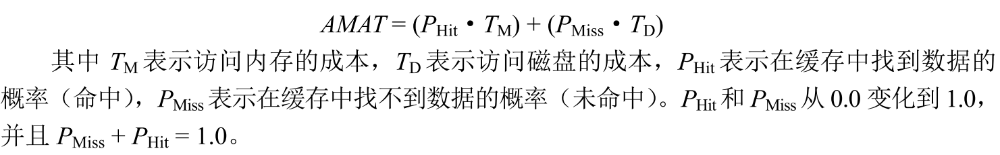
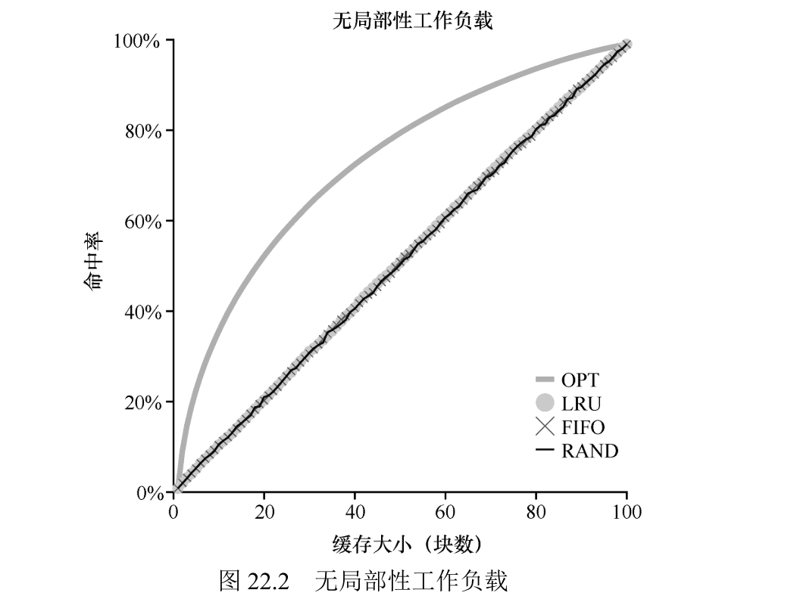
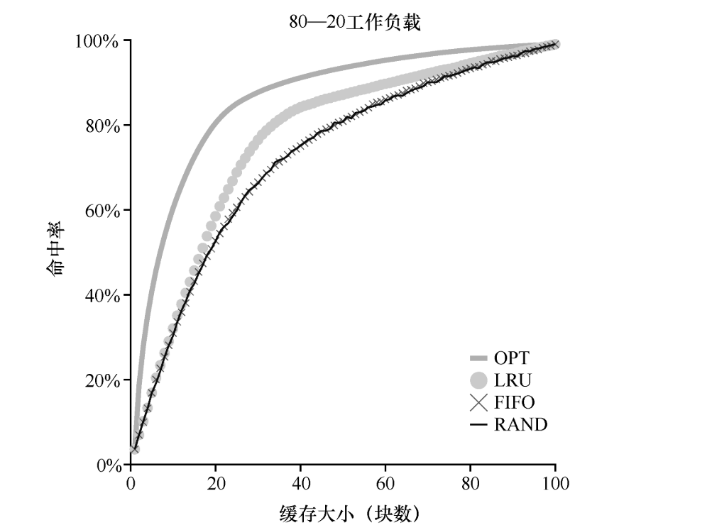

关键问题：如何决定踢出哪一页？

#### 缓存管理

由于内存只包含系统中所有页的子集，因此可以将其视为系统中虚拟内存页的缓存（cache）。在为这个缓存选择替换策略时，我们的目标是让缓存未命中（cache miss）最少，即使得从磁盘获取页的次数最少。或者，可以将目标看成让缓存命中（cache hit）最多，即在内存中找到待访问页的次数最多。

- AMAT：程序的平均内存访问时间。

因为磁盘访问成本非常高，在这个例子中，我们应尽可能避免缓存未命中。（此缓存指的是内存）

#### 最优替换策略

我们要替换掉的页是内存中最远将来才会被访问的页。当然，这很难做到，不过可以用来衡量其他方法的优劣。

#### 简单策略：FIFO

先进先出替换策略。

#### 另一简单策略：随机

随机选择一个页替换掉。

#### 利用历史数据

“最不经常使用”（Least-Frequently-Used，LFU）策略会替换最不经常使用的页。

“最少最近使用”（Least-Recently-Used，LRU） 策略替换最近最少使用的页面。

(利用了局部性原理)

#### 工作负载示例

- OPT:最优替换策略

- 80-20 负载场景，80% 的工作只访问 20% 的页

#### 实现基于历史信息的算法

LRU 在每次页访问（即每次内存访问，不管是取指令还是加载指令还是存储指令）时，我们都必须更新一些数据，从而将该页移动到列表的前面。代价是比较高的。

#### 近似 LRU

增加一个使用位，也叫引用位，粗略的将是否使用分成两部分，使用位为 0 表示没有使用，即可以替换，为 1 就不能替换。一个指针循环查找，如果全为 1 就全部设为 0 然后随机选一个。

#### 考虑脏页

如果页已被修改（modified）并因此变脏（dirty），则踢出它 就必须将它写回磁盘，这很昂贵。如果它没有被修改（因此是干净的，clean），踢出就没成本。物理帧可以简单地重用于其他目的而无须额外的 I/O。

#### 其他虚拟内存策略

页选择策略。对于大多数页而言，操作系统只是使用按需分页（demand paging），这意味着操作系统 在页被访问时将页载入内存中，“按需”即可。操作系统还可以"预取"页面，写回磁盘的时候多个页面同时聚集写入，执行单次大的写操作，比许多小的写操作更有效。

#### 抖动

当内存就是被超额请求时，操作系统应该做什么，这组正在运行的进程的内存需求是否超出了可用物理内存？在这种情况下，系统将不断地进行换页，这种情况有时被称为抖动。

