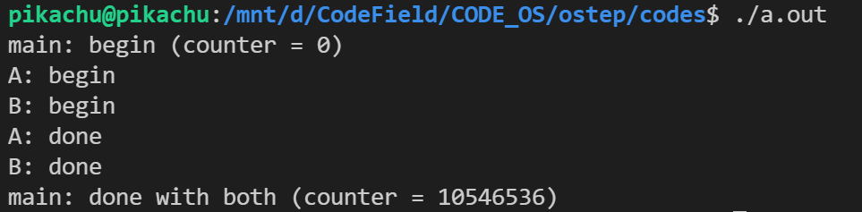
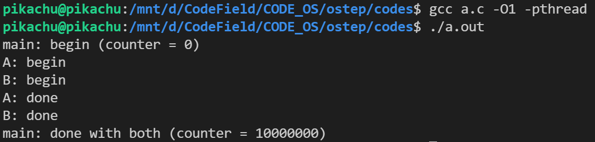
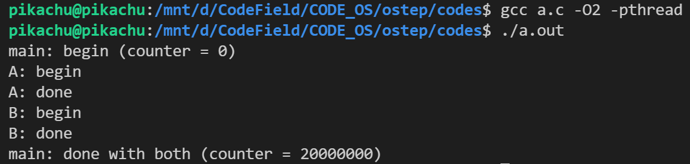

- 线程（thread）：多线程（multi-threaded）程序会有多个执行点（多个程序计数器，每个都用于取指令和执行）。每个线程类似于独立的进程，只有一点区别：它们共享地址空间，能够访问相同的数据。

- 线程之间的上下文切换类似于进程间的上下文切换。线程之间的上下文切换有一点主要区别：地址空间保持不变，不需要切换当前使用的页表。
- 在多线程的进程中，每个线程独立运行，当然可以调用各种例程来完成正在执行的任何工作。不是地址空间中只有一个栈，而是每个线程都有一个栈。（程序代码和堆是共享的）。

#### 线程创建

```c
#include <stdio.h>
#include <assert.h>
#include <pthread.h>

void *mypthread(void *arg)
{
    printf("%s\n", (char *)arg);
    return NULL;
}

int main(int argc, char *argv[])
{
    // pthread_t 是一种用于表示线程的数据类型
    // 每一个 pthread_t 类型的变量都可以表示一个线程
    pthread_t p1, p2;
    int rc;
    printf("main: begin\n");
    // 参数1：pthread_t *thread：传递一个 pthread_t 类型的指针变量 or 地址
    // 参数2：const pthread_attr_t *attr：用于手动设置新建线程的属性
    // 例如线程的调用策略、线程所能使用的栈内存的大小等。默认为 NULL
    // 参数3：void *(*start_routine) (void *)：以函数指针的方式指明新建线程需要执行的函数
    // 该函数的参数最多有 1 个（可以省略不写），形参和返回值的类型都必须为 void* 类型。
    // void *arg：指定传递给 start_routine 函数的实参，当不需要传递任何数据时，将 arg 赋值为 NULL 即可
    rc = pthread_create(&p1, NULL, mypthread, "A");
    // 断言函数，如果为假，就会报错，测试前一条语句是否正确执行
    assert(rc == 0);
    rc = pthread_create(&p2, NULL, mypthread, "B");
    assert(rc == 0);
    // join wait for the threads to finish
    // 返回某个线程执行结束时返回的数据
    // 参数1：thread 参数用于指定接收哪个线程的返回值
    // 参数2：retval 参数表示接收到的返回值
    // 如果 thread 线程没有返回值，又或者我们不需要接收 thread 线程的返回值，可以将 retval 参数置为 NULL
    rc = pthread_join(p1, NULL);
    assert(rc == 0);
    rc = pthread_join(p2, NULL);
    assert(rc == 0);
    printf("main: end\n");
    return 0;
}
```

> 注意：编译时需要加 -pthread 。

这个程序一般来说先输出 A 然后输出 B ，但是却不一定。

#### 共享数据

```c
#include <stdio.h>
#include <assert.h>
#include <pthread.h>

// volatile 易变的、不稳定的意思
// 遇到这个关键字声明的变量，编译器对访问该变量的代码就不再进行优化，从而可以提供对特殊地址的稳定访问
static volatile int counter = 0;

void *mypthread(void *arg)
{
    printf("%s: begin\n", (char *)arg);
    int i;
    for (i = 0; i < 1e7; i++)
    {
        counter += 1;
    }
    printf("%s: done\n", (char *)arg);
    return NULL;
}

int main(int argc, char *argv[])
{
    pthread_t p1, p2;
    int rc;
    printf("main: begin (counter = %d)\n", counter);
    rc = pthread_create(&p1, NULL, mypthread, "A");
    assert(rc == 0);
    rc = pthread_create(&p2, NULL, mypthread, "B");
    assert(rc == 0);
    rc = pthread_join(p1, NULL);
    assert(rc == 0);
    rc = pthread_join(p2, NULL);
    assert(rc == 0);
    printf("main: done with both (counter = %d)\n", counter);
    return 0;
}
```

当我们编译运行的时候，得不到需要的结果，而是：



当我们编译时使用 O1 优化的时候（去掉volatile 关键词）：



当我们使用 O2 优化的时候（去掉volatile 关键词）：



我们可以使用 objdump 工具来查看汇编源码，一探究竟。

#### 核心问题：不可控的调度

加一的汇编代码如下：

```assembly
; 假定变量 counter 位于地址 0x8049a1c
mov 0x8049a1c, %eax 
add $0x1, %eax mov 
%eax, 0x8049a1c
```

线程一读取 counter 加一存储到 eax ，然后中断了，线程二又读取 counter 加一存储到 eax ，然后写入，counter = counter + 1 。然后线程一还是把 eax 写入，counter = eax + 1 。两次加一，实际结果只有一次。

- 临界区：执行这段代码的多个线程可能导致竞争状态，因此我们将此段代码称为临界区。临界区访问共享变量，不能由多个线程同时执行。因此，要尽力实现互斥（mutual exclusion）。

#### 原子性愿望

简而言之，就是我们希望临界区的代码，就像上面三条，像原子一样，不可再分，要么都执行，要么都不执行。

#### 另一个问题：等待另一个线程

本章提出了并发问题，就好像线程之间只有一种交互，即访问共享变量，因此需要为临界区支持原子性。事实证明，还有另一种常见的交互，即一个线程在继续之前必须等待 另一个线程完成某些操作。例如，当进程执行磁盘 I/O 并进入睡眠状态时，会产生这种交互。 当 I/O 完成时，该进程需要从睡眠中唤醒，以便继续进行。