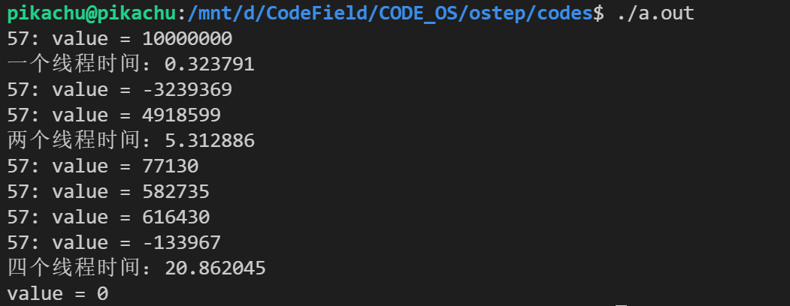
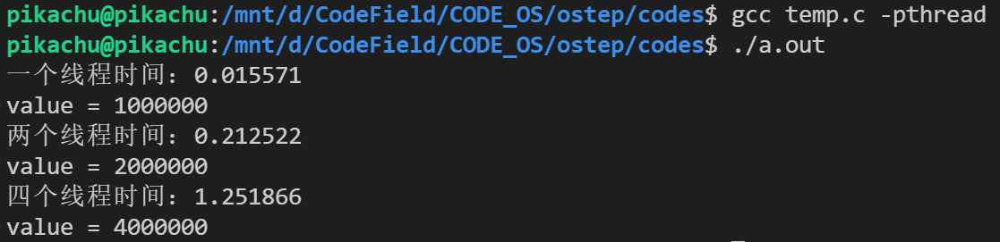
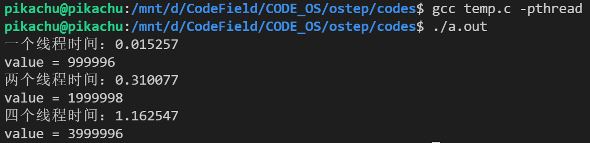
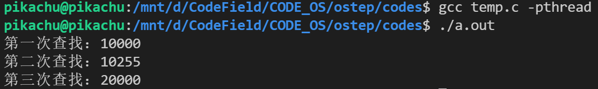
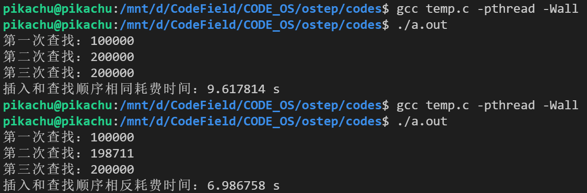
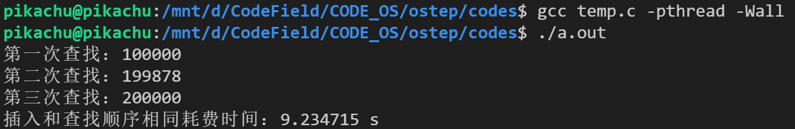
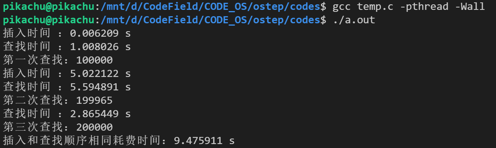

既要保证正确性，同样还要保证效率。

#### 并发计数器

```c
#include <stdio.h>
#include <pthread.h>
#include <assert.h>
#include <stdlib.h>
#include <time.h>
#include <unistd.h>

typedef struct counter_t
{
    int value;
    pthread_mutex_t lock;
} counter_t;

void init(counter_t *c)
{
    c->value = 0;
    int rc = pthread_mutex_init(&c->lock, NULL);
    assert(rc == 0);
}

void increment(counter_t *c)
{
    int rc = pthread_mutex_lock(&c->lock);
    assert(rc == 0);
    c->value++;
    rc = pthread_mutex_unlock(&c->lock);
    assert(rc == 0);
}

void decrement(counter_t *c)
{
    int rc = pthread_mutex_lock(&c->lock);
    assert(rc == 0);
    c->value--;
    rc = pthread_mutex_unlock(&c->lock);
    assert(rc == 0);
}

int get(counter_t *c)
{
    int rc = pthread_mutex_lock(&c->lock);
    assert(rc == 0);
    int ans = c->value;
    rc = pthread_mutex_unlock(&c->lock);
    assert(rc == 0);
    return ans;
}

void *myincrement(void *c)
{
    c = (counter_t *)c;
    for (int i = 0; i < 10000000; i++)
    {
        increment(c);
    }
    printf("%d: value = %d\n", getpid(), get(c));
    for (int i = 0; i < 10000000; i++)
    {
        decrement(c);
    }
}
void *mydecrement(void *c)
{
    c = (counter_t *)c;
    for (int i = 0; i < 10000000; i++)
    {
        decrement(c);
    }
    printf("%d: value = %d\n", getpid(), get(c));
    for (int i = 0; i < 10000000; i++)
    {
        increment(c);
    }
}
int main()
{
    pthread_t p1, p2, p3, p4;
    counter_t c;
    init(&c);
    clock_t t1, t2;
    t1 = clock();
    int rc = pthread_create(&p1, NULL, myincrement, (void *)&c);
    assert(rc == 0);
    rc = pthread_join(p1, NULL);
    assert(rc == 0);
    t2 = clock();
    printf("一个线程时间：%f\n", (double)(t2 - t1) / CLOCKS_PER_SEC);
    t1 = clock();
    rc = pthread_create(&p1, NULL, myincrement, (void *)&c);
    assert(rc == 0);
    rc = pthread_create(&p2, NULL, mydecrement, (void *)&c);
    assert(rc == 0);
    rc = pthread_join(p1, NULL);
    assert(rc == 0);
    rc = pthread_join(p2, NULL);
    assert(rc == 0);
    t2 = clock();
    printf("两个线程时间：%f\n", (double)(t2 - t1) / CLOCKS_PER_SEC);
    t1 = clock();
    rc = pthread_create(&p1, NULL, myincrement, (void *)&c);
    assert(rc == 0);
    rc = pthread_create(&p2, NULL, mydecrement, (void *)&c);
    assert(rc == 0);
    rc = pthread_create(&p3, NULL, myincrement, (void *)&c);
    assert(rc == 0);
    rc = pthread_create(&p4, NULL, mydecrement, (void *)&c);
    assert(rc == 0);
    rc = pthread_join(p1, NULL);
    assert(rc == 0);
    rc = pthread_join(p2, NULL);
    assert(rc == 0);
    rc = pthread_join(p3, NULL);
    assert(rc == 0);
    rc = pthread_join(p4, NULL);
    assert(rc == 0);
    t2 = clock();
    printf("四个线程时间：%f\n", (double)(t2 - t1) / CLOCKS_PER_SEC);
    printf("value = %d\n", c.value);
    return 0;
}
```

结果如下：



中间状态不确定，但是结果是对的。但是我们可以看到，线程数一多，时间就不不是线性增长了，因此它的性能不太行。我们希望，在多处理器上运行的多线程像单线程一样快。

##### 可拓展的计数

懒惰计数器：通过多个局部计数器和一个全局计数器来实现逻辑一个逻辑计数器。其中每个CPU 核心有一个局部计数器。具体来说，在 4 个 CPU 的机器上，有 4 个局部计数器和 1 个全局计数器。除了这些计数器，还有锁：每个局部计数器有一个锁，全局计数器有一个。

为了保持全局计数器更新（以防某个线程要读取该值），局部值会定期转移给全局计数器，方法是获取全局锁，让全局计数器加上局部计数器的值，然后将局部计数器置零。

```c
#include <stdio.h>
#include <pthread.h>
#include <assert.h>
#include <stdlib.h>
#include <time.h>
#include <unistd.h>
#define NUMCPUS 8

typedef struct counter_t
{
    int global;
    pthread_mutex_t glock;
    int local[NUMCPUS];
    pthread_mutex_t llock[NUMCPUS];
    int threshold; // update frequency
} counter_t;

typedef struct arg
{
    counter_t *c;
    int threadID;
} arg;

void init(counter_t *c, int threshold)
{
    c->threshold = threshold;
    c->global = 0;
    int rc = pthread_mutex_init(&c->glock, NULL);
    assert(rc == 0);
    for (int i = 0; i < NUMCPUS; i++)
    {
        c->local[i] = 0;
        rc = pthread_mutex_init(&c->llock[i], NULL);
        assert(rc == 0);
    }
}

void update(counter_t *c, int threadID, int amt)
{
    pthread_mutex_lock(&c->llock[threadID]);
    c->local[threadID] += amt;
    if (c->local[threadID] >= c->threshold)
    {
        pthread_mutex_lock(&c->glock);
        c->global += c->local[threadID];
        pthread_mutex_unlock(&c->glock);
        c->local[threadID] = 0;
    }
    pthread_mutex_unlock(&c->llock[threadID]);
}

int get(counter_t *c)
{
    int rc = pthread_mutex_lock(&c->glock);
    assert(rc == 0);
    int ans = c->global;
    rc = pthread_mutex_unlock(&c->glock);
    assert(rc == 0);
    return ans;
}

void *myincrement(void *x)
{
    arg *c = (arg *)x;
    for (int i = 0; i < 1000000; i++)
    {
        update(c->c, c->threadID, 1);
    }
}
int main()
{
    pthread_t p1, p2, p3, p4;
    counter_t c;
    // 局部转全局的频度，称为 S（表示 sloppiness）
    init(&c, 5);
    clock_t t1, t2;
    t1 = clock();
    arg x;
    x.c = &c;
    x.threadID = 0;
    int rc = pthread_create(&p1, NULL, myincrement, (void *)&x);
    assert(rc == 0);
    rc = pthread_join(p1, NULL);
    assert(rc == 0);
    t2 = clock();
    printf("一个线程时间：%f\n", (double)(t2 - t1) / CLOCKS_PER_SEC);
    printf("value = %d\n", get(&c));
    c.global = 0;
    t1 = clock();
    x.c = &c;
    x.threadID = 0;
    rc = pthread_create(&p1, NULL, myincrement, (void *)&x);
    assert(rc == 0);
    arg y;
    y.c = &c;
    y.threadID = 1;
    rc = pthread_create(&p2, NULL, myincrement, (void *)&y);
    assert(rc == 0);
    rc = pthread_join(p1, NULL);
    assert(rc == 0);
    rc = pthread_join(p2, NULL);
    assert(rc == 0);
    t2 = clock();
    printf("两个线程时间：%f\n", (double)(t2 - t1) / CLOCKS_PER_SEC);
    printf("value = %d\n", get(&c));
    c.global = 0;
    t1 = clock();
    x.c = &c;
    x.threadID = 0;
    rc = pthread_create(&p1, NULL, myincrement, (void *)&x);
    assert(rc == 0);
    y.c = &c;
    y.threadID = 1;
    rc = pthread_create(&p2, NULL, myincrement, (void *)&y);
    assert(rc == 0);
    arg m;
    m.c = &c;
    m.threadID = 2;
    rc = pthread_create(&p3, NULL, myincrement, (void *)&m);
    assert(rc == 0);
    arg n;
    n.c = &c;
    n.threadID = 3;
    rc = pthread_create(&p4, NULL, myincrement, (void *)&n);
    assert(rc == 0);
    rc = pthread_join(p1, NULL);
    assert(rc == 0);
    rc = pthread_join(p2, NULL);
    assert(rc == 0);
    rc = pthread_join(p3, NULL);
    assert(rc == 0);
    rc = pthread_join(p4, NULL);
    assert(rc == 0);
    t2 = clock();
    printf("四个线程时间：%f\n", (double)(t2 - t1) / CLOCKS_PER_SEC);
    printf("value = %d\n", get(&c));
    return 0;
}
```

我们可以看到，时间大大降低：



但是呢，threshold 的设置很重要，比如我们改成 6 ，那么结果会是（此时会有一部分局部计数还没有转全局计数）：



#### 并发链表

实现了并发查找和插入两个 API ，注意 pthread_join ，线程的返回值。

```c
#include <stdio.h>
#include <pthread.h>
#include <assert.h>
#include <stdlib.h>
#include <time.h>
#include <unistd.h>

typedef struct node_t
{
    int key;
    struct node_t *next;
} node_t;

typedef struct list_t
{
    node_t *head;
    pthread_mutex_t lock;
} list_t;

void init(list_t *L)
{
    L->head = NULL;
    int rc = pthread_mutex_init(&L->lock, NULL);
    assert(rc == 0);
}

void insert(list_t *L, int key)
{
    node_t *new = (node_t *)malloc(sizeof(node_t));
    assert(new != NULL);
    new->key = key;
    int rc = pthread_mutex_lock(&L->lock);
    assert(rc == 0);
    new->next = L->head;
    L->head = new;
    rc = pthread_mutex_unlock(&L->lock);
    assert(rc == 0);
}

int lookup(list_t *L, int key)
{
    int ans = 0;
    int rc = pthread_mutex_lock(&L->lock);
    assert(rc == 0);
    node_t *curr = L->head;
    while (curr)
    {
        if (curr->key == key)
        {
            ans++;
        }
        curr = curr->next;
    }
    rc = pthread_mutex_unlock(&L->lock);
    assert(rc == 0);
    return ans;
}

void *myinsert(void *L)
{
    L = (list_t *)L;
    for (int i = 0; i < 10000; i++)
    {
        insert(L, i);
    }
}

void *mylookup(void *L)
{
    L = (list_t *)L;
    // 返回指针，所以 ans 要是指针
    int *ans = (int *)malloc(sizeof(int));
    *ans = 0;
    for (int i = 0; i < 10000; i++)
    {
        *ans += lookup(L, i);
    }
    printf("ans = %d\n", *ans);
    // 强制类型转换
    return (void *)ans;
}

int main()
{
    pthread_t p1, p2;
    list_t L;
    int *ans;
    init(&L);
    // 先插入 10000 个数进去
    pthread_create(&p1, NULL, myinsert, (void *)&L);
    pthread_join(p1, NULL);
    // 第一次查找
    pthread_create(&p2, NULL, mylookup, (void *)&L);
    pthread_join(p2, (void **)&ans);
    printf("第一次查找：%d\n", *ans);
    // 一边插入一边查找
    pthread_create(&p1, NULL, myinsert, (void *)&L);
    pthread_create(&p2, NULL, mylookup, (void *)&L);
    pthread_join(p1, NULL);
    pthread_join(p2, (void **)&ans);
    printf("第二次查找：%d\n", *ans);
    // 最后一次查找
    pthread_create(&p2, NULL, mylookup, (void *)&L);
    // 如果 ans 是一个整型变量，需要 &&ans
    pthread_join(p2, (void **)&ans);
    printf("第三次查找：%d\n", *ans);
    return 0;
}
```

运行结果如下：



##### 拓展链表

过手锁：也叫锁耦合。每个节点都有一个锁，替代之前整个链表一个锁。遍历链表的时候，首先抢占下一个节点的锁，然后释放当前节点的锁。可以避免遍历锁太久了，但是每个节点都要上锁解锁，时间消耗同样非常大。

#### 并发队列

```c
#include <stdio.h>
#include "common_threads.h"
#include <assert.h>
#include <stdlib.h>
#include <time.h>
#include <unistd.h>

typedef struct node_t
{
    int value;
    struct node_t *next;
} node_t;

typedef struct queue_t
{
    node_t *head;
    node_t *tail;
    pthread_mutex_t headlock;
    pthread_mutex_t taillock;
} queue_t;

void init(queue_t *q)
{
    node_t *tmp = (node_t *)malloc(sizeof(node_t));
    assert(tmp != NULL);
    tmp->value = -1;
    tmp->next = NULL;
    q->head = q->tail = tmp;
    // 封装了 assert 的 pthread_mutex_init
    Pthread_mutex_init(&q->headlock, NULL);
    Pthread_mutex_init(&q->taillock, NULL);
}

void enqueue(queue_t *q, int value)
{
    node_t *tmp = (node_t *)malloc(sizeof(node_t));
    assert(tmp != NULL);
    tmp->value = value;
    tmp->next = NULL;
    Pthread_mutex_lock(&q->taillock);
    q->tail->next = tmp;
    q->tail = tmp;
    Pthread_mutex_unlock(&q->taillock);
}

int dequeue(queue_t *q, int *value)
{
    *value = -1;
    Pthread_mutex_lock(&q->headlock);
    node_t *tmp = q->head;
    node_t *newhead = tmp->next;
    // 初始化可以让我们确定，队列至少里面会有一个元素
    if (newhead == NULL)
    {
        Pthread_mutex_unlock(&q->headlock);
        return -1;
    }
    *value = newhead->value;
    q->head = newhead;
    Pthread_mutex_unlock(&q->headlock);
    free(tmp);
    return 0;
}

void *my_enqueue(void *qu)
{
    qu = (queue_t *)qu;
    for (int i = 0; i < 100; i++)
    {
        enqueue(qu, i);
    }
    return NULL;
}

void *my_dequeue(void *qu)
{
    qu = (queue_t *)qu;
    int ans;
    for (int i = 0; i < 100; i++)
    {
        dequeue(qu, &ans);
        printf("队首元素为：%d\n", ans);
    }
    return NULL;
}

int main()
{
    pthread_t p1, p2;
    queue_t qu;
    init(&qu);
    Pthread_create(&p2, NULL, my_dequeue, (void *)&qu);
    Pthread_create(&p1, NULL, my_enqueue, (void *)&qu);
    Pthread_join(p1, NULL);
    Pthread_join(p2, NULL);
    return 0;
}
```

#### 并发散列表

```c
#include "list.c"
#define BUCKETS 101

typedef struct hash_t
{
    list_t lists[BUCKETS];
} hash_t;

void hash_init(hash_t *hash)
{
    for (int i = 0; i < BUCKETS; i++)
    {
        init(&hash->lists[i]);
    }
}

void hash_insert(hash_t *hash, int key)
{
    int buckets = key % BUCKETS;
    insert(&hash->lists[buckets], key);
}

int hash_lookup(hash_t *hash, int key)
{
    int buckets = key % BUCKETS;
    return lookup(&hash->lists[buckets], key);
}

void *my_hash_insert(void *hash)
{
    hash = (hash_t *)hash;
    for (int i = 0; i < 100000; i++)
    {
        hash_insert(hash, i);
    }
    return NULL;
}

void *my_hash_lookup(void *hash)
{
    hash = (hash_t *)hash;
    int *ans = (int *)malloc(sizeof(int));
    // for (int i = 100000 - 1; i >= 0; i--)
    for (int i = 0; i < 100000; i++)
    {
        *ans += hash_lookup(hash, i);
    }
    return (void *)ans;
}

int main()
{
    pthread_t p1, p2;
    clock_t t1, t2;
    hash_t hash;
    int *ans;
    hash_init(&hash);
    t1 = clock();
    // 先插入 100000 个数进去
    pthread_create(&p1, NULL, my_hash_insert, (void *)&hash);
    pthread_join(p1, NULL);
    // 第一次查找
    pthread_create(&p2, NULL, my_hash_lookup, (void *)&hash);
    pthread_join(p2, (void **)&ans);
    printf("第一次查找：%d\n", *ans);
    // 一边插入一边查找
    pthread_create(&p1, NULL, my_hash_insert, (void *)&hash);
    pthread_create(&p2, NULL, my_hash_lookup, (void *)&hash);
    pthread_join(p1, NULL);
    pthread_join(p2, (void **)&ans);
    printf("第二次查找：%d\n", *ans);
    // 最后一次查找
    pthread_create(&p2, NULL, my_hash_lookup, (void *)&hash);
    // 如果 ans 是一个整型变量，需要 &&ans
    pthread_join(p2, (void **)&ans);
    printf("第三次查找：%d\n", *ans);
    t2 = clock();
    printf("插入和查找顺序相同耗费时间：%f s\n", (double)(t2 - t1) / CLOCKS_PER_SEC);
    return 0;
}
```

运行结果：



有点奇怪，在链表并发的时候，几乎都是先查找然后插入，所以第二次查找结果很接近第一次查找。我估计可能这种锁时间长的优先级会高。但是，为什么在多个链表的哈希表里面，查找就会在插入后面了呢？甚至插入和查找同方向进行的时候，每一次都是查找在插入后面。因为查找耗时长！最开始都在第一个链表操作，但是查找时间复杂度是 O(n) ，插入是 O(n) ，因此查找一定会在插入之前进入到新的链表，所以总的来说，插入就快得多了。

我们可以人为的给查找优势，让查找先执行一会儿：

```c
pthread_create(&p2, NULL, my_hash_lookup, (void *)&hash);
usleep(100);
pthread_create(&p1, NULL, my_hash_insert, (void *)&hash);
```

结果还是一样的，慢就是慢：



因此，主要区别就是，链表那个是两个线程在竞争同一把锁，因此查找这种或许优先级高的就占优势。这里一般来说两个线程是不同的链表，因此插入这种复杂度低的就占优势。而且因为先创建，所以会出现 20000 这种压倒性优势。



看结果，就是并发时，查找和插入时间都差不多。为什么？因为插入快了一圈后，又要和查找竞争，可是就像前面说的，他竞争不赢，于是又拖拖拖，哪一次竞争赢了以后，它又会一骑绝尘。可以猜想 BUCKETS 越大，对插入越有利，越小，对查找越有利。

