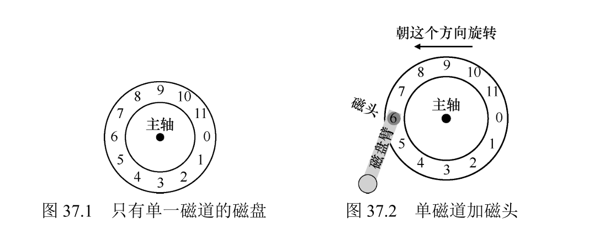

关键问题：如何存储和访问磁盘上的数据现代磁盘驱动器如何存储数据？接口是什么？数据是如何安排和访问的？磁盘调度如何提高性能？

#### 接口

所有现代驱动器的基本接口都很简单。驱动器由大量扇区（512 字节块）组成，每个扇区都可以读取或写入。在具有 n 个扇区的磁盘上，扇区从 0 到 n−1 编号。因此，我们可以将磁盘视为一组扇区，0 到 n−1 是驱动器的地址空间（address space）。

多扇区操作是可能的。实际上，许多文件系统一次读取或写入 4KB（或更多）。但是，在更新磁盘时，驱动器制造商唯一保证的是单个 512 字节的写入是原子的（atomic，即它将完整地完成或者根本不会完成）。

通常可以假设访问驱动器地址空间内两个彼此靠近的块将比访问两个相隔很远的块更快。人们通常也可以假设访问连续块（即顺序读取或写入）是最快的访问模式，并且通常比任何更随机的访问模式快得多。

#### 基本几何形状

磁盘可能有一个或多个盘片，盘片是一个圆形坚硬的表面，通过引入磁性变化来永久存储数据。每个盘片都有两面，每面都称为表面，用以持久存储数据。

所有盘片都围绕主轴连接在一起，以固定的速率旋转盘片（旋转速率以每分钟转速（RPM））来测量。数据在扇区的同心圆中的每个表面上被编码。我们称这样的同心圆为一个磁道（track）。

要从表面进行读写操作，我们需要一种机制，使我们能够感应（即读取）磁盘上的磁性图案，或者让它们发生变化（即写入）。读写过程由磁头（disk head）完成；驱动器的每个表面有一个这样的磁头。磁头连接到单个磁盘臂（disk arm）上，磁盘臂在表面上移动， 将磁头定位在期望的磁道上。

#### 简单的磁盘驱动器

假设我们有一个单一磁道的简单磁盘，该磁道只有 12 个扇区，每个扇区的大小为 512 字节（典型的扇区大小，回忆一下），
因此用 0 到 11 的数字表示。这里的单个盘片围绕主轴旋转，电机连接到主轴。当然，磁道本身并不太有趣，我们希望能够读取或写入这些扇区，因此需要一个连接到磁盘臂上的磁头。

##### 单磁道延迟：旋转延迟

等待需要读取的扇区旋转到磁头之下，平均延迟时间是 R / 2 。

##### 多磁道：寻道时间

驱动器将磁盘臂移动到磁头对准正确的磁道，称为寻道过程。

完整的 I/O 时间图：首先寻道，然后等待转动延迟，最后传输。

##### 一些其他细节

许多驱动器采用某种形式的磁道偏斜（track skew），以确保即使在跨越磁道边界时，顺序读取也可以方便地服务。作用是磁头移动到对应磁道后，磁盘重新定位磁头的时间大大减少（或许为 0 ）。

任何现代磁盘驱动器都有一个重要组成部分，即它的缓存（cache），由于历史原因有时称为磁道缓冲区（track buffer）。该缓存只是少量的内存（通常大约8MB或 16MB）， 驱动器可以使用这些内存来保存从磁盘读取或写入磁盘的数据。

在写入时，驱动器面临一个选择：它应该在将数据放入其内存之后，还是写入实际写入磁盘之后，回报写入完成？前者被称为后写（write back）缓存（有时称为立即报告，immediate reporting），后者则称为直写（write through）。后写缓存有时会使驱动器看起来“更快”，但 可能有危险。如果文件系统或应用程序要求将数据按特定顺序写入磁盘以保证正确性，后写缓存可能会导致问题。

#### I/O 时间：用数学

> $T_{I/O} = T_{寻道} + T_{旋转} + T_{传输}$

主要衡量也有两个方面：随机工作负载和顺序工作负载。

#### 磁盘调度

对于磁盘调度，我们可以很好地猜测“任务”（即磁盘请求）需要多长时间。通过估计请求的查找和可能的旋转延迟，磁盘调度程序可以知道每个请求将花费多长时间，因此（贪婪地）选择先服务花费最少时间的请求。

##### SSTF：最短寻道时间优先

进一步优化：最近块优先（NBF）。

缺点：饥饿，一堆接近的请求和一个很远的读取请求，那么这个远的就饿死了。

##### 电梯（SCAN）

磁头一直在磁道往复，而不会走回头路。

##### SPTF：最短定位时间优先

综合寻道时间和旋转时间，决定顺序。

##### 其他调度问题

- I/O 合并，两个相邻的扇区可以合并访问。
- 有 I/O 请求时适当等待或许会更好。

