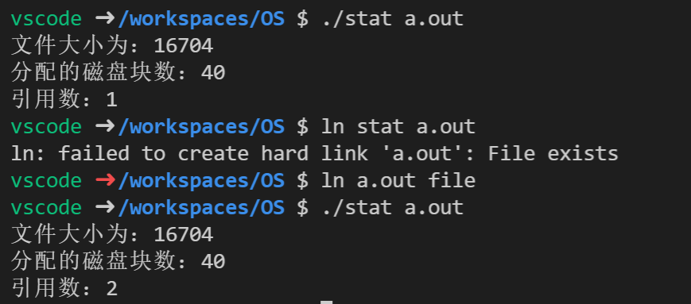
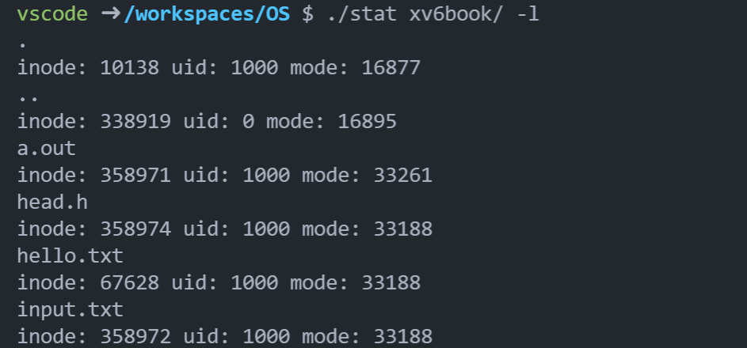
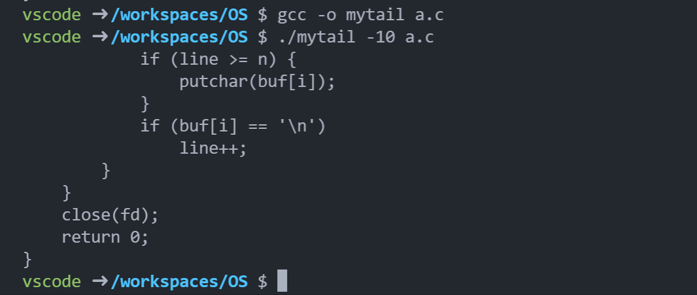
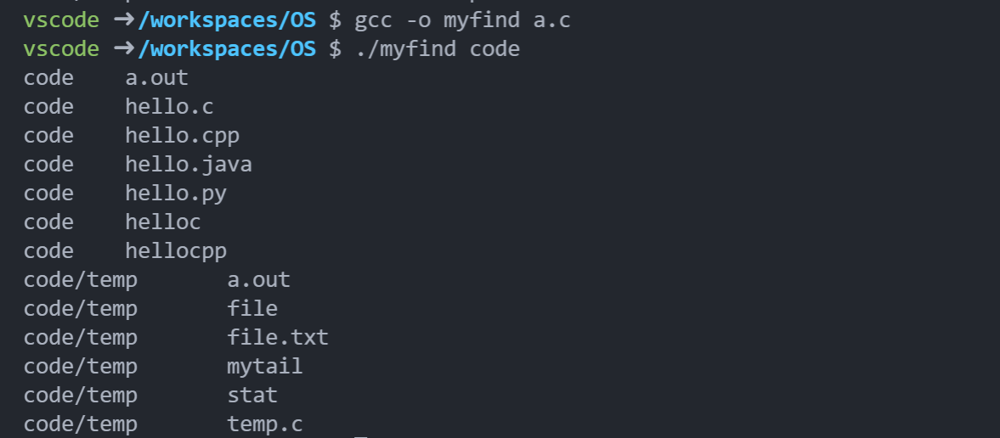

到目前为止，我们看到了两项关键操作系统技术的发展：进程，它是虚拟化的 CPU； 地址空间，它是虚拟化的内存。在这两种抽象共同作用下，程序运行时就好像它在自己的 私有独立世界中一样，好像它有自己的处理器（或多处理器），好像它有自己的内存。

在这一部分，我们加上虚拟化拼图中更关键的一块：持久存储（persistent storage）。永 久存储设备永久地（或至少长时间地）存储信息，如传统硬盘驱动器（hard disk drive）或 更现代的固态存储设备（solid-state storage device）。

#### 文件和目录

- 文件：文件就是 一个线性字节数组，每个字节都可以读取或写入。每个文件都有一个与其关联的 innode 号。
- 目录：目录中的每个条目 都指向文件或其他目录。通过将目录放入其他目录中，用户可以构建任意的目录树。

#### 创建文件

```c
#include <stdio.h>
#include <sys/types.h>
#include <sys/stat.h>
#include <fcntl.h>
#include <unistd.h>
int main()
{
    int fd = open("foo.txt", O_CREAT | O_WRONLY | O_TRUNC);
    close(fd);
    return 0;
}
```

- fd：文件描述符
- O_CREAT：创建文件
- O_WRONLY：只能写
- O_TRUNC：删除文件中的现有内容

#### 读写文件

strace 用于跟踪命令。

```shell
echo hello > foo.txt
strace cat foo.txt
```

每个正在运行的进程已经打开了 3 个文件：标准输入（进程可以读取以接收输入），标准输出（进程 可以写入以便将信息显示到屏幕），以及标准错误（进程可以写入错误消息）。这些分别由 文件描述符 0、1 和 2 表示。因此，当你第一次打开另一个文件时（如上例所示），它几乎 肯定是文件描述符 3。

#### 读取与写入，但不按顺序

有时能够读取或写入文件中的特定偏移量是有用的。例如，如果你在文本文件上构建了索引并利用它来查找特定单词，最终可能会从文件中的某些随机（random）偏移量中读取数据。为此，我们将使用 lseek()系统调用。

```c
off_t lseek(int fildes, off_t offset, int whence);
```

第一个参数是熟悉的（一个文件描述符）。第二个参数是偏移量，它将文件偏移量定位 到文件中的特定位置。第三个参数，由于历史原因而被称为 whence，明确地指定了搜索的 执行方式。

#### 用 fsync（）立即写入

大多数情况下，当程序调用 write()时，它只是告诉文件系统：请在将来的某个时刻，将此数据写入持久存储。出于性能的原因，文件系统会将这些写入在内存中缓冲（buffer）一 段时间（例如 5s 或 30s）。在稍后的时间点，写入将实际发送到存储设备。

当进程针对特定文件描述符调用 fsync()时， 文件系统通过强制将所有脏（dirty）数据（即尚未写入的）写入磁盘来响应，针对指定文件描述符引用的文件。一旦所有这些写入完成，fsync()例程就会返回。

```c
int fd = open("foo", O_CREAT | O_WRONLY | O_TRUNC); 
assert(fd > -1); 
int rc = write(fd, buffer, size); 
assert(rc == size); 
rc = fsync(fd); 
assert(rc == 0);
```

#### 文件重命名

通过 shell 命令，将文件 foo 重命名为 bar 。

```shell
mv foo bar
```

利用 strace，我们可以看到 mv 使用了系统调用 rename(char * old, char * new)，它只需要两个参数：文件的原来名称（old）和新名称（new）。这是一个原子操作。

```c
int fd = open("foo.txt.tmp", O_WRONLY|O_CREAT|O_TRUNC); 
write(fd, buffer, size); // write out new version of file 
fsync(fd); 
close(fd);
rename("foo.txt.tmp", "foo.txt");
```

将文件的新版本写入临时名称（foot.txt.tmp），使用 fsync()将其强制写入磁盘。然后，当应用程序确定新文件的元数据和内容在磁盘上， 就将临时文件重命名为原有文件的名称。最后一步自动将新文件交换到位，同时删除旧版 本的文件，从而实现原子文件更新。

#### 获取文件信息

两个系统调用 stat 和 fstat ，可以将一个路径或文件描述符添加到一个文件中，并将信息填充到 stat 结构中。

同时，我们还能通过命令查看文件信息。

```shell
stat file
```

每个文件系统通常将这种类型的信息保存在一个名为 inode 的结构中。当 我们讨论文件系统的实现时，会学习更多关于 inode 的知识。就目前而言，你应该将 inode 看作是由文件系统保存的持久数据结构，包含上述信息。

#### 删除文件

```shell
strace rm file
```

rm 主要调用的命令是 unlink() 只需要待删除文件的名称，并在成功时返回零。

#### 创建目录

```shell
strace mkdir foo
```

创建一个目录（文件夹）叫做 foo

```shell
rm * 
rm -rf *
```

删除目录中的所有内容（文件）

递归的进入每个目录并删除其内容

空目录有两个条目：一个引用自身的条目，一个引用其父目录的条目。前者称为“.”（点） 目录，后者称为“..”（点-点）目录。可以通过以下命令查看。

```shell
ls -a
```

#### 读取目录

```c
int main(int argc, char *argv[]) { 
    DIR *dp = opendir("."); 
    assert(dp != NULL); 
    struct dirent *d; 
    while ((d = readdir(dp)) != NULL) { 
        printf("%d %s\n", (int) d->d_ino, d->d_name);
	}
	closedir(dp); 
    return 0;
}
```

该程序使用了 opendir()、readdir()和 closedir()这 3 个调用来完成工作，你可 以看到接口有多简单。我们只需使用一个简单的循环就可以一次读取一个目录条目，并打 印目录中每个文件的名称和 inode 编号。

#### 删除目录

你可以通过调用 rmdir()来删除目录。但是要求目录为空。

#### 硬链接

link()系统调用，在文件系统树中创建条目的新方法。link()系统调用有两个参数：一个旧路径名和一个新路径名。当你将一个新的文件名“链接”到一个旧的文件名时，你实际上创建了另一种引用同一个文件的方法。

```shell
prompt> echo hello > file
prompt> cat file 
hello
prompt> ln file file2 
prompt> cat file2 
hello
```

link 只是在要创建链接的目录中创建了另一个名称，并将其指向原有文件的相同 inode 号（即低级别名称）。该文件不以任何方式复制。相反，你现在就有了两个人类可读的名称（file 和 file2），都指向同一个文件。

我们可以通过下面的命令打印这两个文件的 inode 号，可以看到是一样的。

```shell
ls -i file file2
```

创建一个文件时，实际上做了两件事。首先，要构建一个结构（inode），它将跟踪几乎所有关于文件的信息，包括其大小、文件块 在磁盘上的位置等等。其次，将人类可读的名称链接到该文件，并将该链接放入目录中。

因此，为了从文件系统中删除一个文件，我们调用 unlink()，其实就是把这种链接删除了，文件还没有变。我们 `rm file` 还能通过 `file2` 读取文件。

但是如果链接数量变成 0 之后，文件系统就会释放 inode 号和相关数据。

#### 符号链接

也叫软链接。

硬链接有点局限：你不能创建目录的硬链接（因为担心会在目录树中创 建一个环）。你不能硬链接到其他磁盘分区中的文件（因为 inode 号在特定文件系统中是唯 一的，而不是跨文件系统），等等。因此，人们创建了一种称为符号链接的新型链接。

```c
prompt> echo hello > file 
prompt> ln -s file file2 
prompt> cat file2 
hello
```

增加 -s 标志，就可以建立起软链接。

可以这样理解，硬链接就是两个文件名指的都是同一个文件，软链接就是新形成的 file2 指向 file ，如果 file 被删除，那么 file2 就找不到文件了。

#### 创建并挂载文件系统


#### 作业

1. Stat：实现一个自己的命令行工具 stat，实现对一个文件或目录调用 stat() 函数即可。 将文件的大小、分配的磁盘块数、引用数等信息打印出来。当目录的内容发生变化时，目 录的引用计数如何变化？有用的接口：stat()。

```c
#include <stdio.h>
#include <sys/stat.h>
#include <unistd.h>
#include <assert.h>
#include <stdlib.h>

int main(int argc, const char* argv[])
{
    assert(argc == 2);
    const char* file = argv[1];
    struct stat fd;
    int rc = stat(file, &fd);
    assert(rc == 0);
    // 文件的大小、分配的磁盘块数、引用数
    printf("文件大小为：%d\n", fd.st_size);
    printf("分配的磁盘块数：%d\n", fd.st_blocks);
    printf("引用数：%d\n", fd.st_nlink);
    exit(0);
}
```



2. 列出文件：编写一个程序，列出指定目录内容。如果没有传参数，则程序仅输出文件名。当传入-l 参数时，程序需要打印出文件的所有者，所属组权限以及 stat() 函数获得的 一些其他信息。另外还要支持传入要读取的目录作为参数，比如 myls -l directory。如果没有传入目录参数，则用当前目录作为默认参数。有用的接口：stat()、opendir()、readdir()和getcwd()。

```c
#include <stdio.h>
#include <string.h>
#include <dirent.h>
#include <assert.h>
#include <sys/stat.h>
#include <stdlib.h>
#include <unistd.h>

int main(int argc, char* argv[])
{
    char* sdir;
    int flag;
    if (argc == 3 && (strcmp(argv[1], "-l") == 0 || strcmp(argv[2], "-l") == 0)) {
        flag = 1;
        sdir = strcmp(argv[1], "-l") == 0 ? argv[2] : argv[1];
    } else if (argc == 1) {
        flag = 0;
        // 获取当前工作路径
        sdir = getcwd(NULL, 10);
    } else {
        printf("error\n");
        exit(1);
    }
    DIR* dp = opendir(sdir);
    assert(dp != NULL);
    struct dirent* d;
    // 遍历目录中的所有文件
    while ((d = readdir(dp)) != NULL) {
        printf("%s\n", d->d_name);
        // 如果不是当前目录，那么需要输出较多信息
        if (flag) {
            // 获得文件的路径
            char filestr[200] = "";
            strcat(filestr, sdir);
            strcat(filestr, "/");
            strcat(filestr, d->d_name);
            struct stat st;
            stat(filestr, &st);
            printf("inode: %d uid: %d mode: %d\n", st.st_ino, st.st_uid, st.st_mode);
        }
    }
    return 0;
}
```



3. Tail：编写一个程序，输出一个文件的最后几行。这个程序运行后要能跳到文件末尾附近，然后一直读取指定的数据行数，并全部打印出来。运行程序的命令是 mytail -n file， 其中参数 n 是指从文件末尾数起要打印的行数。有用的接口：stat()、lseek()、open()、read() 和 close()。

```c
#include <stdio.h>
#include <string.h>
#include <assert.h>
#include <stdlib.h>
#include <sys/types.h>
#include <sys/stat.h>
#include <fcntl.h>
#include <unistd.h>
#define LENGTH 1024

// stat()、lseek()、open()、read() 和 close()。
int main(int argc, char* argv[])
{
    assert(argc == 3);
    // 投机取巧了一下，因为 - 就是减号，所以可以直接调用 atoi 转数字
    int n = -atoi(argv[1]);
    const char* file = argv[2];
    int fd = open(file, O_RDONLY);
    assert(fd >= 0);
    char* buf = (char*)malloc(LENGTH + 1);
    // 重复读，求出总共有多少行
    int line = 0;
    while (1) {
        int size = read(fd, buf, LENGTH);
        assert(size >= 0);
        if (size == 0)
            break;
        for (int i = 0; i < size; i++) {
            if (buf[i] == '\n')
                line++;
        }
    }
    n = line - n;
    // 将文件偏移量设置为 0 
    lseek(fd, 0, SEEK_SET);
    // 继续一直读，直到行数超过后开始输出
    line = 0;
    while (1) {
        int size = read(fd, buf, LENGTH);
        assert(size >= 0);
        if (size == 0)
            break;
        for (int i = 0; i < size; i++) {
            if (line >= n) {
                putchar(buf[i]);
            }
            if (buf[i] == '\n')
                line++;
        }
    }
    close(fd);
    return 0;
}

```



4. 递归查找：编写一个程序，打印指定目录树下所有的文件和目录名。比如，当不带参数运行程序时，会从当前工作目录开始递归打印目录内容以及其所有子目录的所有内容， 直到打印完以当前工作目录为根的整棵目录树。如果传入了一个目录参数，则以这个目录 为根开始递归打印。可以添加更多的参数来限制程序的递归遍历操作，可以参照 find 命令。 有用的接口：自己想一下。

```c
#include <stdio.h>
#include <string.h>
#include <dirent.h>
#include <assert.h>
#include <sys/stat.h>
#include <stdlib.h>
#include <unistd.h>

void myfind(char* sdir)
{
    DIR* dp = opendir(sdir);
    assert(dp != NULL);
    struct dirent* d;
    // 遍历目录中的所有文件
    while ((d = readdir(dp)) != NULL) {
        if (strcmp(d->d_name, ".") == 0 || strcmp(d->d_name, "..") == 0)
            continue;
        // 4 和 8 是通过实验求出来的
        if (d->d_type == 4) {
            // 新目录递归处理
            char arg[100] = "";
            strcat(arg, sdir);
            strcat(arg, "/");
            strcat(arg, d->d_name);
            myfind(arg);
        } else if (d->d_type == 8) {
            printf("%s\t%s\n", sdir, d->d_name);
        }
    }
}
int main(int argc, char* argv[])
{
    char* sdir;
    if (argc == 2) {
        sdir = argv[1];
    } else if (argc == 1) {
        sdir = ".";
    } else {
        printf("error\n");
        exit(1);
    }
    myfind(sdir);
    return 0;
}
```


