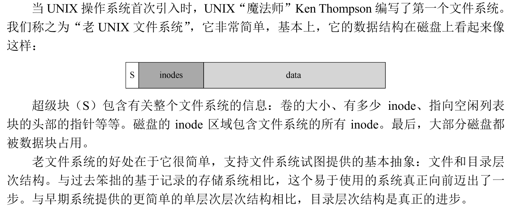

#### 问题：性能不佳

主要问题是老 UNIX 文件系统将磁盘当成随机存取内存。数据遍布各处，而不考虑保存数据的介质是磁盘的事实，因此具有实实在在的、昂贵的定位成本。同时，文件系统最终会变得非常碎片化。原始块太小了，冲数据传输上来看是低效的。

#### FFS：磁盘意识是解决方案

快速文件系统（Fast File System，FFS），思路是让文件系统的结构和分配策略具有“磁盘意识”，从 而提高性能，这正是他们所做的。

#### 组织结构：柱面组

将磁盘划分为一些分组，称为柱面组。这些分组是 FFS 用于改善性能的核心机制。通过在同一组中放置两个文件，FFS 可以 确保先后访问两个文件不会导致穿越磁盘的长时间寻道。

#### 策略：如何分配文件和目录

基本的原则很简单：相关的东西放一起（以此推论，无关的东西分开放）。

#### 大文件例外

如果我们将大文件放在一个组里面，那么他就会占满这个组，导致或许和该文件同目录，本该占据这个组的其他文件（相关文件）不能分布在这个组。这样做确实有好处，可以顺序的访问该大文件，缺点就是损害了局部性。

我们将它拆分，存储于不同的组，但是控制好大小，那么寻道的时间就可以被均摊掉，时间不会太差，又不会损害局部性。

#### 关于 FFS 的其他几件事

引入子块（sub-block），这些子块有 512 字节，文件系统可以将它们分配给文件。因此，如果你创建了一个小文件 （比如大小为 1KB），它将占用两个子块，因此不会浪费整个 4KB 块。同时我们利用缓冲写入，达到 4KB 了再同时写入。

针对性能对磁盘布局优化，如果我们把 0 和 1 相邻，读完 0 后 1 已经过了，因此我们可以错开，如此就能提高效率。

现代磁盘更加智 能：它们在内部读取整个磁道并将其缓冲在内部磁盘缓存中（由于这个原因，通常称为磁 道缓冲区，track buffer）。然后，在对轨道的后续读取中，磁盘就从其高速缓存中返回所需 数据。