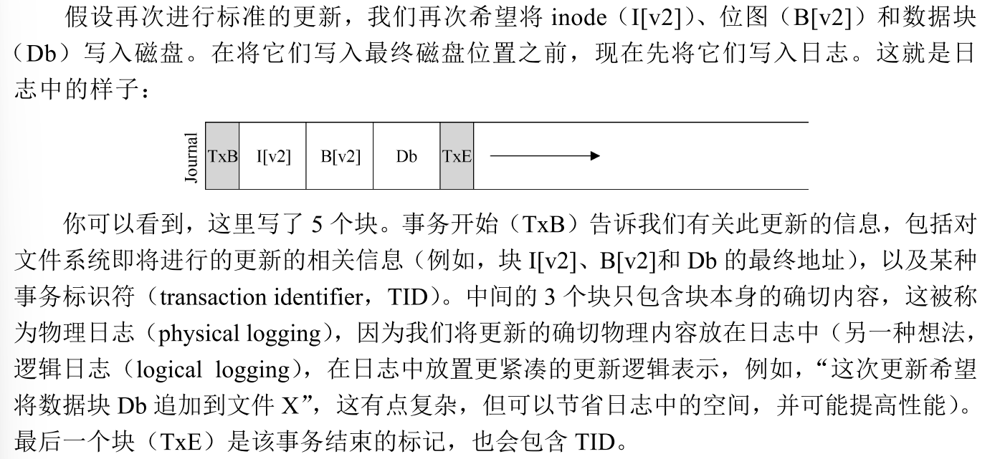

如何在断电、系统崩溃的情况下，更新持久数据结构？

#### 一个详细的例子

新建一个文件，需要增加一个 data block ，然后还需要标记 inode ，还需要标记 data bmap 和 inode bmap 。（如果是在一个原有的文件后增加，那么不需要更改 inode bmap ，因为只用修改之前的 inode 即可，而不需要添加 inode 。）

那么我们崩溃的场景千千万，总而言之就是有些已经写入了，有些没有写入。

崩溃一致性问题，说人话，就是崩溃了我们需要保证需要更改的要么都更改了要么都不更改。

#### 解决方法1：文件系统检查程序

早期的文件系统采用了一种简单的方法来处理崩溃一致性。基本上，它们决定让不一致的事情发生，然后再修复它们（重启时）。

fsck （修复程序）的基本总结：

- 超级块：fsck 首先检查超级块是否合理，主要是进行健全性检查，例如确保文件系 统大小大于分配的块数。通常，这些健全性检查的目的是找到一个可疑的（冲突 的）超级块。在这种情况下，系统（或管理员）可以决定使用超级块的备用副本。
- 空闲块：接下来，fsck 扫描 inode、间接块、双重间接块等，以了解当前在文件系 统中分配的块。它利用这些知识生成正确版本的分配位图。因此，如果位图和 inode 之间存在任何不一致，则通过信任 inode 内的信息来解决它。对所有 inode 执行相 同类型的检查，确保所有看起来像在用的 inode，都在 inode 位图中有标记。
- inode 状态：检查每个 inode 是否存在损坏或其他问题。例如，fsck 确保每个分配 的 inode 具有有效的类型字段（即常规文件、目录、符号链接等）。如果 inode 字 段存在问题，不易修复，则 inode 被认为是可疑的，并被 fsck 清除，inode 位图相 应地更新。
- inode 链接：fsck 还会验证每个已分配的 inode 的链接数。你可能还记得，链接计 数表示包含此特定文件的引用（即链接）的不同目录的数量。为了验证链接计数， fsck 从根目录开始扫描整个目录树，并为文件系统中的每个文件和目录构建自己的链接计数。如果新计算的计数与 inode 中找到的计数不匹配，则必须采取纠正措施， 通常是修复 inode 中的计数。如果发现已分配的 inode 但没有目录引用它，则会将 其移动到 lost + found 目录。
- 重复：fsck 还检查重复指针，即两个不同的 inode 引用同一个块的情况。如果一个 inode 明显不好，可能会被清除。或者，可以复制指向的块，从而根据需要为每个 inode 提供其自己的副本。
- 坏块：在扫描所有指针列表时，还会检查坏块指针。如果指针显然指向超出其有 效范围的某个指针，则该指针被认为是“坏的”，例如，它的地址指向大于分区 大小的块。在这种情况下，fsck 不能做任何太聪明的事情。它只是从 inode 或间接 块中删除（清除）该指针。
- 目录检查：fsck 不了解用户文件的内容。但是，目录包含由文件系统本身创建的特 定格式的信息。因此，fsck 对每个目录的内容执行额外的完整性检查，确保“.” 和“..”是前面的条目，目录条目中引用的每个 inode 都已分配，并确保整个层次 结构中没有目录的引用超过一次。

很容易看出来，太麻烦了。

#### 解决方案2：日志（预写日志）

更新磁盘时，在覆写结构之前，首先写下一点小注记（在磁盘上的其他地方，在一个众所周知的位置），描述你将要做的事情。写下这个注记就是“预写”部分， 我们把它写入一个结构，并组织成“日志”。因此，就有了预写日志。（借鉴自数据库系统）。那么我们只需要通过日志来分析有无崩溃，如何修改。

##### 数据日志

一旦这个事务安全地存在于磁盘上，我们就可以覆写文件系统中的旧结构了。这个过程称为加检查点（checkpointing）。

1. 日志写入：将事务写入日志，等待这些写入完成
2. 将待处理的元数据和数据更新写入文件系统中的最终位置

我们将这五个块写入日志时，如果顺序提交效率很低，如果一次性提交那么由于调度可能顺序会出问题， TxB 和 TxE 都写入了，但是 Db 没有写入就断电了。那么恢复的时候，因为 Db 没有写入日志，就会出问题。

解决起来也很简单，先提交前 4 个，完成后再提交 TxE ，并且我们保证 TxE 的原子性。

修改后的过程为：

1. 日志写入：将事务的内容（包括TxB、元数据和数据）写入日志，等待这些写入完成。 
2. 日志提交：将事务提交块（包括 TxE）写入日志，等待写完成，事务被认为已提交（committed）。 
3. 加检查点：将更新内容（元数据和数据）写入其最终的磁盘位置。

##### 恢复

重写日志，重新执行一遍日志即可。

##### 批处理日志更新

每个更改都要写入日志，挺麻烦的，比如修改文件 1 和文件 2 ，都要修改父目录的 inode 。因此我们可以将更新缓冲到全局事务中，然后再来调节写入。

##### 使日志有限

循环日志。一段时间后，通过更新日志超级块，在日志中标记该事务为空闲。

好了，这样我们确实解决了崩溃一致性问题，但是代价有点高，因为原本写入一次的，现在写入两次了。

##### 元数据类型

我们将 Db 不写入日志，只写入文件系统。因为数据是最大的，所以减少这个对效率的提高是显著的。

先写入数据，然后再写入日志，就算崩溃了，大不了重新写一遍数据，不会有别的问题。

1. 数据写入：将数据写入最终位置，等待完成（等待是可选的，详见下文）。 
2. 日志元数据写入：将开始块和元数据写入日志，等待写入完成。 
3. 日志提交：将事务提交块（包括 TxE）写入日志，等待写完成，现在认为事务（包括数据）已提交（committed）。
4. 加检查点元数据：将元数据更新的内容写入文件系统中的最终位置。
5. 释放：稍后，在日志超级块中将事务标记为空闲。

##### 棘手的情况：块复用

假设你正在使用某种形式的元数据日志（因此不记录文件的数据块）。假设你有一个名为 foo 的目录。用户向 foo 添加一个条目（例如通过创建文件），因此 foo 的内容（因为目录被认为是元数据）被写入日志。假设 foo 目录数据的位置是块 1000。

此时，用户删除目录中的所有内容以及目录本身，从而释放块 1000 以供复用。最后，用户创建了一个新文件（比如 foobar），结果复用了过去属于 foo 的相同块（1000）。foobar 的 inode 提交给磁盘，其数据也是如此。但是，请注意，因为正在使用元数据日志，所以只 有 foobar 的 inode 被提交给日志，文件 foobar 中块 1000 中新写入的数据没有写入日志。

现在假设发生了崩溃，所有这些信息仍然在日志中。在重放期间，恢复过程简单地重 放日志中的所有内容，包括在块 1000 中写入目录数据。因此，重放会用旧目录内容覆盖当前文件 foobar 的用户数据！

解决办法：可以永远不再重复使用块，直到所述块的删除加上检查点，从日志中清除。Linux ext3 的做法是将新类型的记录添加到日志中，称为撤销（revoke） 记录。在上面的情况中，删除目录将导致撤销记录被写入日志。在重放日志时，系统首先扫 描这样的重新记录。任何此类被撤销的数据都不会被重放，从而避免了上述问题。

##### 总结日志：时间线

在数据日志协议中，事务开始块（TxB）的写入和事务的内容可以在逻辑上同时发出，因此可以按任何顺序完成。但是，在上述写入完成之前，不得发出对事务结束块（TxE）的写入。同样，在事务结束块提交之前，写入数据和元数据块的加检查点无法开始。

对元数据日志协议也显示了类似的时间线。请注意，在逻辑上，数据写入可以与对事务开始的写入和日志的内容一起发出。但是，必须在事务结束发出之前发出并完成。

