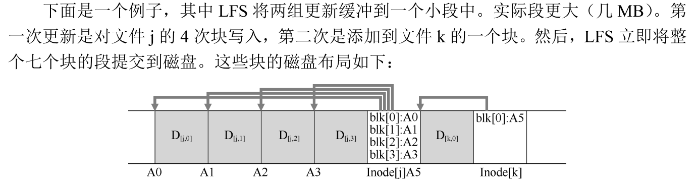
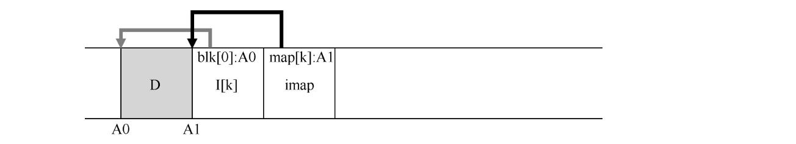

因为：

- 内存大小不断增长，读取将在缓存中处理，因此文件系统性能很大程度上取决于写入性能。
- 随机 I/O 性能与顺序 I/O 性能之间存在巨大的差距，且不断扩大：传输带宽每年增加约 50%～100%。因此要尽量顺序方式使用磁盘。
- 现有文件系统在许多常见工作负载上表现不佳。例如 FFS 会执行大量写入。
- 文件系统不支持 RAID

理想的文件系统会专注于写入性能，并尝试利用磁盘的顺序带宽。此外，它在常见工作负载上表现良好，这种负载不仅写出数据，还经常更新磁盘上的元数据结构。最 后，它可以在 RAID 和单个磁盘上运行良好。

引入的新型文件系统 Rosenblum 和 Ousterhout 称为 LFS，是日志结构文件系统（Log-structured File System）的缩写。写入磁盘时，LFS 首先将所有更新（包括元数据！）缓 冲在内存段中。当段已满时，它会在一次长时间的顺序传输中写入磁盘，并传输到磁盘的 未使用部分。LFS 永远不会覆写现有数据，而是始终将段写入空闲位置。由于段很大，因此 可以有效地使用磁盘，并且文件系统的性能接近其峰值。

#### 按顺序写入磁盘

简单地将所有更新（例如数据块、inode 等）顺序写入磁盘的这一基本思想是 LFS 的核 心。如果你理解这一点，就抓住了基本的想法。

#### 顺序而高效地写入

（单单）顺序写入磁盘并不足以保证高效写入。例如，假设我们在时间 T 向地址A写入一个块。然后等待一会儿，再向磁盘写入地址 A+1（下一个块地址按顺序），但 是在时间 T+δ。遗憾的是，在第一次和第二次写入之间，磁盘已经旋转。当你发出第二次写 入时，它将在提交之前等待一大圈旋转（具体地说，如果旋转需要时间 Trotation，则磁盘将等 待 Trotation−δ，然后才能将第二次写入提交到磁盘表面）。

LFS 使用了一种称为写入缓冲（write buffering）的古老技术。在 写入磁盘之前，LFS 会跟踪内存中的更新。收到足够数量的更新时，会立即将它们写入磁盘， 从而确保有效使用磁盘。LFS 一次写入的大块更新被称为段（segment）。

#### 通过间接解决方案：inode 映射

LFS 将 inode 映射的块放在它写入所有其他新信息的位置旁边。因此，当将 数据块追加到文件 k 时，LFS 实际上将新数据块，其 inode 和一段 inode 映射一起写入磁盘， 如下所示：

#### 检查点区域(CR)

我们如何很到 inode 映射，现在它的各个部分现在也分布在整个磁盘上？归根到底：文件系统必须在磁盘上有一 些固定且已知的位置，才能开始文件查找。

检查点区域包含指向最新的 inode 映射片段的指针（即地址），因此可以通过首先读取 CR 来很 到 inode 映射片段。

