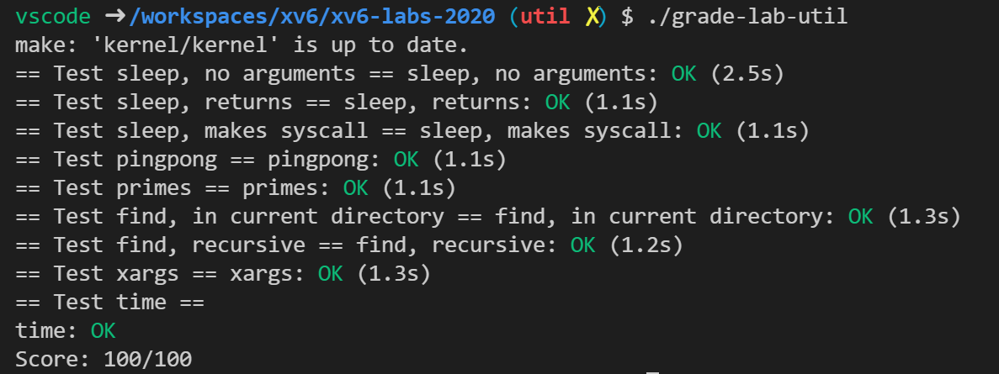

对照实验说明[实验说明](https://pdos.csail.mit.edu/6.828/2020/labs/util.html)阅读。

### Boot xv6

```shell
$ git clone git://g.csail.mit.edu/xv6-labs-2020
$ cd xv6-labs-2020
$ git checkout util
```

在命令行运行 `make qemu` 即可启动xv6操作系统。按住 ctrl + a ，松开后按 x 退出。

### sleep

> 为 xv6 实现 UNIX 程序`sleep`；您的`sleep`应该暂停用户指定的滴答数。滴答是 xv6 内核定义的时间概念，即来自计时器芯片的两次中断之间的时间。您的解决方案应该在文件 `user/sleep.c`中。

```c
#include "kernel/types.h"
#include "kernel/stat.h"
#include "user/user.h"

int main(int argc, char const *argv[])
{
    // 期望参数数量为 2
    if (argc != 2)
    {
        fprintf(2, "error\n");
        exit(1);
    }
    // 将第二个参数转换为整数类型
    sleep(atoi(argv[1]));
    exit(0);
}
```

照着来就行了，最后需要是 exit(0) 不能是 return 0 。说实话，我并不喜欢这种代码风格，但是如果不是这种风格他他他居然自动改我头文件顺序。

### pingpong

> 编写一个程序，使用 UNIX 系统调用通过一对管道在两个进程之间 “pingpong” 一个字节，一个管道用于每个方向。父母应该向孩子发送一个字节；子进程应该打印“<pid>: received ping”，其中 <pid> 是它的进程 ID，将管道上的字节写入父进程，然后退出；父母应该从孩子那里读取字节，打印“<pid>: received pong”，然后退出。您的解决方案应该在文件`user/pingpong.c`中。

```c
#include "kernel/types.h"
#include "kernel/stat.h"
#include "user/user.h"

int main(int argc, char const *argv[])
{
    // 期望参数的数量是 1
    if (argc != 1)
    {
        fprintf(2, "error\n");
        exit(1);
    }
    // 管道，p[0] 为读管道，p[1] 为写管道
    int p[2];
    pipe(p);
    int rc = fork();
    if (rc == 0)
    {
        // 子进程先从管道中读取一个字节
        char buf[2];
        if (read(p[0], buf, 1) != 1)
        {
            fprintf(2, "error\n");
            exit(1);
        }
        // 及时关闭管道
        close(p[0]);
        printf("%d: received ping\n", getpid());
        // 子进程先管道中写入一个字节
        if (write(p[1], buf, 1) != 1)
        {
            fprintf(2, "error\n");
            exit(1);
        }
        // 关闭管道
        close(p[1]);
        exit(0);
    }
    else if (rc > 0)
    {
        char buf[2] = "a";
        // 向管道中写入一个字节
        if (write(p[1], buf, 1) != 1)
        {
            fprintf(2, "error\n");
            exit(1);
        }
        close(p[1]);
        // 等到子进程结束，这样后面读到的一定是子进程写入的而不是刚刚自己写入的
        wait(0);
        // 从管道中读取一个字节
        if (read(p[0], buf, 1) != 1)
        {
            fprintf(2, "error\n");
            exit(1);
        }
        // 关闭管道
        close(p[0]);
        printf("%d: received pong\n", getpid());
        exit(0);
    }
    else
    {
        fprintf(2, "error\n");
        exit(1);
    }
}
```

### primes

> 使用管道编写一个并发版本的初筛。这个想法归功于 Unix 管道的发明者 Doug McIlroy。[本页](http://swtch.com/~rsc/thread/)中间的图片和周围的文字说明了如何做到这一点。您的解决方案应该在文件`user/primes.c`中。

```c
#include "kernel/types.h"
#include "kernel/stat.h"
#include "user/user.h"

void my_prime(int p[2])
{
    int prime;
    int next;
    close(p[1]);
    if (read(p[0], &prime, 4) != 4)
    {
        fprintf(2, "error\n");
        exit(1);
    }
    // 从管道中读取一个数字，一定是素数。因为我们采用的筛法，不是素数会被筛选出去，留下的最开头一个一定是素数
    printf("prime %d\n", prime);
    // 如果管道中还有没处理完的数据，就像父进程创建这个进程一样创建一个新的进程
    if (read(p[0], &next, 4) == 4)
    {
        // 新的管道
        int newp[2];
        pipe(newp);
        int rc = fork();
        if (rc == 0)
        {
            my_prime(newp);
        }
        else if (rc > 0)
        {
            close(newp[0]);
            // 将后续的数字从前一个管道取出，写入后一个管道，而且数字如果是当前素数的倍数，那么就不必写入了
            do
            {
                if (next % prime != 0)
                {
                    write(newp[1], &next, 4);
                }
            } while (read(p[0], &next, 4) == 4);
            close(p[0]);
            close(newp[1]);
            wait(0);
            exit(0);
        }
        else
        {
            fprintf(2, "error\n");
            exit(1);
        }
        exit(0);
    }
    exit(0);
}
int main(int argc, char const *argv[])
{
    // 期待一个参数
    if (argc != 1)
    {
        fprintf(2, "error\n");
        exit(1);
    }
    // 管道
    int p[2];
    pipe(p);
    int rc = fork();
    if (rc == 0)
    {
        my_prime(p);
        exit(0);
    }
    else if (rc > 0)
    {
        close(p[0]);
        // 向管道中传入所有的数字
        for (int i = 2; i <= 35; i++)
        {
            // 每次 4 个字节，也就是一个数字
            if (write(p[1], &i, 4) != 4)
            {
                fprintf(2, "error\n");
                exit(1);
            }
        }
        close(p[1]);
        wait(0);
        exit(0);
    }
    else
    {
        fprintf(2, "error\n");
        exit(1);
    }
}
```

我的本意是想，每个进程只读出一个数，然后判断这个数能否是素数，并且把剩余的素数全部都写入到下一个管道。但是，这样要创建的管道就很多，而我们的 xv6 系统不支持这么多管道。因此需要使用素数筛，这样这个进程都是素数。进程数量大大减少。

### find

> 编写一个简单版本的 UNIX 查找程序：查找目录树中具有特定名称的所有文件。您的解决方案应该在文件`user/find.c`中。
>

```c
#include "kernel/types.h"
#include "kernel/stat.h"
#include "user/user.h"
#include "kernel/fs.h"

void my_find(char const *path, char const *name)
{
    int fd;
    char buf[512], *p;
    struct dirent de;
    struct stat st;
    // 无法打开
    if ((fd = open(path, 0)) == 0)
    {
        fprintf(2, "error\n");
        exit(1);
    }
    // 将文件信息写入 st
    if (fstat(fd, &st) < 0)
    {
        fprintf(2, "error\n");
        close(fd);
        exit(1);
    }
    switch (st.type)
    {
    // 传入的参数不是文件夹，肯定是不行的
    case T_FILE:
        fprintf(2, "error\n");
        exit(1);
    case T_DIR:
        // 当前的路径太深了
        if (strlen(path) + 1 + DIRSIZ + 1 > sizeof(buf))
        {
            printf("error\n");
            exit(1);
        }
        // 复制一个新路径
        strcpy(buf, path);
        p = buf + strlen(buf);
        *p++ = '/';
        // 遍历当前路径的每个文件（夹）
        while (read(fd, &de, sizeof(de)) == sizeof(de))
        {
            // 不能是 "." 和 ".."
            if (de.inum == 0 || strcmp(de.name, ".") == 0 || strcmp(de.name, "..") == 0)
                continue;
            // 复制文件（夹）名，如果是将字符串 20-30
            memmove(p, de.name, DIRSIZ);
            p[DIRSIZ] = 0;
            if (stat(buf, &st) < 0)
            {
                printf("error\n");
                exit(1);
            }
            switch (st.type)
            {
            // 新形成的路径是文件
            case T_FILE:
                if (strcmp(de.name, name) == 0)
                {
                    printf("%s\n", buf);
                }
                break;
            case T_DIR:
                my_find(buf, name);
                break;
            }
        }
    }
}
int main(int argc, char const *argv[])
{
    // 期望参数是 3 个
    if (argc != 3)
    {
        fprintf(2, "Usage: find dir file\n");
        exit(1);
    }
    my_find(argv[1], argv[2]);
    exit(0);
}
```

### xargs

> 编写一个简单版本的 UNIX xargs 程序：从标准输入读取行并为每一行运行一个命令，将该行作为参数提供给命令。您的解决方案应该在文件`user/xargs.c`中。

```c
#include "kernel/types.h"
#include "kernel/stat.h"
#include "user/user.h"
#include "kernel/param.h"

int readline(char *arg[32], int arc)
{
    char buf[1024];
    int n = 0;
    // 一个字节一个字节的读，直到满了或者 "\n"
    while (read(0, buf + n, 1))
    {
        if (n == 1023)
        {
            fprintf(2, "error\n");
            exit(1);
        }
        if (buf[n] == '\n')
        {
            break;
        }
        n++;
    }
    buf[n] = 0;
    if (n == 0)
        return 0;
    int offset = 0;
    // 切分，将 ' ' 改成 0 （也就是 NULL）
    while (offset < n)
    {
        arg[arc++] = buf + offset;
        while (buf[offset] != ' ' && offset < n)
        {
            offset++;
        }
        while (buf[offset] == ' ' && offset < n)
        {
            buf[offset++] = 0;
        }
    }
    return arc;
}

int main(int argc, char const *argv[])
{
    // 期待参数个数大于 1
    if (argc <= 1)
    {
        fprintf(2, "error\n");
        exit(1);
    }
    // 命令
    char *command = (char *)malloc(sizeof(char) * (strlen(argv[1]) + 1));
    strcpy(command, argv[1]);
    // 参数列表
    char *arg[MAXARG];
    for (int i = 1; i < argc; ++i)
    {
        arg[i - 1] = (char *)malloc(sizeof(char) * (strlen(argv[i]) + 1));
        strcpy(arg[i - 1], argv[i]);
    }
    int arc;
    // 每行处理一次，将得到的参数写在后面，生成子进程执行
    while ((arc = readline(arg, argc - 1)) != 0)
    {
        arg[arc] = 0;
        if (fork() == 0)
        {
            exec(command, arg);
            fprintf(2, "error\n");
            exit(1);
        }
        wait(0);
    }
    exit(0);
}
```

### 最后结果



