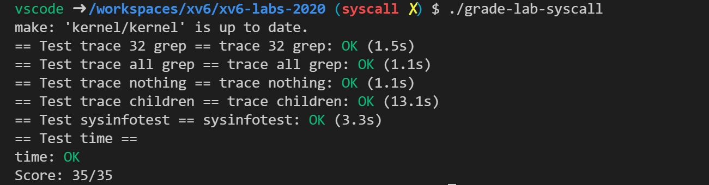

务必对照[实验说明](https://pdos.csail.mit.edu/6.828/2020/labs/syscall.html)阅读。

前置知识：

> 1. 阅读 xv6 book 的第 2 章、第 4 章。
> 2. 系统调用的用户空间代码在 user/user.h 和 user/user.pl 中。
> 3. 内核空间代码是 kernel/syscall.h 和 kernel/syscall.c 。
> 4. 与进程相关的代码是 kernel/proc.h 和 kernel/proc.c 。

### System call tracing

> 在本作业中，您将添加一个系统调用跟踪功能，该功能可能会在以后调试实验时帮助您。您将创建一个新的`trace`系统调用来控制跟踪。它应该采用一个参数，一个整数“掩码”，其位指定要跟踪的系统调用。例如，要跟踪 fork 系统调用，程序调用`trace(1 << SYS_fork)`，其中`SYS_fork`是来自`kernel/syscall.h`的系统调用号。如果掩码中设置了系统调用的编号，则必须修改 xv6 内核以在每个系统调用即将返回时打印出一行。该行应包含进程id、系统调用的名称和返回值；您不需要打印系统调用参数。`trace`这个系统调用应该启用对调用它的进程以及它随后派生的任何子进程的跟踪，但不应影响其他进程。

完成之后我们应该会看到：

```shell
$ trace 32 grep hello README
3: syscall read -> 1023
3: syscall read -> 966
3: syscall read -> 70
3: syscall read -> 0
```

这里 32 等于 2 的 5 次方，系统调用号为 5 的命令为 read ，那么我们调用 read 的时候就应该输出信息。如果是 2147483647 ，1 到 31 的命令都应该输出。

一些提示：

- 在 `Makefile`中将 `$U/_trace`添加到 `UPROGS`
- 运行`make qemu`，您将看到编译器无法编译`user/trace.c`，因为系统调用的用户空间存根尚不存在：将系统调用的原型添加到`user/user.h`，将存根添加到`user /usys.pl`和`kernel/syscall.h`的系统调用号。`Makefile` 调用 `perl` 脚本`user/usys.pl`，它产生`user/usys.S`，实际的系统调用存根，它使用 RISC-V `ecall`指令转换到内核。修复编译问题后，运行`trace 32 grep hello README`；它会失败，因为你还没有在内核中实现系统调用。
- `在kernel/sysproc.c`中添加一个`sys_trace()`函数，该函数通过在`proc`结构中的新变量中记住其参数来实现新的系统调用（参见`kernel/proc.h`）。从用户空间检索系统调用参数的函数在`kernel/syscall.c`中，您可以在`kernel/sysproc.c`中查看它们的使用示例。
- 修改`fork()`（参见`kernel/proc.c`）以将跟踪掩码从父进程复制到子进程。
- 修改`kernel/syscall.c`中的`syscall()`函数以打印跟踪输出。您将需要添加一组系统调用名称以对其进行索引。

我们根据提示慢慢来：

第一点很简单，添加即可。

第二点，我们先看代码，可以看到 `user/trace.c` 里面的内容是：

```c
#include "kernel/param.h"
#include "kernel/types.h"
#include "kernel/stat.h"
#include "user/user.h"

int main(int argc, char* argv[])
{
    int i;
    char* nargv[MAXARG];

    if (argc < 3 || (argv[1][0] < '0' || argv[1][0] > '9')) {
        fprintf(2, "Usage: %s mask command\n", argv[0]);
        exit(1);
    }

    // 这里我们调用了 trace 函数
    if (trace(atoi(argv[1])) < 0) {
        fprintf(2, "%s: trace failed\n", argv[0]);
        exit(1);
    }
	
    // 然后执行后面的命令
    for (i = 2; i < argc && i < MAXARG; i++) {
        nargv[i - 2] = argv[i];
    }
    exec(nargv[0], nargv);
    exit(0);
}
```

然后去看 `user/user.h` ，我们应该要添加函数原型，根据上面的代码，我们可以看到，应该要在 `system calls` 添加的函数原型是：

```c
int trace(int);
```

然后我们看 `user /usys.pl` ，同样依葫芦画瓢，在末尾添加：

```c
entry("trace");
```

然后继续看 `kernel/syscall.h` ，同样依葫芦画瓢，在末尾添加：

```c
#define SYS_trace 22
```

到此为止用户这边已经能很好的调用内核程序了，可是我们的内核中还没有这个命令。接下来就是需要在内核中写出这个命令。

第三步，`在kernel/sysproc.c`中添加一个`sys_trace()`函数。

我们可以参考一下熟悉的 kill 函数是这样的：

```c
uint64
sys_kill(void)
{
    int pid; // kill 一定是有一个尝试，是进程的 pid

    // 去看一下这个函数，会发现返回值是 p->trapframe->a0
    if (argint(0, &pid) < 0)
        return -1;
    // 然后执行后返回。
    return kill(pid);
}
```

然后关注一下调用的这个函数

```c
static uint64
argraw(int n)
{
    struct proc* p = myproc();
    switch (n) {
    case 0:
        return p->trapframe->a0;
    case 1:
        return p->trapframe->a1;
    case 2:
        return p->trapframe->a2;
    case 3:
        return p->trapframe->a3;
    case 4:
        return p->trapframe->a4;
    case 5:
        return p->trapframe->a5;
    }
    panic("argraw");
    return -1;
}

// Fetch the nth 32-bit system call argument.
int argint(int n, int* ip)
{
    *ip = argraw(n);
    return 0;
}
```

然后我们可以看到 proc （进程的内容有这些）：

```c
// Per-process state
struct proc {
    struct spinlock lock;

    // p->lock must be held when using these:
    enum procstate state; // Process state
    struct proc* parent; // Parent process
    void* chan; // If non-zero, sleeping on chan
    int killed; // If non-zero, have been killed
    int xstate; // Exit status to be returned to parent's wait
    int pid; // Process ID

    // these are private to the process, so p->lock need not be held.
    uint64 kstack; // Virtual address of kernel stack
    uint64 sz; // Size of process memory (bytes)
    pagetable_t pagetable; // User page table
    struct trapframe* trapframe; // data page for trampoline.S
    struct context context; // swtch() here to run process
    struct file* ofile[NOFILE]; // Open files
    struct inode* cwd; // Current directory
    char name[16]; // Process name (debugging)
    int mask; // 添加的 mask 
};
```

我们可以确定需要在后面添加一个程序，框架大概是下面这样的，然后有一个参数是 mask ，然后判断一下调用是否出错，然后我们在 proc 中添加 mask 并且设置为相应的值。（提示里是这样说的：该函数通过在`proc`结构中的`新变量`中记住其参数来实现新的系统调用）

```c
uint64
sys_trace(void)
{
    int mask;
    
    // 从数据表里面获取 mask ，出错了返回负数
    if (argint(0, &mask) < 0)
        return -1;
   	/* 这是没有能让我们调用的接口啊，可能对每个调用都要执行 
   	   因此我们这里在 proc 里面添加一项
   	   这样进程里的每个系统调用都共用它
   	 */
    myproc()->mask = mask;
    // 正确执行了需要返回一个非负数，那么就 0 吧
    return 0;
}
```

从用户空间检索系统调用参数的函数在`kernel/syscall.c`中，您可以在`kernel/sysproc.c`中查看它们的使用示例。

还是一招，依葫芦画瓢：

```c
// 增加的
extern uint64 sys_trace(void);
// static uint64 (*syscalls[])(void) 中需要增加
[SYS_trace] sys_trace,
```

第四步：修改 `fork`。很容易看出来，这里 fork 就是在赋值一份一模一样的 proc ，因此我们的 mask 值也要传过去就好了。

```c
int fork(void)
{
    int i, pid;
    struct proc* np;
    struct proc* p = myproc();

    // Allocate process.
    if ((np = allocproc()) == 0) {
        return -1;
    }

    // Copy user memory from parent to child.
    if (uvmcopy(p->pagetable, np->pagetable, p->sz) < 0) {
        freeproc(np);
        release(&np->lock);
        return -1;
    }
    np->sz = p->sz;

    np->parent = p;

    // copy saved user registers.
    *(np->trapframe) = *(p->trapframe);

    // Cause fork to return 0 in the child.
    np->trapframe->a0 = 0;

    // increment reference counts on open file descriptors.
    for (i = 0; i < NOFILE; i++)
        if (p->ofile[i])
            np->ofile[i] = filedup(p->ofile[i]);
    np->cwd = idup(p->cwd);

    safestrcpy(np->name, p->name, sizeof(p->name));

    pid = np->pid;

    np->state = RUNNABLE;

    // 赋值 mask
    np->mask = p->mask;

    release(&np->lock);

    return pid;
}
```

第五步，修改`kernel/syscall.c`中的`syscall()`函数以打印跟踪输出。

```c
char* sysname[] = {
    [SYS_fork] "fork",
    [SYS_exit] "exit",
    [SYS_wait] "wait",
    [SYS_pipe] "pipe",
    [SYS_read] "read",
    [SYS_kill] "kill",
    [SYS_exec] "exec",
    [SYS_fstat] "stat",
    [SYS_chdir] "chdir",
    [SYS_dup] "dup",
    [SYS_getpid] "getpid",
    [SYS_sbrk] "sbrk",
    [SYS_sleep] "sleep",
    [SYS_uptime] "uptime",
    [SYS_open] "open",
    [SYS_write] "write",
    [SYS_mknod] "mknod",
    [SYS_unlink] "unlink",
    [SYS_link] "link",
    [SYS_mkdir] "mkdir",
    [SYS_close] "close",
    [SYS_trace] "trace",
};
void syscall(void)
{
    int num;
    struct proc* p = myproc();

    // 容易想到，这里的 num 就是系统调用号
    num = p->trapframe->a7;
    if (num > 0 && num < NELEM(syscalls) && syscalls[num]) {
        p->trapframe->a0 = syscalls[num]();
        // 如果系统调用号和 mask 与运算结果是 1 那么就输出，达到跟踪的作用
        // 但是我们现在还没有系统调用号到系统调用名称的映射，所以建立一个如上
        if ((1 << num) & p->mask) {
            printf("%d: syscall %s -> %d\n", p->pid, sysname[num], p->trapframe->a0);
        }
    } else {
        printf("%d %s: unknown sys call %d\n",
            p->pid, p->name, num);
        p->trapframe->a0 = -1;
    }
}
```

好了，大功告成。

### Sysinfo

> 在这个作业中，您将添加一个系统调用`sysinfo`，它收集有关正在运行的系统的信息。系统调用有一个参数：指向`struct sysinfo`的指针 （参见`kernel/sysinfo.h`）。内核应填写此结构的字段：`freemem`字段应设置为空闲内存的字节数，`nproc` 字段应设置为`status` 不是`UNUSED`的进程数。我们提供了一个测试程序`sysinfotest`；如果它打印“sysinfotest：OK”，你就通过了这个任务。

一些提示：

- 在 `Makefile`中将 `$U/_sysinfotest`添加到 UPROGS

- 运行make qemu；`user/sysinfotest.c`将无法编译。添加系统调用 `sysinfo`，步骤与之前的分配相同。要在 `user/user.h` 中声明`sysinfo() `的原型，您需要预先声明`struct sysinfo`的存在：

  ```c
  struct sysinfo;
  int sysinfo(struct sysinfo*);
  ```

  修复编译问题后，运行 sysinfotest ；它会失败，因为你还没有在内核中实现系统调用。

- `sysinfo` 需要将`struct sysinfo`复制回用户空间；有关如何使用`copyout()`执行此操作的示例，请参见`sys_fstat()` ( `kernel/sysfile.c` ) 和`filestat()` ( `kernel /file.c` ) 。

- 要收集可用内存量，请在`kernel/kalloc.c`中添加一个函数

- 要收集进程数，请在`kernel/proc.c`中添加一个函数

咱们还是一步一步的来，慢慢来，问题不大。

第一步，简单，直接添加就好了，第二步也和前面的一样，可以 make qemu 了那么就说明前两步步骤都没有问题。

然后我们看 sysinfotest.c ，它的主要作用就是测试我们的内核命令是否正确：

```c
int main(int argc, char* argv[])
{
    printf("sysinfotest: start\n");
    // 测试调用 sysinfo 有无问题
    testcall();
    // 测试调用 sysinfo 求出的空闲内存有无问题
    testmem();
    // 测试调用 sysinfo 求出的进程数量有无问题
    testproc();
    printf("sysinfotest: OK\n");
    exit(0);
}
```

要收集可用内存量，请在`kernel/kalloc.c`中添加一个函数（用于计算空闲空间）：

```c
uint64 free_mem()
{
    uint64 n = 0;
    struct run* r;
    acquire(&kmem.lock);
    r = kmem.freelist;
    while (r) {
        n += PGSIZE;
        r = r->next;
    }
    release(&kmem.lock);
    return n;
}
```

要收集进程数，请在`kernel/proc.c`中添加一个函数（用于求解当前的进程数）：

```c
uint64 count_proc()
{
    uint64 n = 0;
    // NPROC 这个词的意思是：maximum number of processes
    所以我们很容易知道这个数组存的就是进程
    for (int i = 0; i < NPROC; i++) {
        struct proc* r = &proc[i];
        acquire(&r->lock);
        if (r->state != UNUSED) {
            n++;
        }
        release(&r->lock);
    }
    return n;
}
```

最后我们的 sysinfo 函数，应该和 trace 一样，在 sysproc.c 内。

```c
uint64
sys_sysinfo(void)
{
    struct sysinfo info;
    info.freemem = free_mem();
    info.nproc = count_proc();

    // to do 返回结构体给用户
    struct proc* p = myproc();
    uint64 addr;
    if (argaddr(0, &addr) < 0)
        return -1;
    if (copyout(p->pagetable, addr, (char*)&info, sizeof(info)) < 0)
        return -1;
    return 0;
}
```

那么就这样，实验结束：



