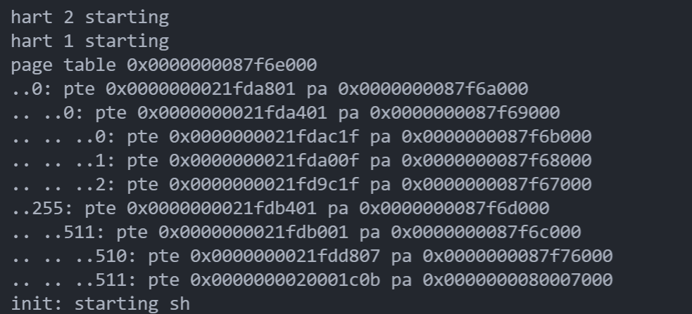
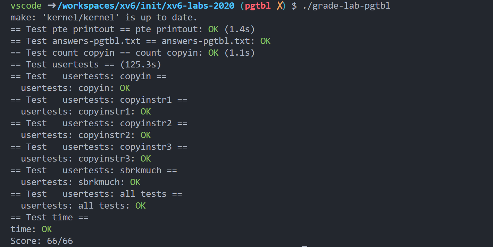

对照[实验文档](https://pdos.csail.mit.edu/6.828/2020/labs/pgtbl.html)阅读。

### Print a page table

> 定义一个名为`vmprint()`的函数。它应该接受一个`pagetable_t`参数，并以下面描述的格式打印该页表。在 `exec.c` 中的`return argc`之前插入`if(p->pid==1) vmprint(p->pagetable)`，以打印第一个进程的页表。如果您通过`make Grade`的`pte printout` 测试，您将获得此作业的全部学分。

一些提示：

- 您可以将`vmprint()`放在`kernel/vm.c`中。
- 使用文件 `kernel/riscv.h` 末尾的宏。
- 函数 `freewalk` 可能会对你很有启发。
- 在 `kernel/defs.h` 中定义`vmprint`的原型，以便您可以从 `exec.c` 中调用它。
- 在您的 `printf` 调用中使用 `%p` 打印出完整的 64 位十六进制 `PTE` 和地址，如示例中所示。

首先，把 `exec` 和 `defs.h` 等写好，然后我们专心开始在 `vm.c` 中写代码。

然后，肯定是阅读 `freewalk` 函数，然后就知道该怎么写我们的程序了。

```c
void vmprint_helper(pagetable_t pagetable, int level)
{
    for (int i = 0; i < 512; i++) {
        pte_t pte = pagetable[i];
        if (pte & PTE_V) {
            // 先打印前面的 ..
            for (int _ = 0; _ < level - 1; _++) {
                printf(".. ");
            }
            printf("..");
            // 下一层页表的地址
            uint64 child = PTE2PA(pte);
            printf("%d: pte %p pa %p\n", i, pte, child);
            if ((pte & (PTE_R | PTE_W | PTE_X)) == 0)
                vmprint_helper((pagetable_t)child, level + 1);
        }
    }
}
int vmprint(pagetable_t pagetable)
{
    printf("page table %p\n", pagetable);
    vmprint_helper(pagetable, 1);
    return 0;
}
```

运行结果如下：



### A kernel page table per process

> 您的第一项工作是修改内核，以便每个进程在内核中执行时都使用自己的内核页表副本。修改`struct proc`为每个进程维护一个内核页表，并修改调度器在切换进程时切换内核页表。对于这一步，每个进程的内核页表应该与现有的全局内核页表相同。如果`usertests`运行正确，你就通过了这部分的实验。

一些提示：

- 为进程的内核页表添加一个字段到`struct proc `。
- 为新进程生成内核页表的合理方法是实现`kvminit`的修改版本 ，该版本生成新页表，而不是修改`kernel_pagetable`。您需要从`allocproc`调用此函数。
- 确保每个进程的内核页表都有该进程的内核堆栈的映射。在未修改的 xv6 中，所有内核堆栈都设置在`procinit`中。您需要将部分或全部功能移至`allocproc`。
- 修改`scheduler()`以将进程的内核页表加载到内核的`satp`寄存器中（请参阅`kvminithart`以获得灵感）。不要忘记在调用`w_satp()` 之后调用`sfence_vma()`。
- `scheduler()`应该在没有进程运行时使用`kernel_pagetable `。
- 在`freeproc`中释放进程的内核页表。
- 您将需要一种方法来释放页表，而无需同时释放叶物理内存页面。
- `vmprint`在调试页表时可能会派上用场。
- 修改xv6功能或添加新功能都可以；您可能至少需要在`kernel/vm.c` 和`kernel/proc.c`中执行此操作。（但是，不要修改`kernel/vmcopyin.c`、`kernel/stats.c`、 `user/usertests.c`和`user/stats.c`。）
- 缺少页表映射可能会导致内核遇到页面错误。它将打印一个包含`sepc=0x00000000XXXXXXXXX`的错误。 您可以通过在`kernel/kernel.asm`中搜索`XXXXXXXX`来找出故障发生的位置。

这个实验和下一个实验就是要求为每个进程分配一个 kpagetable ，当用户陷入内核态时切换到 kpagetable 而不是全局的 kernel_pagetable 。这个 kpagetable 的内容要求有3个:

1. 内容和 kernel_pagetable 基本一样使得在内核态时能够使用内核的代码和数据。

2. 在 trampoline 下面是进程的内核栈， kpagetable 只能把本进程对应的内核栈 map 好。其他进程的不能 map 。

3. 最重要的一点,由于进程的 va 从0开始且连续增长,我们在 kpagetable 中也要保存进程 va 和 pa 的对应关系,这样在内核态时可以直接使用用户空间的虚拟地址.以上述例子来说,内核态可以直接使用地址 a ，因为硬件会自动把 a 翻译为物理地址 b 。

还是跟着提示，一步一步来。首先，我们需要在 `struct proc` 中添加一个新的字段，即我们需要实现的页表，称为 `kpagetable` 。（在文件 `proc.h` 中）

```c
pagetable_t kpagetable;
```

然后，实现`kvminit`的修改版本，这个函数是在 `vm.c` 中，这样实现了创建一份内核副本：

```c
// kvmmap is only set for the original kernel page table, so we need to use a new
// kvmmap function to map page for all the kernel page tables (each proc has one page table)
void kvmmapkern(pagetable_t pagetable, uint64 va, uint64 pa, uint64 sz, int perm)
{
    if (mappages(pagetable, va, sz, pa, perm) != 0)
        panic("kvmmap");
}

// proc's version of kvminit
pagetable_t kvmcreate()
{
    pagetable_t pagetable;
    pagetable = uvmcreate();
    for (int i = 0; i < 512; i++) {
        pagetable[i] = kernel_pagetable[i];
    }

    // uart registers
    kvmmapkern(pagetable, UART0, UART0, PGSIZE, PTE_R | PTE_W);

    // virtio mmio disk interface
    kvmmapkern(pagetable, VIRTIO0, VIRTIO0, PGSIZE, PTE_R | PTE_W);

    // CLINT
    kvmmapkern(pagetable, CLINT, CLINT, 0x10000, PTE_R | PTE_W);

    // PLIC
    kvmmapkern(pagetable, PLIC, PLIC, 0x400000, PTE_R | PTE_W);

    return pagetable;
}
```

记得在 `defs.h` 中添加函数原型，最后在 `proc.c` 的 `allocproc()` 中添加语句 `p->kpagetable = kvmcreate();` ，这样创建进程的时候同样也复制了一份内核的页表过来。

然后修改 `schduler()` 将进程的内核页表加载到内核的`satp`寄存器中：

```c
if (p->state == RUNNABLE) {
    // Switch to chosen process.  It is the process's job
    // to release its lock and then reacquire it
    // before jumping back to us.
    p->state = RUNNING;
    c->proc = p;

    /* 切换到我们创建的页表 */
    w_satp(MAKE_SATP(p->kpagetable));
    sfence_vma();
	
    swtch(&c->context, &p->context);
    // Process is done running for now.
    // It should have changed its p->state before coming back.
    c->proc = 0;

    /* 结束后切换到内核页表 */
    kvminithart();

    found = 1;
}
```

然后在 `freeproc` 函数中添加，看看这个函数，你会知道在哪里添加的。

```c
if (p->kpagetable)
 	kvmfree(p->kpagetable);
p->kpagetable = 0;
```

那么，最后我们需要实现 `kvmfree` 这个函数，在文件 `vm.c` 中，记得在 `defs.h` 中声明函数原型。

```c
void kvmfree(pagetable_t kpagetale)
{
    pte_t pte = kpagetale[0];
    pagetable_t level1 = (pagetable_t)PTE2PA(pte);
    for (int i = 0; i < 512; i++) {
        pte_t pte = level1[i];
        if (pte & PTE_V) {
            uint64 level2 = PTE2PA(pte);
            kfree((void*)level2);
            level1[i] = 0;
        }
    }
    kfree((void*)level1);
    kfree((void*)kpagetale);
}
```

那么到此为止，就大功告成。

### Simplify copyin/copyinstr

> 将`kernel/vm.c`中的`copyin` 主体替换为对`copyin_new` 的调用（在 `kernel/vmcopyin.c`中定义）；对`copyinstr`和`copyinstr_new`执行相同的操作。将用户地址的映射添加到每个进程的内核页表，以便 `copyin_new`和`copyinstr_new`工作。如果`usertests`运行正确并且所有的`make Grade`测试都通过了，那么你就通过了这个作业。

一些提示：

- 先将`copyin()`替换为对`copyin_new` 的调用，并使其工作，然后再转到`copyinstr`。
- 在内核更改进程的用户映射的每一点，都以相同的方式更改进程的内核页表。这些点包括`fork()`、`exec()`和`sbrk()`。
- 不要忘记在`userinit`的内核页表中包含第一个进程的用户页表。
- 用户地址的 `PTE` 在进程的内核页表中需要什么权限？（在内核模式下无法访问设置 了`PTE_U`的页面。）
- 不要忘记上述 `PLIC` 限制。

将对 `vm.c` 中 `copyin()` 和 `copyinstr()` 的调用替换成  `copyin_new()` 和 `copyinstr_new()` 的调用，分别在函数开头添加下面两个语句。

```c
return copyin_new(pagetable, dst, srcva, len);

return copyinstr_new(pagetable, dst, srcva, max);
```

 更改进程的内核页表使用下面这个程序，不要忘记 `defs.h` 中添加函数原型。

```c
// copy PTEs from the user page table into this proc's kernel page table
void kvmmapuser(int pid, pagetable_t kpagetable, pagetable_t upagetable, uint64 newsz, uint64 oldsz)
{
    uint64 va;
    pte_t* upte;
    pte_t* kpte;

    if (newsz >= PLIC)
        panic("kvmmapuser: newsz too large");

    for (va = oldsz; va < newsz; va += PGSIZE) {
        upte = walk(upagetable, va, 0);
        kpte = walk(kpagetable, va, 1);
        *kpte = *upte;
        // because the user mapping in kernel page table is only used for copyin
        // so the kernel don't need to have the W,X,U bit turned on
        *kpte &= ~(PTE_U | PTE_W | PTE_X);
    }
}
```

然后 `exec.c` 中添加：

```c
if(p->pid==1) vmprint(p->pagetable); // 第一部分的时候添加过了
kvmmapuser(p->pid, p->kpagetable, p->pagetable, p->sz, 0);
```

然后就是 `fork()` 和 `sbrk()` （其实就是 `growproc()`）和 `userinit()` 中分别添加：

```c
kvmmapuser(np->pid, np->kpagetable, np->pagetable, np->sz, 0);
kvmmapuser(p->pid, p->kpagetable, p->pagetable, sz, p->sz);
kvmmapuser(p->pid, p->kpagetable, p->pagetable, p->sz, 0);
```

#### 结果



