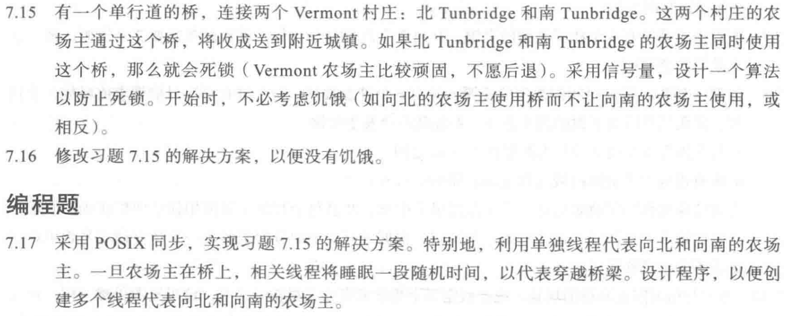
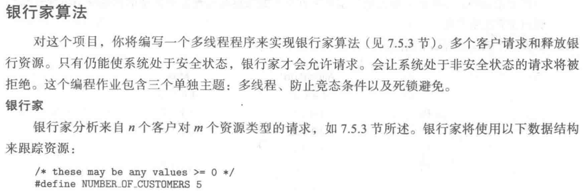
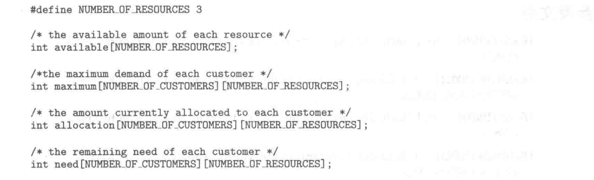
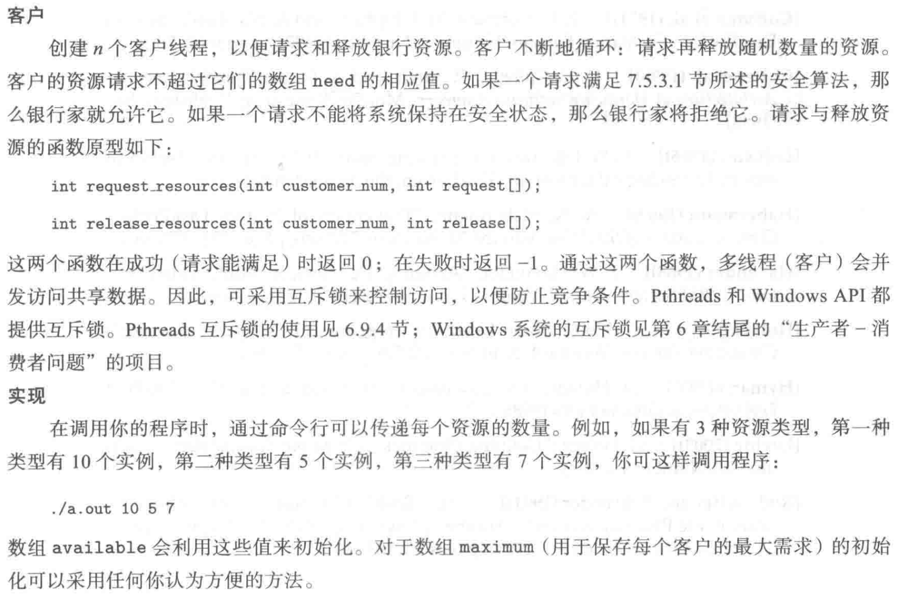
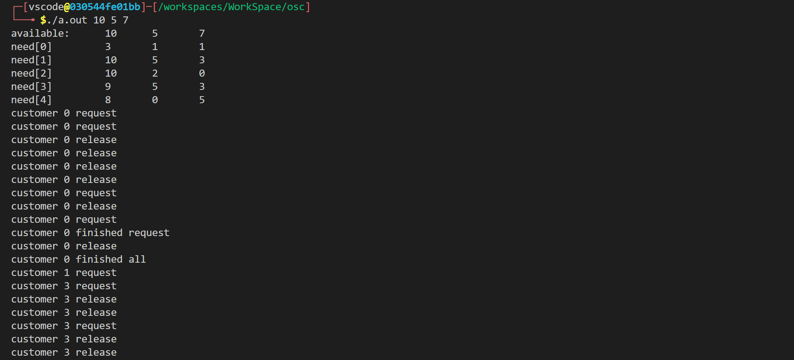

```c
#include <stdio.h>
#include <unistd.h>
#include <pthread.h>
#include <semaphore.h>
#define MAX 100

int left = 0, right = 0;
sem_t leftlock, rightlock, brigelock;

void left_pass()
{
    // sleep(1);
    printf("left_pass\n");
}
void right_pass()
{
    // sleep(1);
    printf("right_pass\n");
}
void acquire_left()
{
    sem_wait(&leftlock);
    left++;
    if (left == 1)
        sem_wait(&brigelock);
    sem_post(&leftlock);
}
void release_left()
{
    sem_wait(&leftlock);
    left--;
    if (left == 0)
        sem_post(&brigelock);
    sem_post(&leftlock);
}

void* left_car(void* arg)
{
    acquire_left();
    left_pass();
    release_left();
}

void acquire_right()
{
    sem_wait(&rightlock);
    right++;
    if (right == 1)
        sem_wait(&brigelock);
    sem_post(&rightlock);
}
void release_right()
{
    sem_wait(&rightlock);
    right--;
    if (right == 0)
        sem_post(&brigelock);
    sem_post(&rightlock);
}

void* right_car(void* arg)
{
    acquire_right();
    right_pass();
    release_right();
}
int main()
{
    sem_init(&leftlock, 0, 1);
    sem_init(&rightlock, 0, 1);
    sem_init(&brigelock, 0, 1);
    pthread_t p[MAX];
    for (int i = 0; i < MAX; i += 2) {
        pthread_create(&p[i], NULL, left_car, NULL);
        pthread_create(&p[i + 1], NULL, right_car, NULL);
    }
    for (int i = 0; i < MAX; i++) {
        pthread_join(p[i], NULL);
    }
    return 0;
}
```

> 这一题就是 WHUOS 里 hw4 的独木桥问题，相关分析可以看那个，不过因为那个作业只写了伪代码，因此这里来实现一下。如果过桥需要时间的话，饥饿不可避免。因为我们这里的设定就是大家同时到达。只要抢占了桥梁，那么不可能让出来。（如果大家不是同时到达的话，那么没有关系）。



```c
#include <stdio.h>
#include <stdlib.h>
#include <assert.h>
#include <unistd.h>
#include <pthread.h>
#include <semaphore.h>
#define CUSROMER 5
#define RESOURCE 3

int available[RESOURCE];
pthread_mutex_t lock;
int maximum[CUSROMER][RESOURCE];
int allocation[CUSROMER][RESOURCE];
int need[CUSROMER][RESOURCE];

int request_resources(int x, int* request)
{
    pthread_mutex_lock(&lock);
    for (int i = 0; i < RESOURCE; i++) {
        if (request[i] > available[i]) {
            pthread_mutex_unlock(&lock);
            return -1;
        }
    }
    for (int i = 0; i < RESOURCE; i++) {
        available[i] -= request[i];
    }
    pthread_mutex_unlock(&lock);
    for (int i = 0; i < RESOURCE; i++) {
        allocation[x][i] += request[i];
        need[x][i] -= request[i];
    }
    return 0;
}

int release_resources(int x, int* release)
{
    for (int i = 0; i < RESOURCE; i++) {
        if (release[i] > allocation[x][i]) {
            return -1;
        }
    }
    pthread_mutex_lock(&lock);
    for (int i = 0; i < RESOURCE; i++) {
        available[i] += release[i];
    }
    pthread_mutex_unlock(&lock);
    for (int i = 0; i < RESOURCE; i++) {
        allocation[x][i] -= release[i];
    }
    return 0;
}
void* customer(void* arg)
{
    int request[RESOURCE];
    int release[RESOURCE];
    int flag = 0;
    while (1) {
        int sum1 = 0, sum2 = 0;
        for (int i = 0; i < RESOURCE; i++) {
            request[i] = rand() % (need[*(int*)arg][i] + 1);
            sum1 += need[*(int*)arg][i];
            release[i] = rand() % (allocation[*(int*)arg][i] + 1);
            sum2 += allocation[*(int*)arg][i];
        }
        if (sum1 == 0 && sum2 == 0) {
            printf("customer %d finished all\n", *(int*)arg);
            break;
        } else if (sum1 == 0 && flag == 0) {
            printf("customer %d finished request\n", *(int*)arg);
            flag = 1;
        } else if (sum1 == 0) {
            if (release_resources(*(int*)arg, release) == 0) {
                printf("customer %d release\n", *(int*)arg);
            }
        } else if (sum2 == 0) {
            if (request_resources(*(int*)arg, request) == 0) {
                printf("customer %d request\n", *(int*)arg);
            }
        } else {
            int temp = rand() % 2;
            if (temp == 1) {
                if (request_resources(*(int*)arg, request) == 0) {
                    printf("customer %d request\n", *(int*)arg);
                }
            } else {
                if (release_resources(*(int*)arg, release) == 0) {
                    printf("customer %d release\n", *(int*)arg);
                }
            }
        }
    }
}
int main(int argc, char* argv[])
{
    if (argc != RESOURCE + 1) {
        printf("please input %d parameters(exclude the first parameter)\n", RESOURCE);
        exit(1);
    }
    srand((int)time(0));
    pthread_mutex_init(&lock, NULL);
    printf("available:\t");
    for (int i = 0; i < RESOURCE; i++) {
        available[i] = atoi(argv[i + 1]);
        printf("%d\t", available[i]);
    }
    printf("\n");
    for (int i = 0; i < CUSROMER; i++) {
        printf("need[%d]\t\t", i);
        for (int j = 0; j < RESOURCE; j++) {
            allocation[i][j] = 0;
            need[i][j] = rand() % (available[j] + 1);
            printf("%d\t", need[i][j]);
        }
        printf("\n");
    }
    pthread_t p[CUSROMER];
    int arg[CUSROMER];
    for (int i = 0; i < CUSROMER; i++) {
        arg[i] = i;
        pthread_create(&p[i], NULL, customer, (void*)&arg[i]);
    }
    for (int i = 0; i < CUSROMER; i++) {
        pthread_join(p[i], NULL);
    }
    return 0;
}
```



> 我根本没有使用 maximum ，因为这个东西的值就是用来确定银行能不能给客户分配足够的资源，如果不能的话，那么需要杀死这个进程。单独考虑一下就好了。但是因为我这里采用的是随机生成 need ，我这里已经保证了 maximum 不会大于 available 了，因此没有必要用。如果没有保证的话，就在 request_resources 最前面遍历一下，如果超限的话直接 exit(1) 。

