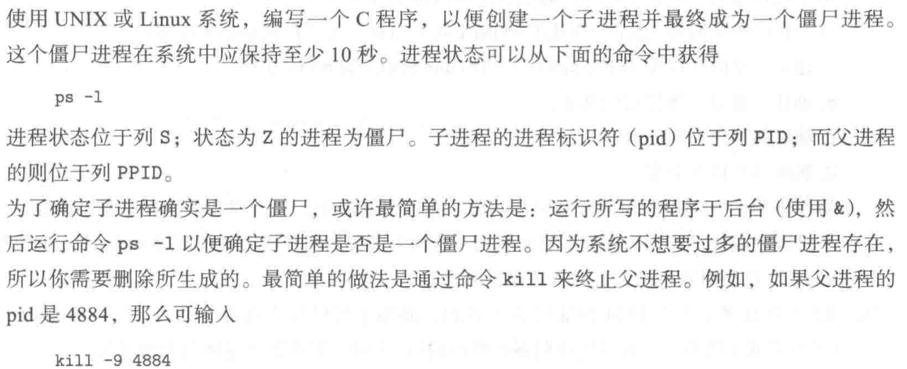

```c
#include <stdio.h>
#include <stdlib.h>
#include <sys/types.h>
#include <unistd.h>
#include <sys/wait.h>

int main()
{
    pid_t pid;
    pid = fork();
    if (pid < 0) {
        printf("error\n");
        exit(1);
    } else if (pid == 0) {
        printf("child: %d\n", getpid());
        sleep(30);
    } else {
        printf("parent: %d\n", getpid());
        wait(NULL);
    }
    return 0;
}
```

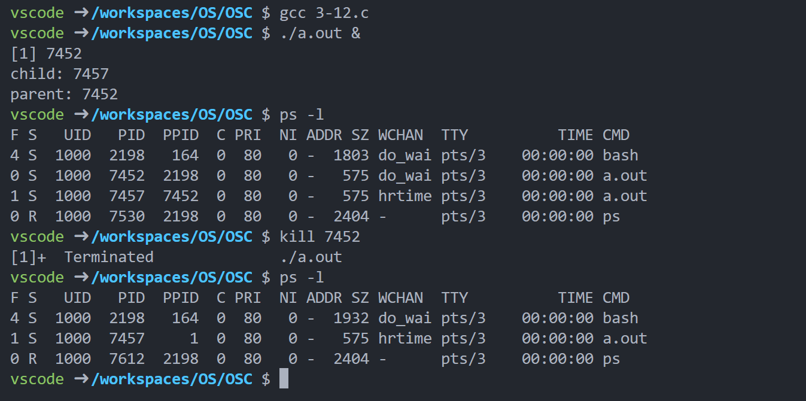

> 如果开两个终端，那么需要在另一个终端输入 ps -e 查看整个系统的进程；或者利用 & 同时在一个终端中运行两个命令。

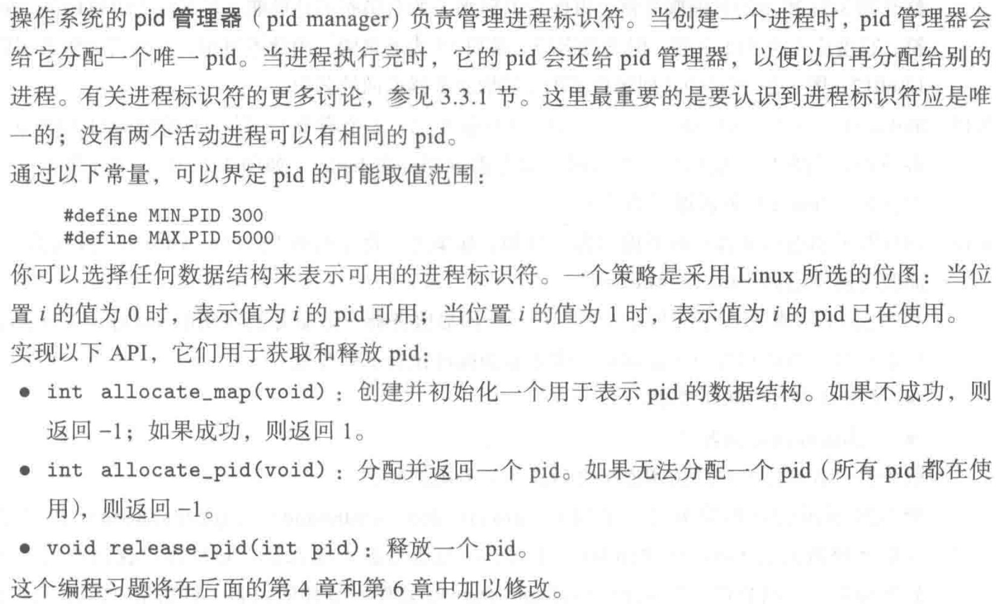

```c
#include <stdio.h>
#include <stdlib.h>
#include <string.h>
#define MIN_PID 300
#define MAX_PID 5000
int* bitset;
int allocate_map(void);
int allocate_pid(void);
void release_pid(int pid);

int main()
{
    allocate_map();
    for (int i = 0; i < 5000; i++) {
        int pid = allocate_pid();
        printf("%d ", pid);
        if (i % 50 == 0)
            printf("\n");
    }
    for (int i = 300; i <= 5000; i++) {
        release_pid(i);
    }
    for (int i = 0; i < 5000 / 32 + 1; i++) {
        if (bitset[i] != 0) {
            printf("false\n");
        }
    }
    printf("true\n");
    return 0;
}
int allocate_map()
{
    bitset = (int*)malloc(sizeof(int) * (MAX_PID / 32 + 1));
    if (bitset == NULL)
        return -1;
    memset(bitset, 0, sizeof(int) * (MAX_PID / 32 + 1));
    return 1;
}

int allocate_pid()
{
    for (int i = MIN_PID; i <= MAX_PID; i++) {
        int a = i / 32, b = i % 32;
        if (((bitset[a] >> b) & 1) == 0) {
            bitset[a] |= 1 << b;
            return i;
        }
    }
    return -1;
}

void release_pid(int i)
{
    int a = i / 32, b = i % 32;
    if (((bitset[a] >> b) & 1) == 1) {
        bitset[a] ^= 1 << b;
    }
}
```

> 输出来判断程序是否正确。当然我们可以用一个指针来标记上次分配的 pid ，这样可以减少循环次数。

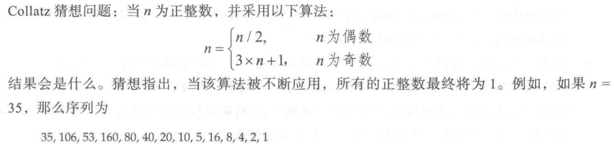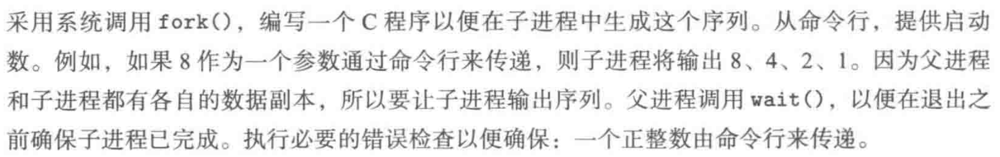

```c
#include <stdio.h>
#include <stdlib.h>
#include <assert.h>
#include <sys/types.h>
#include <unistd.h>
#include <sys/wait.h>

int main(int argc, char* argv[])
{
    assert(argc == 2);
    pid_t pid;
    pid = fork();
    if (pid < 0) {
        printf("error\n");
        exit(1);
    } else if (pid == 0) {
        printf("child: %d\n", getpid());
        int n = atoi(argv[1]);
        while (n > 1) {
            printf("%d, ", n);
            if (n % 2 == 0) {
                n = n / 2;
            } else {
                n = 3 * n + 1;
            }
        }
        printf("%d\n", n);
    } else {
        wait(NULL);
        printf("parent: %d\n", getpid());
    }
    return 0;
}
```

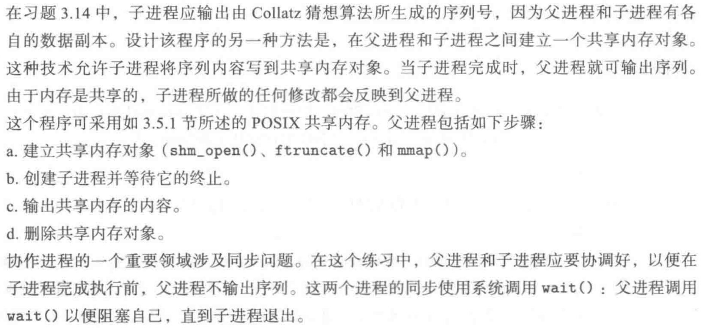

```c
#include <stdio.h>
#include <stdlib.h>
#include <string.h>
#include <fcntl.h>
#include <assert.h>
#include <semaphore.h>
#include <sys/mman.h>
#include <sys/shm.h>
#include <sys/stat.h>
#include <sys/types.h>
#include <unistd.h>
#include <sys/wait.h>	// 头文件太多太讨厌了

int main(int argc, char* argv[])
{
    assert(argc == 2);
    const int SIZE = 4096;
    const char* name = "OS";
    int pid = fork();
    assert(pid >= 0);
    if (pid == 0) {
        printf("child: %d\n", getpid());
        int n = atoi(argv[1]);
        int shm_fd = shm_open(name, O_CREAT | O_RDWR, 0666);
        ftruncate(shm_fd, SIZE);
        void* ptr = mmap(0, SIZE, PROT_WRITE, MAP_SHARED, shm_fd, 0);
        while (n > 1) {
            char str[10];
            sprintf(str, "%d", n);
            sprintf(ptr, "%s", str);
            ptr += strlen(str);
            sprintf(ptr, "%s", ",");
            ptr += 1;
            if (n % 2 == 0) {
                n = n / 2;
            } else {
                n = 3 * n + 1;
            }
        }
        sprintf(ptr, "%d\n", n);
    } else {
        wait(NULL);
        printf("parent: %d\n", getpid());
        int shm_fd = shm_open(name, O_RDONLY, 0666);
        // ftruncate(shm_fd, SIZE);
        void* ptr = mmap(0, SIZE, PROT_READ, MAP_SHARED, shm_fd, 0);
        printf("%s", (char*)ptr);
        shm_unlink(name);
    }
    return 0;
}
```

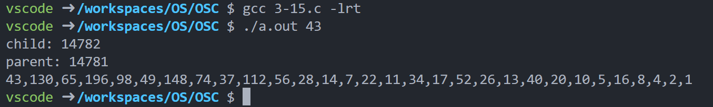

16、17、18需要使用 Java 语言


```c
#include "headers.h"
#define SIZE 512

int main()
{
    int fd1[2], fd2[2];
    char buffer[SIZE];
    int rt = pipe(fd1);
    assert(rt != -1);
    rt = pipe(fd2);
    assert(rt != -1);
    pid_t pid = fork();
    assert(pid >= 0);
    if (pid == 0) {
        close(fd1[1]);
        read(fd1[0], buffer, SIZE);
        close(fd1[0]);
        for (int i = 0; i < strlen(buffer); i++) {
            if (buffer[i] >= 'a' && buffer[i] <= 'z') {
                buffer[i] -= 32;
            } else if (buffer[i] >= 'A' && buffer[i] <= 'Z') {
                buffer[i] += 32;
            }
        }
        close(fd2[0]);
        write(fd2[1], buffer, strlen(buffer) + 1);
        close(fd2[1]);
    } else {
        close(fd1[0]);
        write(fd1[1], "Hello World", 12);
        close(fd1[1]);
        wait(NULL);
        read(fd2[0], buffer, SIZE);
        printf("%s\n", buffer);
        close(fd2[0]);
    }
    return 0;
}
```

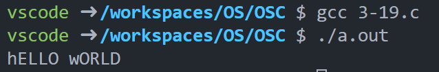

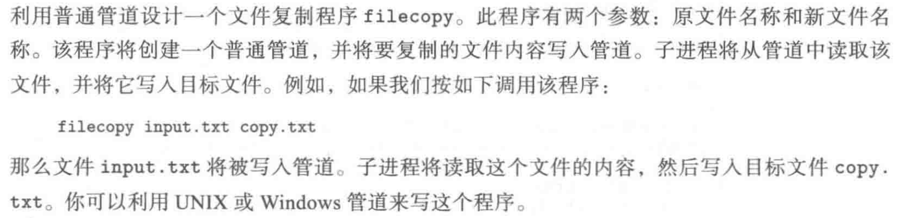

```c
#include "headers.h"
#define SIZE 512

int main(int argc, char* argv[])
{
    assert(argc == 3);
    char* file1 = argv[1];
    char* file2 = argv[2];
    char buffer[SIZE];
    memset(buffer, 0, sizeof(buffer));
    int fd[2];
    int rt = pipe(fd);
    int pid = fork();
    assert(pid >= 0);
    if (pid == 0) {
        printf("child start\n");
        close(fd[1]);
        read(fd[0], buffer, SIZE);
        close(fd[0]);
        int f = open(file2, O_WRONLY | O_CREAT);
        write(f, buffer, strlen(buffer) + 1);
        close(f);
        printf("child end\n");
    } else {
        printf("parent start\n");
        close(fd[0]);
        int f = open(file1, O_RDONLY);
        read(f, buffer, SIZE);
        close(f);
        write(fd[1], buffer, strlen(buffer) + 1);
        close(fd[1]);
        wait(NULL);
        printf("parent end\n");
    }
    return 0;
}
```

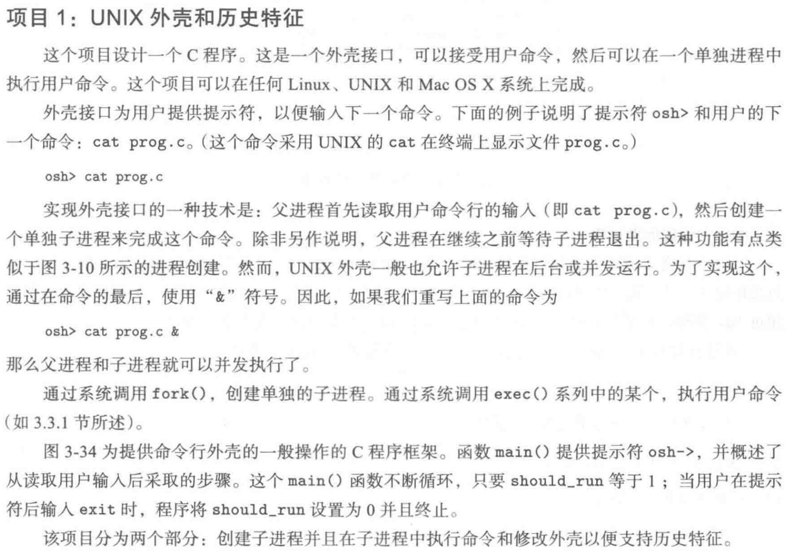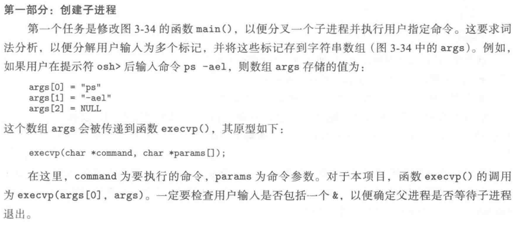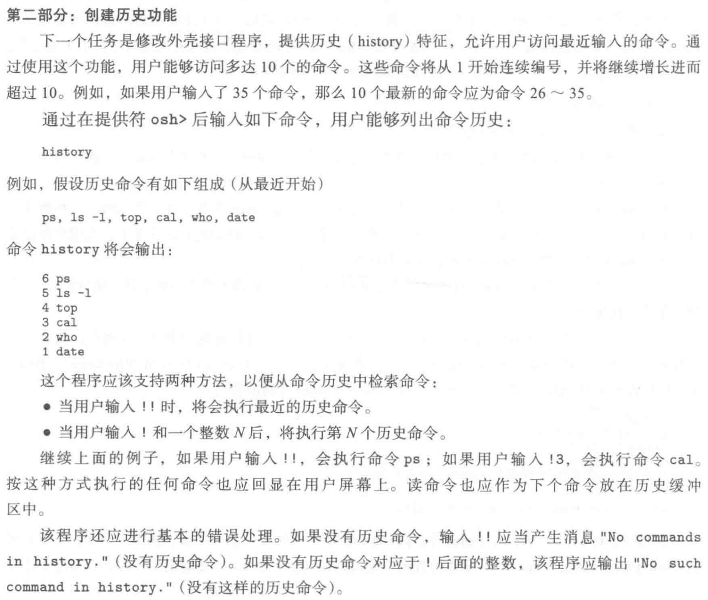

```c
#include "headers.h"
#define MAX_LINE 80
int main(void)
{
    char* args[MAX_LINE / 2 + 1];
    char* history[36];
    int index = 0;
    int flag = 0;
    while (1) {
        printf("osh>");
        fflush(stdin);
        fflush(stdout);
        char c;
        char temp[24];
        int i = 0, argc = 0;
        while ((c = getchar()) != '\n') {
            if (c == ' ') {
                char* t = (char*)malloc(sizeof(char) * (i + 1));
                strcpy(t, temp);
                t[i] = '\0';
                // printf("%s\n", t);
                args[argc++] = t;
                i = 0;
            } else {
                temp[i++] = c;
            }
        }
        char* t = (char*)malloc(sizeof(char) * (i + 1));
        strcpy(t, temp);
        t[i] = '\0';
        // printf("%s\n", t);
        args[argc++] = t;
        // 将指令拷贝一份到 history
        history[index] = (char*)malloc(100);
        int sign = 0;
        for (int i = 0; i < argc; i++) {
            for (int j = 0; j < strlen(args[i]); j++) {
                history[index][sign++] = args[i][j];
            }
            history[index][sign++] = ' ';
        }
        if (index == 35) {
            flag = 1;
            history[index][sign - 1] = '\0';
            index = 0;
        } else {
            history[index++][sign - 1] = '\0';
        }
        if (strcmp(args[0], "exit") == 0) {
            return 0;
        } else if (strcmp(args[0], "history") == 0) {
            if (flag == 0) {
                for (int i = index - 1; i > 0; i--) {
                    printf("%d %s\n", i, history[i - 1]);
                }
            } else {
                for (int i = 0; i < 35; i++) {
                    printf("%d %s\n", 35 - i, history[(index + 34 - i) % 36]);
                }
            }
        } else if (strcmp(args[0], "!!") == 0) {
            // to do history 转参数列表
        } else if (args[0][0] == '!') {
            // to do history 转参数列表
        } else if (strcmp(args[argc - 1], "&") == 0) {
            args[argc - 1] = NULL;
            int pid = fork();
            assert(pid >= 0);
            if (pid == 0) {
                execvp(args[0], args);
            }
        } else {
            args[argc] = NULL;
            int pid = fork();
            assert(pid >= 0);
            if (pid == 0) {
                execvp(args[0], args);
            } else {
                wait(NULL);
            }
        }
    }
    return 0;
}
```

> 项目二就不写了，感觉没什么意思。
