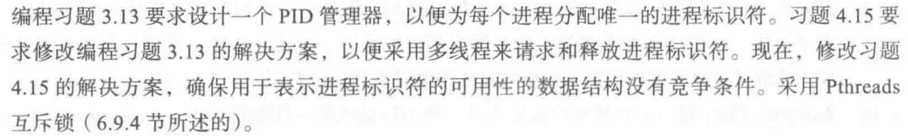

```c
#include "headers.h"
#define MIN_PID 300
#define MAX_PID 5000
int* bitset;
int allocate_map(void);
int allocate_pid(void);
void release_pid(int pid);

pthread_mutex_t lock; // 锁

void* func()
{
    int pid = allocate_pid();
    int temp = rand() % 10;
    sleep(temp);
    release_pid(pid);
}

int main()
{
    allocate_map();
    pthread_mutex_init(&lock, NULL); // 初始化锁
    pthread_t p[100];
    struct timeval start, end;
    gettimeofday(&start, NULL);
    for (int i = 0; i < 100; i++) {
        pthread_create(&p[i], NULL, func, NULL);
    }
    for (int i = 0; i < 100; i++) {
        pthread_join(p[i], NULL);
    }
    gettimeofday(&end, NULL);
    printf("%ld s\n", end.tv_sec - start.tv_sec);
    for (int i = 0; i < 5000 / 32 + 1; i++) {
        if (bitset[i] != 0) {
            printf("false\n");
            return 0;
        }
    }
    printf("true\n");
    return 0;
}
int allocate_map()
{
    bitset = (int*)malloc(sizeof(int) * (MAX_PID / 32 + 1));
    if (bitset == NULL)
        return -1;
    memset(bitset, 0, sizeof(int) * (MAX_PID / 32 + 1));
    return 1;
}

int allocate_pid()
{
    for (int i = MIN_PID; i <= MAX_PID; i++) {
        int a = i / 32, b = i % 32;
        pthread_mutex_lock(&lock);
        if (((bitset[a] >> b) & 1) == 0) {
            bitset[a] |= 1 << b;
            pthread_mutex_unlock(&lock);
            return i;
        }
        pthread_mutex_unlock(&lock);
    }
    return -1;
}

void release_pid(int i)
{
    int a = i / 32, b = i % 32;
    pthread_mutex_lock(&lock);
    if (((bitset[a] >> b) & 1) == 1) {
        bitset[a] ^= 1 << b;
    }
    pthread_mutex_unlock(&lock);
}
```


> （换了个花里胡哨的终端）这里我们添加一把锁，将 bitset 锁住，那么一次有一个进程能够获得锁，就不会产生并发导致的问题，注意 allocate_pid 函数需要两个解锁。

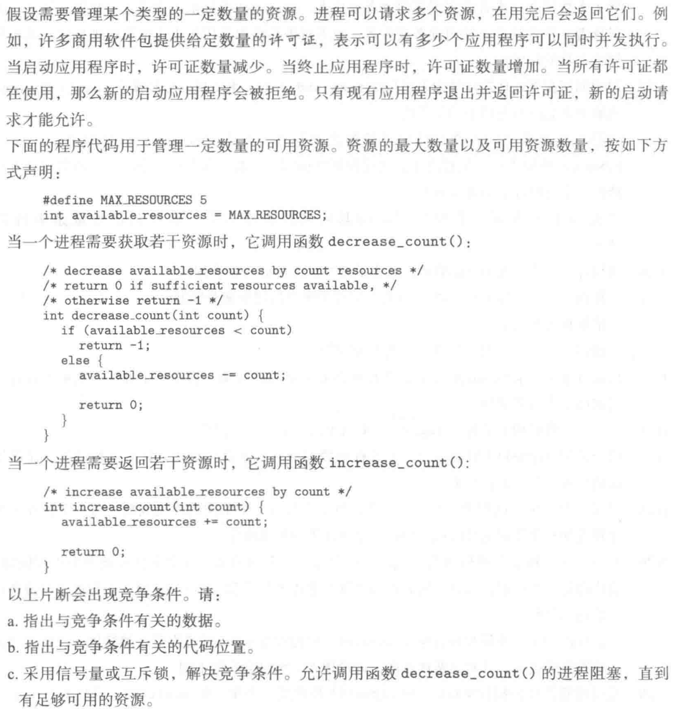

```c
#include "headers.h"
#define MAX 100
int resource = MAX;
sem_t lock;
int count = 0;

void* producer(void* arg)
{
    for (int i = 1; i <= 100000; i++) {
        sem_wait(&lock);
        resource += i;
        sem_post(&lock);
    }
}

void* consumer(void* arg)
{
    for (int i = 100000; i > 0; i--) {
        while (1) {
            sem_wait(&lock);
            if (resource >= i) {
                resource -= i;
                sem_post(&lock);
                break;
            } else {
                sem_post(&lock);
            }
        }
    }
}

int main()
{
    sem_init(&lock, 0, 1);
    pthread_t p[4];
    pthread_create(&p[0], NULL, producer, NULL);
    pthread_create(&p[1], NULL, producer, NULL);
    pthread_create(&p[2], NULL, consumer, NULL);
    pthread_create(&p[3], NULL, consumer, NULL);
    for (int i = 0; i < 4; i++) {
        pthread_join(p[i], NULL);
    }
    printf("resource = %d\n", resource);
    printf("count = %d\n", count);
    return 0;
}
```


> 我觉得这个题的意思就是说，实现一个锁，不太可能是实现信号量，因为信号量的话一次减少一个，这里是一次减少 count 个。或者说就是实现一个二值信号量，而不是一个初始值为 resourse 的信号量。

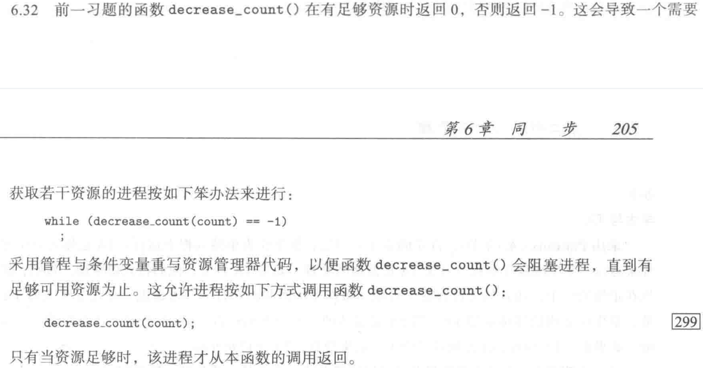

> 感觉前面也没有完全按他说的写，但是也差不多。管程不太明白，那就 pass 吧。

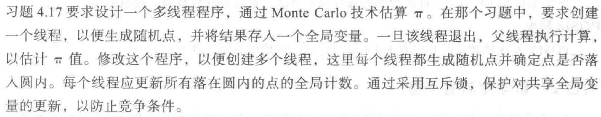

```c
#include "headers.h"
#define LOOPS 10000
int count = 0;
pthread_mutex_t lock;

void* func()
{
    srand((unsigned int)time(NULL));
    for (int i = 0; i < LOOPS; i++) {
        double a = (double)rand() / RAND_MAX * 2 - 1;
        double b = (double)rand() / RAND_MAX * 2 - 1;
        if (a * a + b * b <= 1) {
            pthread_mutex_lock(&lock);
            count += 1;
            pthread_mutex_unlock(&lock);
        }
    }
}
int main(int argc, char* argv[])
{
    assert(argc == 2);
    int n = atoi(argv[1]);
    assert(n <= 1000);
    pthread_mutex_init(&lock, NULL);
    pthread_t p[1000];
    for (int i = 0; i < n; i++) {
        pthread_create(&p[i], NULL, func, NULL);
    }
    for (int i = 0; i < n; i++) {
        pthread_join(p[i], NULL);
    }
    printf("PI = %.6f\n", (double)count / (n * LOOPS) * 4);
    return 0;
}
```

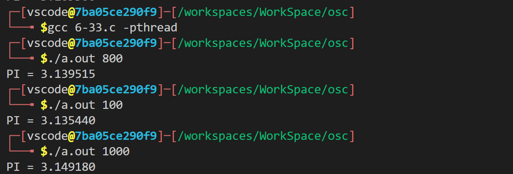

> 我之前做的时候就已经基本完成了，但是是采用的局部变量，通过返回值返回，因此不需要锁。这里我们就用全局变量锁一下呗。（这里我最多提供了开 1000 个线程，感觉有点丧心病狂。至于准确度嘛，随机函数需要背点锅。

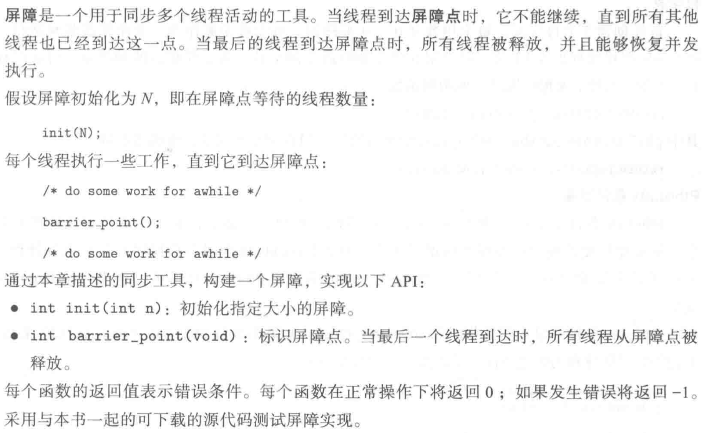

> 屏障(barrier)是协调多个线程并行工作的同步机制。屏障允许每个线程等待，直到所有的合并线程都到达某一点，然后从该点继续执行。
>
> pthread_join函数就是一种屏障，但屏障的概念更加广泛，其允许任意数量的线程等待，直到所有线程完成处理工作阻塞在预先设置的点(也就是调用pthread_barrier_wait 函数的地方),线程不需要退出。所有线程到达barrier后可以接着工作。
>
> 使用pthread_barrier_wait函数表明，当前线程已经完成工作，准备等待其他线程赶上来。调用pthread_barrier_wait函数的线程在屏障计数，如果未达到屏障计数值，当前线程会阻塞进入休眠状态。如果当前线程是最后一个调用pthread_barrier_wait，就满足了屏障计数，所有线程都被唤醒。
>
> ```c
> #include<pthread.h>
>  
> int pthread_barrier_init(pthread_barrier_t *restrict barrier, const pthread_barrierattr_ty * restrict attr, unsigned int count); 
> 
> 
> int pthread_barrier_destroy(pthread_barrier_t *barrier);
> //以上两个函数返回值:0：成功，否则，返回错误编号
> 
> 
> int pthread_barrier_wait(pthread_barrier_t *barrier);
> //返回值:若成功返回0或者PTHREAD_BARRIER_SERIAL_THREAD;否则返回错误编号
> ```

```c
#include "headers.h"
#define MAX 100
int num[MAX];
typedef struct a {
    int start;
    int end;
} Arg;
pthread_barrier_t barrier;

void init()
{
    pthread_barrier_init(&barrier, NULL, 11);
    for (int i = 0; i < MAX; i++) {
        num[i] = rand() % MAX;
    }
}

void* sort(void* arg)
{
    int a = ((Arg*)arg)->start, b = ((Arg*)arg)->end;
    for (int i = a; i < b; i++) {
        for (int j = i + 1; j <= b; j++) {
            if (num[i] > num[j]) {
                int temp = num[i];
                num[i] = num[j];
                num[j] = temp;
            }
        }
    }
    int ret = pthread_barrier_wait(&barrier);
    return NULL;
}
int main()
{
    init();
    pthread_t p[10];
    Arg arg[10]; // 最开始我在循环内部创建，但是可能会因为循环结束资源回收，然后又重新分配新的内容在这个地址上，那么线程内读到的数据就是错误的了。bug 出了很久了。
    for (int i = 0; i < 10; i++) {
        arg[i].start = MAX / 10 * i;
        arg[i].end = MAX / 10 * (i + 1) - 1;
        pthread_create(&p[i], NULL, sort, (void*)&arg[i]);
    }
    // …………
    pthread_barrier_wait(&barrier); // 主函数也算一个线程，也要，合理一点
    // merge
    for (int i = 0; i < MAX; i++) {
        printf("%d ", num[i]);
        if (i % 10 == 9)
            printf("\n");
    }
    pthread_barrier_destroy(&barrier);
    return 0;
}
```

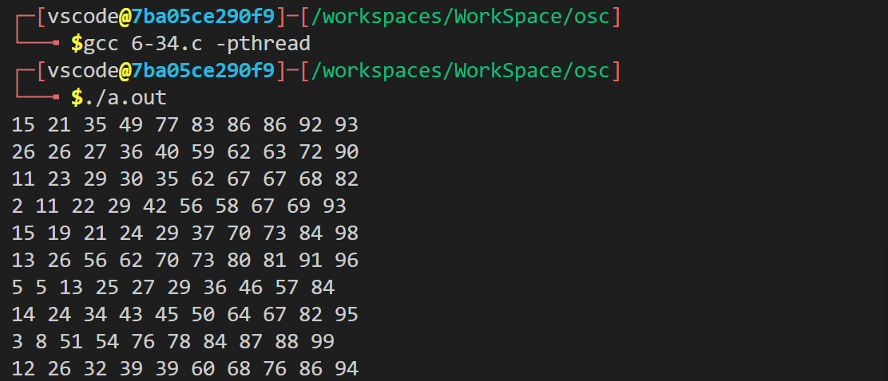

> 就按照直接的想法写了，学习了一下屏障，懒得写 merge 了hhh，每个分组都排好序了。如果需要自己实现的话感觉就是调用 join 然后计数，计数到 N 之后就不用 join 了，可以直接开始。

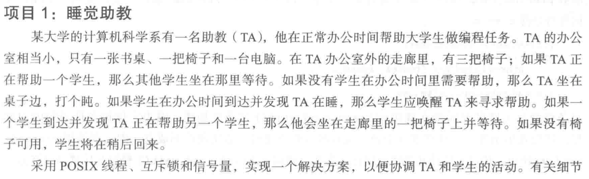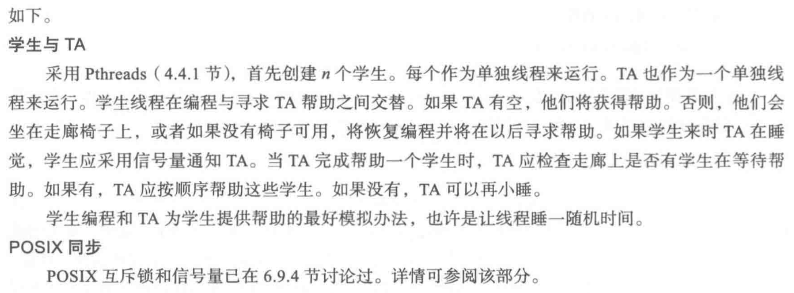

```c
#include "headers.h"
#define MAX 100
struct {
    int seats; // 空闲的凳子
    pthread_mutex_t seatlock;
    sem_t ta;
} mutex;

void* consumer(void* arg)
{
    int count = 0; // 记录已经教了多少学生了，退出循环
    while (1) {
        pthread_mutex_lock(&mutex.seatlock);
        if (mutex.seats < 3) { // 查看有多少空闲凳子，如果少于 3 说明有学生在等
            mutex.seats += 1;
            pthread_mutex_unlock(&mutex.seatlock);
            teach();
            count++;
            if (count == MAX - 1)
                break;
            sem_wait(&mutex.ta); // 减少一个 post
        } else {
            pthread_mutex_unlock(&mutex.seatlock);
            sem_wait(&mutex.ta); // wait ，也就是睡觉
            printf("没有学生，助教睡觉\n");
        }
    }
}

void* producer(void* arg)
{
    while (1) {
        study(); // 学习
        pthread_mutex_lock(&mutex.seatlock);
        if (mutex.seats == 0) { // 没有空闲凳子
            pthread_mutex_unlock(&mutex.seatlock);
            printf("学生 %d 没有找到空位，返回学习\n", gettid());
        } else {
            mutex.seats -= 1;
            pthread_mutex_unlock(&mutex.seatlock);
            sem_post(&mutex.ta); // 叫醒助教（有可能本来就是醒的）
            printf("学生 %d 找到空位，叫醒助教，等待请教\n", gettid());
            break;
        }
    }
}
int main()
{
    mutex.seats = 3;
    pthread_mutex_init(&mutex.seatlock, NULL);
    sem_init(&mutex.ta, 0, 0);
    pthread_t p[MAX];
    pthread_create(&p[0], NULL, consumer, NULL);
    for (int i = 1; i < MAX; i++) {
        pthread_create(&p[i], NULL, producer, NULL);
    }
    for (int i = 0; i < MAX; i++) {
        pthread_join(p[i], NULL);
    }
    return 0;
}
```

> 写的对不对我也不知道，感觉有点怪。

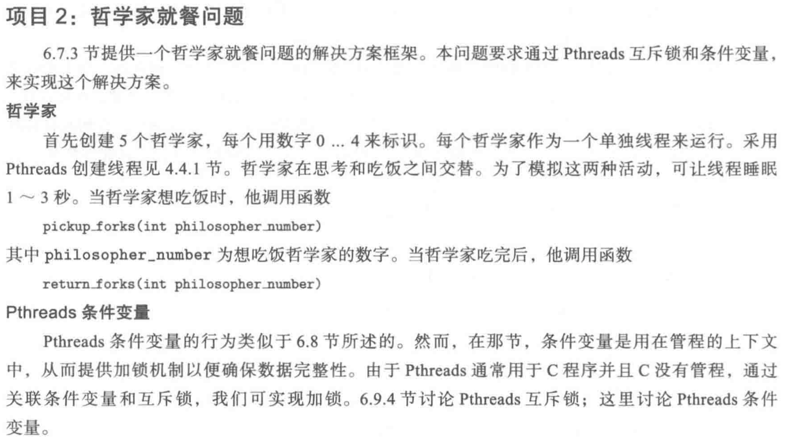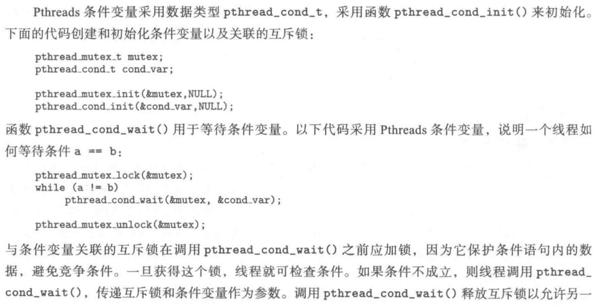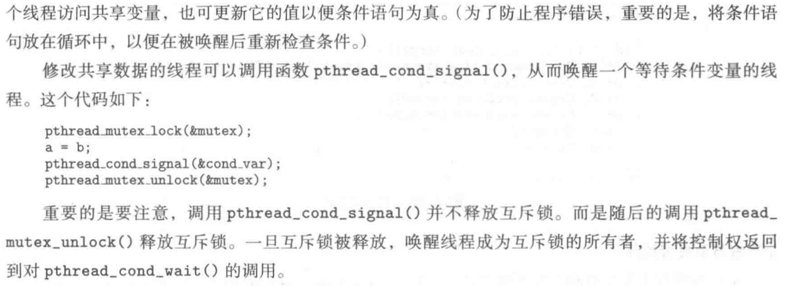

```c
#include "headers.h"
#define MAX 5
int forks[MAX];
pthread_mutex_t lock[MAX];
pthread_cond_t c[MAX];

void pickup_forks(int x)
{
    int a = (x + 1) % MAX, b = (x + MAX - 1) % MAX;
    pthread_mutex_lock(&lock[a]);
    while (forks[a] == 1) {
        pthread_cond_wait(&c[a], &lock[a]);
    }
    forks[a] = 1;
    pthread_mutex_unlock(&lock[a]);
    pthread_mutex_lock(&lock[b]);
    while (forks[b] == 1) {
        pthread_cond_wait(&c[b], &lock[b]);
    }
    forks[a] = 1;
    pthread_mutex_unlock(&lock[b]);
}

void return_forks(int x)
{
    int a = (x + 1) % MAX, b = (x + MAX - 1) % MAX;
    pthread_mutex_lock(&lock[a]);
    forks[a] = 0;
    pthread_cond_signal(&c[a]);
    pthread_mutex_unlock(&lock[a]);
    pthread_mutex_lock(&lock[b]);
    forks[b] = 0;
    pthread_cond_signal(&c[b]);
    pthread_mutex_unlock(&lock[b]);
}
void* philosopher(void* arg)
{
    int a = *(int*)arg;
    thinking(a);
    pickup_forks(a);
    eating(a);
    return_forks(a);
}
int main()
{
    memset(forks, 0, sizeof(forks));
    for (int i = 0; i < MAX; i++) {
        pthread_mutex_init(&lock[i], NULL);
        pthread_cond_init(&c[i], NULL);
    }
    pthread_t p[MAX];
    int arg[MAX];
    for (int i = 0; i < MAX; i++) {
        arg[i] = i;
        pthread_create(&p[i], NULL, philosopher, (void*)&arg[i]);
    }
    for (int i = 0; i < MAX; i++) {
        pthread_join(p[i], NULL);
    }
    return 0;
}
```

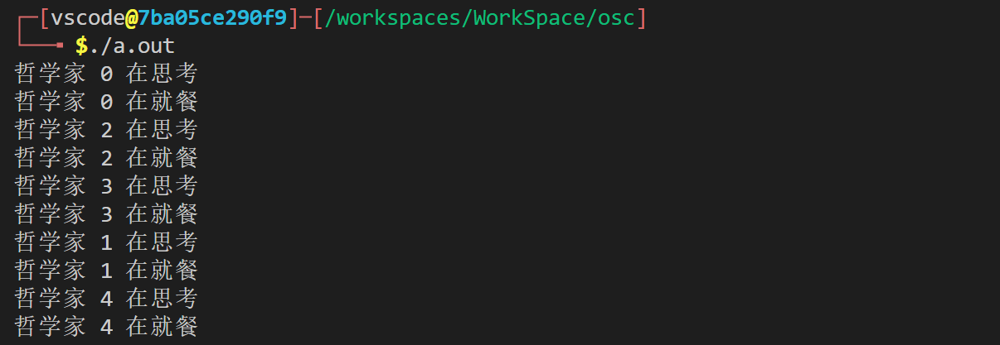

> 我们可以将 MAX 设置为一个很大的数，来测试程序的鲁棒性。

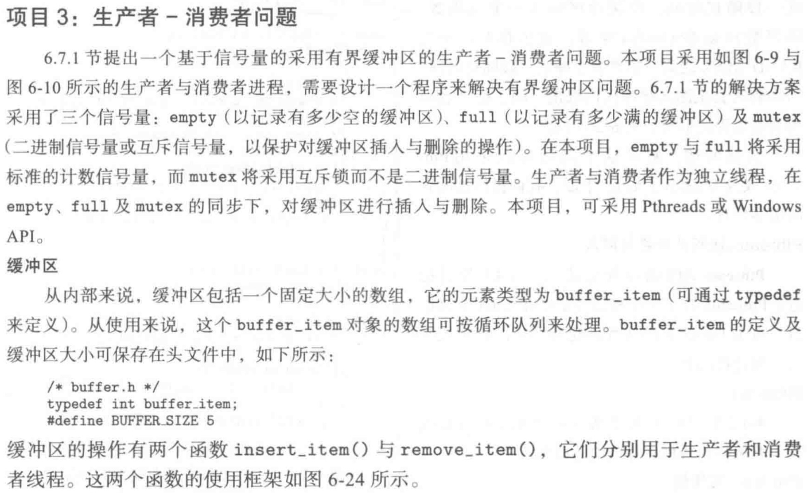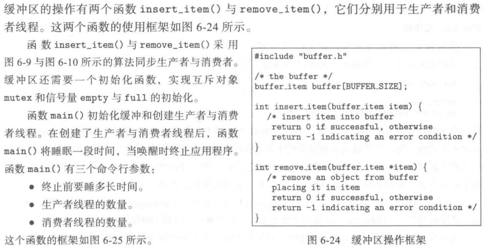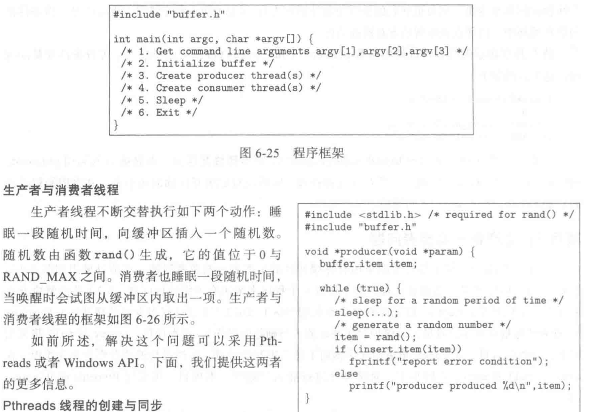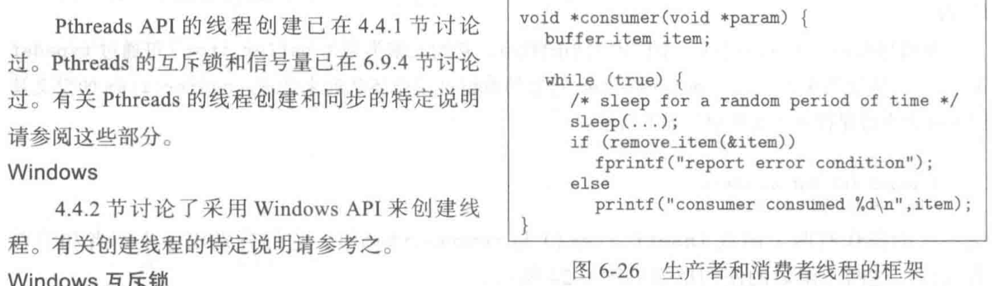

```c
#include <pthread.h>
#include <stdio.h>
#include <stdlib.h>
#include <semaphore.h>
#include <assert.h>
#include <unistd.h>
#define MAX 4

int buffer[MAX];
int fast = 0; // 写入的位置
int slow = 0; // 读取的位置

// 向缓冲区写入数据
int insert_item(int value)
{
    buffer[fast] = value;
    fast = (fast + 1) % MAX;
    return 0;
}

// 从缓冲区读取数据
int remove_item(int* item)
{
    *item = buffer[slow];
    slow = (slow + 1) % MAX;
    return 0;
}

sem_t empty;
sem_t full;
pthread_mutex_t mutex;

// 生产者，首先等待缓冲区有空闲空间，然后获得缓冲区的锁
// 这里锁需要写在条件变量的里面
void* producer(void* arg)
{
    int time = rand() % 10;
    sleep(time);
    int item = rand();
    sem_wait(&empty);
    pthread_mutex_lock(&mutex);
    insert_item(item);
    pthread_mutex_unlock(&mutex);
    sem_post(&full);
}

// 消费者，同上
void* consumer(void* arg)
{
    int time = rand() % 10;
    sleep(time);
    int item;
    sem_wait(&full);
    pthread_mutex_lock(&mutex);
    remove_item(&item);
    pthread_mutex_unlock(&mutex);
    sem_post(&empty);
    printf("remove %d\n", item);
}

int main(int argc, char* argv[])
{
    assert(argc == 4);
    int sleepTime = atoi(argv[1]);
    int producerNum = atoi(argv[2]);
    int consumerNum = atoi(argv[3]);
    // assert(producerNum >= consumerNum);
    sem_init(&empty, 0, MAX); // 初始化 empty 为 MAX ，表明可以向缓冲区写入 MAX 个数字
    sem_init(&full, 0, 0); // 初始化 full 为 0，表明可以从缓冲区读取 0 个数字
    // sem_init(&mutex, 0, 1); 二值信号量，实现锁
    pthread_mutex_init(&mutex, NULL);
    pthread_t p[producerNum + consumerNum];
    printf("%ld\n", sizeof(p));
    for (int i = 0; i < producerNum; i++)
        pthread_create(&p[i], NULL, producer, NULL);
    for (int i = producerNum; i < producerNum + consumerNum; i++)
        pthread_create(&p[i], NULL, consumer, NULL);
    // for (int i = 0; i < producerNum + consumerNum; i++)
    //     pthread_join(p[i], NULL);
    sleep(sleepTime);
    return 0;
}
```

