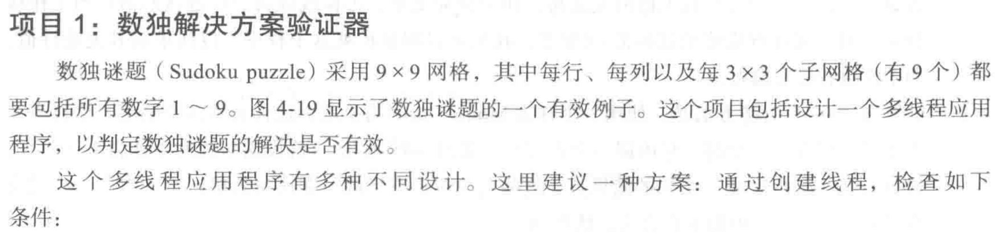
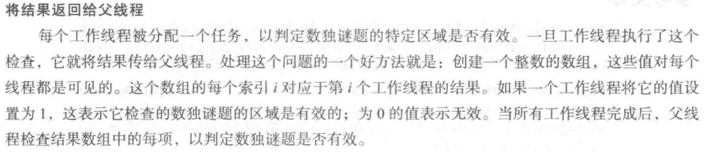

```c
#include "headers.h"
#define MIN_PID 300
#define MAX_PID 5000
int* bitset;
int allocate_map(void);
int allocate_pid(void);
void release_pid(int pid);

void* func()
{
    int pid = allocate_pid();
    int temp = rand() % 10;
    sleep(temp);
    release_pid(temp);
}

int main()
{
    allocate_map();
    pthread_t p[100];
    struct timeval start, end;
    gettimeofday(&start, NULL);
    for (int i = 0; i < 100; i++) {
        pthread_create(&p[i], NULL, func, NULL);
    }
    for (int i = 0; i < 100; i++) {
        pthread_join(p[i], NULL);
    }
    gettimeofday(&end, NULL);
    printf("%d s\n", end.tv_sec - start.tv_sec);
    for (int i = 0; i < 5000 / 32 + 1; i++) {
        if (bitset[i] != 0) {
            printf("false\n");
            return 0;
        }
    }
    printf("true\n");
    return 0;
}
int allocate_map()
{
    bitset = (int*)malloc(sizeof(int) * (MAX_PID / 32 + 1));
    if (bitset == NULL)
        return -1;
    memset(bitset, 0, sizeof(int) * (MAX_PID / 32 + 1));
    return 1;
}

int allocate_pid()
{
    for (int i = MIN_PID; i <= MAX_PID; i++) {
        int a = i / 32, b = i % 32;
        if (((bitset[a] >> b) & 1) == 0) {
            bitset[a] |= 1 << b;
            return i;
        }
    }
    return -1;
}

void release_pid(int i)
{
    int a = i / 32, b = i % 32;
    if (((bitset[a] >> b) & 1) == 1) {
        bitset[a] ^= 1 << b;
    }
}
```

> 运行结果为 false ，是因为并发导致的问题，可以用锁来解决。如果不并发的话，那么我们需要等待大概 5 * 100 s 才能看到结果，但是并发的话就会快很多。（多线程不能用 clock 计时）


```c
#include "headers.h"
#define SIZE 512
typedef struct node {
    int length;
    int* num;
} Arg;

void* my_max(void* arg)
{
    int length = ((Arg*)arg)->length;
    int* num = ((Arg*)arg)->num;
    int* ret = (int*)malloc(4); // 堆区不会被回收，才能顺利传回 main 函数
    *ret = num[0];
    for (int i = 1; i < length; i++) {
        *ret = *ret > num[i] ? *ret : num[i];
    }
    return (void*)ret;
}

void* my_min(void* arg)
{
    int length = ((Arg*)arg)->length;
    int* num = ((Arg*)arg)->num;
    int* ret = (int*)malloc(4);
    *ret = num[0];
    for (int i = 1; i < length; i++) {
        *ret = *ret < num[i] ? *ret : num[i];
    }
    return (void*)ret;
}

void* my_avg(void* arg)
{
    int length = ((Arg*)arg)->length;
    int* num = ((Arg*)arg)->num;
    int* ret = (int*)malloc(4);
    *ret = 0;
    for (int i = 0; i < length; i++) {
        *ret += num[i];
    }
    *ret = (*ret) / length;
    return (void*)ret;
}

int main(int argc, char* argv[])
{
    assert(argc > 1);
    int num[SIZE];
    for (int i = 1; i < argc; i++) {
        num[i - 1] = atoi(argv[i]);
    }
    int *max, *min, *avg;
    pthread_t p[3];
    Arg arg;
    arg.length = argc - 1;
    arg.num = num;
    pthread_create(&p[0], NULL, my_max, (void*)&arg);
    pthread_create(&p[1], NULL, my_min, (void*)&arg);
    pthread_create(&p[2], NULL, my_avg, (void*)&arg);
    pthread_join(p[0], (void**)&max);
    pthread_join(p[1], (void**)&min);
    pthread_join(p[2], (void**)&avg);
    printf("max = %d, min = %d, avg = %d\n", *max, *min, *avg);
    return 0;
}
```


> 这里的 avg 我直接用的 int ，当然用 double 更对了。


```c
#include "headers.h"

void* func()
{
    srand((unsigned int)time(NULL));
    int* ret = (int*)malloc(4);
    *ret = 0;
    for (int i = 0; i < 1000; i++) {
        double a = (double)rand() / RAND_MAX * 2 - 1;
        double b = (double)rand() / RAND_MAX * 2 - 1;
        if (a * a + b * b <= 1) {
            *ret += 1;
        }
    }
    return (void*)ret;
}
int main(int argc, char* argv[])
{
    assert(argc == 2);
    int n = atoi(argv[1]);
    pthread_t p[100];
    for (int i = 0; i < n; i++) {
        pthread_create(&p[i], NULL, func, NULL);
    }
    int sum = 0, *count;
    for (int i = 0; i < n; i++) {
        pthread_join(p[i], (void**)&count);
        sum += *count;
    }
    printf("PI = %.6f\n", (double)sum / (n * 1000) * 4);
    return 0;
}
```


> 因为 p[100], 所以这里我们最多测试到了 100 个线程。这里我们把 18 题一并做了。


> 一个线程，那不就是用埃式筛法就行了吗？没啥意思。


> 也没啥意思，单线程还不如直接写个函数就行了呢?



```c
#include "headers.h"
int sudoku[9][9] = {
    { 6, 2, 4, 5, 3, 9, 1, 8, 7 },
    { 5, 1, 9, 7, 2, 8, 6, 3, 4 },
    { 8, 3, 7, 6, 1, 4, 2, 9, 5 },
    { 1, 4, 3, 8, 6, 5, 7, 2, 9 },
    { 9, 5, 8, 2, 4, 7, 3, 6, 1 },
    { 7, 6, 2, 3, 9, 1, 4, 5, 8 },
    { 3, 7, 1, 9, 5, 6, 8, 4, 2 },
    { 4, 9, 6, 1, 8, 2, 5, 7, 3 },
    { 2, 8, 5, 4, 7, 3, 9, 1, 6 }
};
void* row()
{
    int temp[10];
    for (int i = 0; i < 9; i++) {
        memset(temp, 0, sizeof(temp));
        for (int j = 0; j < 9; j++) {
            if (temp[sudoku[i][j]] == 1) {
                int* ans = (int*)malloc(4);
                *ans = 0;
                return (void*)ans;
            } else {
                temp[sudoku[i][j]] = 1;
            }
        }
    }
    int* ans = (int*)malloc(4);
    *ans = 1;
    return (void*)ans;
}

void* col()
{
    int temp[10];
    for (int i = 0; i < 9; i++) {
        memset(temp, 0, sizeof(temp));
        for (int j = 0; j < 9; j++) {
            if (temp[sudoku[j][i]] == 1) {
                int* ans = (int*)malloc(4);
                *ans = 0;
                return (void*)ans;
            } else {
                temp[sudoku[j][i]] = 1;
            }
        }
    }
    int* ans = (int*)malloc(4);
    *ans = 1;
    return (void*)ans;
}

void* sub()
{
    int temp[10];
    for (int k = 0; k < 9; k++) {
        memset(temp, 0, sizeof(temp));
        int x = (k / 3) * 3, y = (k % 3) * 3;
        for (int i = x; i < x + 3; i++) {
            for (int j = y; j < y + 3; j++) {
                if (temp[sudoku[i][j]] == 1) {
                    int* ans = (int*)malloc(4);
                    *ans = 0;
                    return (void*)ans;
                } else {
                    temp[sudoku[i][j]] = 1;
                }
            }
        }
    }
    int* ans = (int*)malloc(4);
    *ans = 1;
    return (void*)ans;
}
int main()
{
    pthread_t p[3];
    pthread_create(&p[0], NULL, row, NULL);
    pthread_create(&p[1], NULL, col, NULL);
    pthread_create(&p[2], NULL, sub, NULL);
    int *a, *b, *c;
    pthread_join(p[0], (void**)&a);
    pthread_join(p[1], (void**)&b);
    pthread_join(p[2], (void**)&c);
    printf("%d\n", *a & *b & *c);
    return 0;
}
```

> 我就用 3 个， 11 个没必要。


```c
#include "headers.h"
#define LENGTH 10
typedef struct {
    int start, end, length;
} Arg;
int num[LENGTH] = { 6, 2, 4, 5, 3, 9, 1, 8, 7, 0 };

void* sort(void* arg)
{
    int start = ((Arg*)arg)->start, end = ((Arg*)arg)->end;
    for (int i = start; i < end; i++) {
        for (int j = i + 1; j <= end; j++) {
            if (num[i] > num[j]) {
                int temp = num[i];
                num[i] = num[j];
                num[j] = temp;
            }
        }
    }
    return NULL;
}

void* merge(void* arg)
{
    int start1 = ((Arg*)arg)->start, start2 = ((Arg*)arg)->end, length = ((Arg*)arg)->length;
    int* temp = (int*)malloc(sizeof(int) * length);
    int index = 0, i = 0, j = start2;
    while (i < start2 && j < length) {
        if (num[i] <= num[j]) {
            temp[index++] = num[i++];
        } else {
            temp[index++] = num[j++];
        }
    }
    while (i < start2) {
        temp[index++] = num[i++];
    }
    while (j < length) {
        temp[index++] = num[j++];
    }
    for (int i = 0; i < LENGTH; i++) {
        num[i] = temp[i];
    }
    free(temp);
    return NULL;
}
int main()
{
    int mid = LENGTH / 2;
    pthread_t p[3];
    Arg arg1;
    arg1.start = 0, arg1.end = mid - 1, arg1.length = mid;
    pthread_create(&p[0], NULL, sort, (void*)&arg1);
    Arg arg2;
    arg2.start = mid, arg2.end = LENGTH - 1, arg2.length = LENGTH - mid;
    pthread_create(&p[1], NULL, sort, (void*)&arg2);
    pthread_join(p[0], NULL);
    pthread_join(p[1], NULL);
    Arg arg3;
    arg3.start = 0, arg3.end = mid, arg3.length = LENGTH;
    pthread_create(&p[2], NULL, merge, (void*)&arg3);
    pthread_join(p[2], NULL);
    for (int i = 0; i < LENGTH; i++) {
        printf("%d ", num[i]);
    }
    printf("\n");
    return 0;
}
```

> 咱就冒泡了，不整什么快排了；合并就用额外空间了。而且也不要去想什么递归，归并排序还多线程，我不会。

